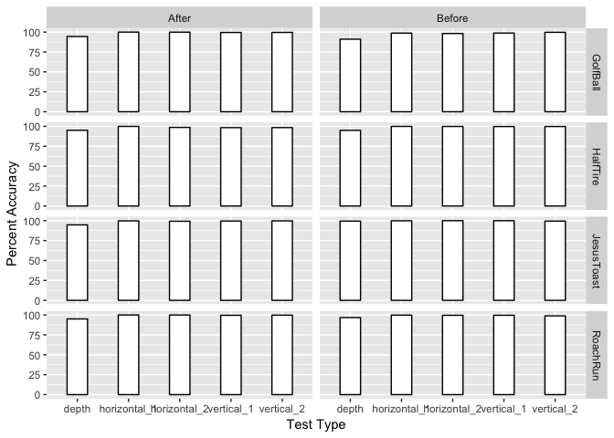
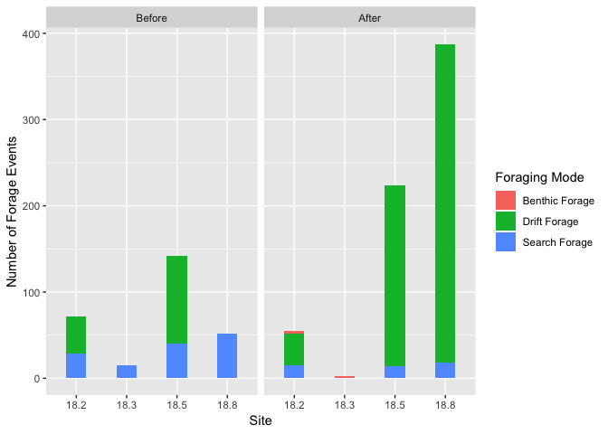

SRF VidSync 2019
================
Keane Flynn
3/18/2019

Load Libraries
--------------

``` r
library(dplyr)
```

    ## 
    ## Attaching package: 'dplyr'

    ## The following objects are masked from 'package:stats':
    ## 
    ##     filter, lag

    ## The following objects are masked from 'package:base':
    ## 
    ##     intersect, setdiff, setequal, union

``` r
library(readr)
library(tidyverse)
```

    ## ── Attaching packages ────────────────────────────────────────────────────────────────────────────────── tidyverse 1.2.1 ──

    ## ✔ ggplot2 3.0.0     ✔ purrr   0.2.5
    ## ✔ tibble  1.4.2     ✔ stringr 1.3.1
    ## ✔ tidyr   0.8.1     ✔ forcats 0.3.0

    ## ── Conflicts ───────────────────────────────────────────────────────────────────────────────────── tidyverse_conflicts() ──
    ## ✖ dplyr::filter() masks stats::filter()
    ## ✖ dplyr::lag()    masks stats::lag()

``` r
library(ggplot2)
library(lubridate)
```

    ## 
    ## Attaching package: 'lubridate'

    ## The following object is masked from 'package:base':
    ## 
    ##     date

``` r
library(geometry)
```

    ## Loading required package: magic

    ## Loading required package: abind

``` r
library(rgl)
library(hypervolume)
```

    ## Loading required package: Rcpp

``` r
library(zoo)
```

    ## 
    ## Attaching package: 'zoo'

    ## The following objects are masked from 'package:base':
    ## 
    ##     as.Date, as.Date.numeric

``` r
library(stringr)
```

VidSync Data
============

This section of the code is devoted to importing, analyzing, and creating correlations with 3-D Videogrammetry data collected using VidSync from the summer of 2018 on Porter Creek. This is my child and I will keep it neat.

Importing Data
--------------

### Pre-Augmentation

``` r
GolfBall_VidSync_Pre <- 
  readr::read_csv(file = "Vidsync-data/PreAugmentation/Porter_BACI_GolfBall_30June2018_Part3.csv",
           skip = 2,
                    col_names = c("objects", "event", "timecode", "time", "X", "Y", "Z", "pld_error", "projection_error", "nearest_camera_distance", "screen_coordinates"),
                    col_types = "cccdddddddd") %>% 
  mutate(date = as.Date("2018-06-30")) %>% 
  mutate(BACI_date = as.Date("2018-06-29")) %>% 
  mutate(site = "18.3") %>% 
  mutate(sample_event = "Before")
```

    ## Warning in rbind(names(probs), probs_f): number of columns of result is not
    ## a multiple of vector length (arg 1)

    ## Warning: 168 parsing failures.
    ## row # A tibble: 5 x 5 col     row col   expected   actual   file                                     expected   <int> <chr> <chr>      <chr>    <chr>                                    actual 1     1 <NA>  11 columns 10 colu… 'Vidsync-data/PreAugmentation/Porter_BA… file 2     2 <NA>  11 columns 10 colu… 'Vidsync-data/PreAugmentation/Porter_BA… row 3     3 <NA>  11 columns 10 colu… 'Vidsync-data/PreAugmentation/Porter_BA… col 4     4 <NA>  11 columns 10 colu… 'Vidsync-data/PreAugmentation/Porter_BA… expected 5     5 <NA>  11 columns 10 colu… 'Vidsync-data/PreAugmentation/Porter_BA…
    ## ... ................. ... .......................................................................... ........ .......................................................................... ...... .......................................................................... .... .......................................................................... ... .......................................................................... ... .......................................................................... ........ ..........................................................................
    ## See problems(...) for more details.

``` r
HalfTire_VidSync_Pre <-
  readr::read_csv(file = "Vidsync-data/PreAugmentation/Porter_BACI_HalfTire_29June2018_Part2.csv",
           skip = 2,
                    col_names = c("objects", "event", "timecode", "time", "X", "Y", "Z", "pld_error", "projection_error", "nearest_camera_distance", "screen_coordinates"),
                    col_types = "cccdddddddd") %>% 
  mutate(date = as.Date("2018-06-29")) %>% 
  mutate(BACI_date = as.Date("2018-06-29")) %>% 
  mutate(site = "18.8") %>% 
  mutate(sample_event = "Before")
```

    ## Warning in rbind(names(probs), probs_f): number of columns of result is not
    ## a multiple of vector length (arg 1)

    ## Warning: 113 parsing failures.
    ## row # A tibble: 5 x 5 col     row col   expected   actual   file                                     expected   <int> <chr> <chr>      <chr>    <chr>                                    actual 1     1 <NA>  11 columns 10 colu… 'Vidsync-data/PreAugmentation/Porter_BA… file 2     2 <NA>  11 columns 10 colu… 'Vidsync-data/PreAugmentation/Porter_BA… row 3     3 <NA>  11 columns 10 colu… 'Vidsync-data/PreAugmentation/Porter_BA… col 4     4 <NA>  11 columns 10 colu… 'Vidsync-data/PreAugmentation/Porter_BA… expected 5     5 <NA>  11 columns 10 colu… 'Vidsync-data/PreAugmentation/Porter_BA…
    ## ... ................. ... .......................................................................... ........ .......................................................................... ...... .......................................................................... .... .......................................................................... ... .......................................................................... ... .......................................................................... ........ ..........................................................................
    ## See problems(...) for more details.

``` r
RoachRun_VidSync_Pre <-
  readr::read_csv(file = "Vidsync-data/PreAugmentation/Porter_BACI_RoachRun_29June2018_Part3.csv",
           skip = 2,
                    col_names = c("objects", "event", "timecode", "time", "X", "Y", "Z", "pld_error", "projection_error", "nearest_camera_distance", "screen_coordinates"),
                    col_types = "cccdddddddd") %>% 
  mutate(date = as.Date("2018-06-29")) %>% 
  mutate(BACI_date = as.Date("2018-06-29")) %>% 
  mutate(site = "18.5") %>% 
  mutate(sample_event = "Before")

JesusToast_VidSync_Pre <- 
  readr::read_csv(file = "Vidsync-data/PreAugmentation/Porter_BACI_JTPool_30June2018_Part1.csv",
           skip = 2,
                    col_names = c("objects", "event", "timecode", "time", "X", "Y", "Z", "pld_error", "projection_error", "nearest_camera_distance", "screen_coordinates"),
                    col_types = "cccdddddddd") %>% 
  mutate(date = as.Date("2018-06-30")) %>% 
  mutate(BACI_date = as.Date("2018-06-29")) %>% 
  mutate(site = "18.2") %>% 
  mutate(sample_event = "Before")
```

    ## Warning in rbind(names(probs), probs_f): number of columns of result is not
    ## a multiple of vector length (arg 1)

    ## Warning: 113 parsing failures.
    ## row # A tibble: 5 x 5 col     row col       expected actual                   file                   expected   <int> <chr>     <chr>    <chr>                    <chr>                  actual 1     1 screen_c… a double "LC: screen={499.007995… 'Vidsync-data/PreAugm… file 2     2 screen_c… a double "RC: screen={246.945831… 'Vidsync-data/PreAugm… row 3     3 screen_c… a double "LC: screen={448.637695… 'Vidsync-data/PreAugm… col 4     4 screen_c… a double "LC: screen={470.562622… 'Vidsync-data/PreAugm… expected 5     5 screen_c… a double "LC: screen={470.971984… 'Vidsync-data/PreAugm…
    ## ... ................. ... .......................................................................... ........ .......................................................................... ...... .......................................................................... .... .......................................................................... ... .......................................................................... ... .......................................................................... ........ ..........................................................................
    ## See problems(...) for more details.

### Post-Augmentation

``` r
GolfBall_VidSync_Post <-
  readr::read_csv(file = "Vidsync-data/PostAugmentation/Porter_BACI_Golfball_6July2018_Part1.csv",
           skip = 2,
                    col_names = c("objects", "event", "timecode", "time", "X", "Y", "Z", "pld_error", "projection_error", "nearest_camera_distance", "screen_coordinates"),
                    col_types = "cccdddddddd") %>%
  mutate(date = as.Date("2018-07-06")) %>% 
  mutate(BACI_date = as.Date("2018-07-05")) %>% 
  mutate(site = "18.3") %>% 
  mutate(sample_event = "After")
```

    ## Warning in rbind(names(probs), probs_f): number of columns of result is not
    ## a multiple of vector length (arg 1)

    ## Warning: 107 parsing failures.
    ## row # A tibble: 5 x 5 col     row col   expected   actual   file                                     expected   <int> <chr> <chr>      <chr>    <chr>                                    actual 1     1 <NA>  11 columns 10 colu… 'Vidsync-data/PostAugmentation/Porter_B… file 2     2 <NA>  11 columns 10 colu… 'Vidsync-data/PostAugmentation/Porter_B… row 3     3 <NA>  11 columns 10 colu… 'Vidsync-data/PostAugmentation/Porter_B… col 4     4 <NA>  11 columns 10 colu… 'Vidsync-data/PostAugmentation/Porter_B… expected 5     5 <NA>  11 columns 10 colu… 'Vidsync-data/PostAugmentation/Porter_B…
    ## ... ................. ... .......................................................................... ........ .......................................................................... ...... .......................................................................... .... .......................................................................... ... .......................................................................... ... .......................................................................... ........ ..........................................................................
    ## See problems(...) for more details.

``` r
RoachRun_VidSync_Post <-
  readr::read_csv(file = "Vidsync-data/PostAugmentation/Porter_BACI_RoachRun_5July2018_Part1.csv",
           skip = 2,
                    col_names = c("objects", "event", "timecode", "time", "X", "Y", "Z", "pld_error", "projection_error", "nearest_camera_distance", "screen_coordinates"),
                    col_types = "cccdddddddd") %>% 
  mutate(date = as.Date("2018-07-05")) %>% 
  mutate(BACI_date = as.Date("2018-07-05")) %>% 
  mutate(site = "18.5") %>% 
  mutate(sample_event = "After")
```

    ## Warning in rbind(names(probs), probs_f): number of columns of result is not
    ## a multiple of vector length (arg 1)

    ## Warning: 475 parsing failures.
    ## row # A tibble: 5 x 5 col     row col   expected   actual   file                                     expected   <int> <chr> <chr>      <chr>    <chr>                                    actual 1     1 <NA>  11 columns 10 colu… 'Vidsync-data/PostAugmentation/Porter_B… file 2     2 <NA>  11 columns 10 colu… 'Vidsync-data/PostAugmentation/Porter_B… row 3     3 <NA>  11 columns 10 colu… 'Vidsync-data/PostAugmentation/Porter_B… col 4     4 <NA>  11 columns 10 colu… 'Vidsync-data/PostAugmentation/Porter_B… expected 5     5 <NA>  11 columns 10 colu… 'Vidsync-data/PostAugmentation/Porter_B…
    ## ... ................. ... .......................................................................... ........ .......................................................................... ...... .......................................................................... .... .......................................................................... ... .......................................................................... ... .......................................................................... ........ ..........................................................................
    ## See problems(...) for more details.

``` r
HalfTire_VidSync_Post <- 
  readr::read_csv(file = "Vidsync-data/PostAugmentation/Porter_BACI_HalfTire_5July2018_Part3.csv",
           skip = 2,
                    col_names = c("objects", "event", "timecode", "time", "X", "Y", "Z", "pld_error", "projection_error", "nearest_camera_distance", "screen_coordinates"),
                    col_types = "cccdddddddd") %>% 
  mutate(date = as.Date("2018-07-05")) %>% 
  mutate(BACI_date = as.Date("2018-07-05")) %>% 
  mutate(site = "18.8") %>% 
  mutate(sample_event = "After")
```

    ## Warning in rbind(names(probs), probs_f): number of columns of result is not
    ## a multiple of vector length (arg 1)

    ## Warning: 692 parsing failures.
    ## row # A tibble: 5 x 5 col     row col   expected   actual   file                                     expected   <int> <chr> <chr>      <chr>    <chr>                                    actual 1     1 <NA>  11 columns 10 colu… 'Vidsync-data/PostAugmentation/Porter_B… file 2     2 <NA>  11 columns 10 colu… 'Vidsync-data/PostAugmentation/Porter_B… row 3     3 <NA>  11 columns 10 colu… 'Vidsync-data/PostAugmentation/Porter_B… col 4     4 <NA>  11 columns 10 colu… 'Vidsync-data/PostAugmentation/Porter_B… expected 5     5 <NA>  11 columns 10 colu… 'Vidsync-data/PostAugmentation/Porter_B…
    ## ... ................. ... .......................................................................... ........ .......................................................................... ...... .......................................................................... .... .......................................................................... ... .......................................................................... ... .......................................................................... ........ ..........................................................................
    ## See problems(...) for more details.

``` r
JesusToast_VidSync_Post <-
  readr::read_csv(file = "Vidsync-data/PostAugmentation/Porter_BACI_JesusToast_6July2018_Part1.csv",
           skip = 2,
                    col_names = c("objects", "event", "timecode", "time", "X", "Y", "Z", "pld_error", "projection_error", "nearest_camera_distance", "screen_coordinates"),
                    col_types = "cccdddddddd") %>% 
  mutate(date = as.Date("2018-07-06")) %>% 
  mutate(BACI_date = as.Date("2018-07-05")) %>% 
  mutate(site = "18.2") %>% 
  mutate(sample_event = "After")
```

    ## Warning in rbind(names(probs), probs_f): number of columns of result is not
    ## a multiple of vector length (arg 1)

    ## Warning: 145 parsing failures.
    ## row # A tibble: 5 x 5 col     row col   expected   actual   file                                     expected   <int> <chr> <chr>      <chr>    <chr>                                    actual 1     1 <NA>  11 columns 10 colu… 'Vidsync-data/PostAugmentation/Porter_B… file 2     2 <NA>  11 columns 10 colu… 'Vidsync-data/PostAugmentation/Porter_B… row 3     3 <NA>  11 columns 10 colu… 'Vidsync-data/PostAugmentation/Porter_B… col 4     4 <NA>  11 columns 10 colu… 'Vidsync-data/PostAugmentation/Porter_B… expected 5     5 <NA>  11 columns 10 colu… 'Vidsync-data/PostAugmentation/Porter_B…
    ## ... ................. ... .......................................................................... ........ .......................................................................... ...... .......................................................................... .... .......................................................................... ... .......................................................................... ... .......................................................................... ........ ..........................................................................
    ## See problems(...) for more details.

Test Measurement Accuracy
-------------------------

``` r
Vidsync_TestMeasurements <- 
  readr::read_csv(file = "Vidsync-data/Test-Data/Vidsync Test Measurments - Sheet1.csv") %>%
  filter(Stream == "Porter") %>%
  mutate(Percent_Accuracy = (1 - (abs(Test_measured_mm - Test_target_mm)/Test_target_mm))*100) %>%
  select(Site, Event, Test_Type, Percent_Accuracy)
```

    ## Parsed with column specification:
    ## cols(
    ##   Date = col_date(format = ""),
    ##   Stream = col_character(),
    ##   Site = col_character(),
    ##   Event = col_character(),
    ##   Video_num = col_character(),
    ##   Test_num = col_integer(),
    ##   Test_target_mm = col_integer(),
    ##   Test_measured_mm = col_double(),
    ##   Test_Type = col_character(),
    ##   Notes = col_character()
    ## )

``` r
Vidsync_TestMeasurements
```

    ## # A tibble: 40 x 4
    ##    Site     Event  Test_Type    Percent_Accuracy
    ##    <chr>    <chr>  <chr>                   <dbl>
    ##  1 RoachRun Before horizontal_1             99.8
    ##  2 RoachRun Before horizontal_2             99.6
    ##  3 RoachRun Before vertical_1               99.6
    ##  4 RoachRun Before vertical_2               98.9
    ##  5 RoachRun Before depth                    96.6
    ##  6 RoachRun After  horizontal_1            100  
    ##  7 RoachRun After  horizontal_2             99.9
    ##  8 RoachRun After  vertical_1               99.6
    ##  9 RoachRun After  vertical_2               99.7
    ## 10 RoachRun After  depth                    95  
    ## # ... with 30 more rows

``` r
ggplot(Vidsync_TestMeasurements, aes(Test_Type, Percent_Accuracy)) + 
  geom_col(width = 0.4, fill = "white", color = "black") + 
  facet_grid(Site ~ Event) +
  xlab("Test Type") +
  ylab("Percent Accuracy") 
```



Analyzation
-----------

We will be analyzing functions such as NND, distance travelled per time (cm/s), distance to forage attempt (DFA), proportion of forage types, volume occupied, overlap in forage volumes, etc.

### Nearest Neighbor Distance (NND)

This will use the three dimensional distance formula to look at nearest neighbor at any given time during the subsample rather than the average centroid point.

#### Pre-Augmentation

``` r
nnd_GolfBall_Pre <- GolfBall_VidSync_Pre %>%
  ungroup() %>%
  filter(grepl("^Subsample.*", objects)) %>%
  filter(!grepl("^Length.*", event)) %>%
  filter(!grepl("^Attack.*", event)) %>%
  filter(!grepl("^Nip.*", event)) %>%
  mutate(subsample = as.numeric(str_extract(objects, "\\d"))) %>%
  mutate(index = as.numeric(str_extract(objects, "\\h\\d{1,2}"))) %>%
  arrange(time) %>%
  group_by(time) %>%
  mutate(distance_travelled_X_cm = X - lag(X, default = first(X))) %>%
  mutate(distance_travelled_Y_cm = Y - lag(Y, default = first(Y))) %>%
  mutate(distance_travelled_Z_cm = Z - lag(Z, default = first(Z))) %>%
  mutate(nnd = sqrt((distance_travelled_X_cm)^2
                                        + (distance_travelled_Y_cm)^2
                                        + (distance_travelled_Z_cm)^2)) %>%
  group_by(time) %>%
  filter(!nnd == 0) %>%
  filter(nnd == min(nnd)) %>%
  ungroup() %>%
  group_by(index) %>%
  summarise(mean_nnd = mean(nnd), median_nnd = median(nnd)) %>%
  mutate(date = as.Date("2018-06-30")) %>%
  mutate(BACI_date = as.Date("2018-06-29")) %>%
  mutate(site = "18.3") %>%
  mutate(sample_event = "Before") 

nnd_HalfTire_Pre <- HalfTire_VidSync_Pre %>%
  ungroup() %>%
  filter(grepl("^Subsample.*", objects)) %>%
  filter(!grepl("^Length.*", event)) %>%
  filter(!grepl("^Attack.*", event)) %>%
  filter(!grepl("^Nip.*", event)) %>%
  mutate(subsample = as.numeric(str_extract(objects, "\\d"))) %>%
  mutate(index = as.numeric(str_extract(objects, "\\h\\d{1,2}"))) %>%
  arrange(time) %>%
  group_by(time) %>%
  mutate(distance_travelled_X_cm = X - lag(X, default = first(X))) %>%
  mutate(distance_travelled_Y_cm = Y - lag(Y, default = first(Y))) %>%
  mutate(distance_travelled_Z_cm = Z - lag(Z, default = first(Z))) %>%
  mutate(nnd = sqrt((distance_travelled_X_cm)^2
                                        + (distance_travelled_Y_cm)^2
                                        + (distance_travelled_Z_cm)^2)) %>%
  group_by(time) %>%
  filter(!nnd == 0) %>%
  filter(nnd == min(nnd)) %>%
  ungroup() %>%
  group_by(index) %>%
  summarise(mean_nnd = mean(nnd), median_nnd = median(nnd)) %>%
  mutate(date = as.Date("2018-06-29")) %>%
  mutate(BACI_date = as.Date("2018-06-29")) %>%
  mutate(site = "18.8") %>%
  mutate(sample_event = "Before")   

nnd_RoachRun_Pre <- RoachRun_VidSync_Pre %>%
  ungroup() %>%
  filter(grepl("^Subsample.*", objects)) %>%
  filter(!grepl("^Length.*", event)) %>%
  filter(!grepl("^Attack.*", event)) %>%
  filter(!grepl("^Nip.*", event)) %>%
  mutate(subsample = as.numeric(str_extract(objects, "\\d"))) %>%
  mutate(index = as.numeric(str_extract(objects, "\\h\\d{1,2}"))) %>%
  arrange(time) %>%
  group_by(time) %>%
  mutate(distance_travelled_X_cm = X - lag(X, default = first(X))) %>%
  mutate(distance_travelled_Y_cm = Y - lag(Y, default = first(Y))) %>%
  mutate(distance_travelled_Z_cm = Z - lag(Z, default = first(Z))) %>%
  mutate(nnd = sqrt((distance_travelled_X_cm)^2
                                        + (distance_travelled_Y_cm)^2
                                        + (distance_travelled_Z_cm)^2)) %>%
  group_by(time) %>%
  filter(!nnd == 0) %>%
  filter(nnd == min(nnd)) %>%
  ungroup() %>%
  group_by(index) %>%
  summarise(mean_nnd = mean(nnd), median_nnd = median(nnd)) %>%
  mutate(date = as.Date("2018-06-29")) %>%
  mutate(BACI_date = as.Date("2018-06-29")) %>%
  mutate(site = "18.5") %>%
 mutate(sample_event = "Before")   

nnd_JesusToast_Pre <- JesusToast_VidSync_Pre %>%
  ungroup() %>%
  filter(grepl("^Subsample.*", objects)) %>%
  filter(!grepl("^Length.*", event)) %>%
  filter(!grepl("^Attack.*", event)) %>%
  filter(!grepl("^Nip.*", event)) %>%
  mutate(subsample = as.numeric(str_extract(objects, "\\d"))) %>%
  mutate(index = as.numeric(str_extract(objects, "\\h\\d{1,2}"))) %>%
  arrange(time) %>%
  group_by(time) %>%
  mutate(distance_travelled_X_cm = X - lag(X, default = first(X))) %>%
  mutate(distance_travelled_Y_cm = Y - lag(Y, default = first(Y))) %>%
  mutate(distance_travelled_Z_cm = Z - lag(Z, default = first(Z))) %>%
  mutate(nnd = sqrt((distance_travelled_X_cm)^2
                                        + (distance_travelled_Y_cm)^2
                                        + (distance_travelled_Z_cm)^2)) %>%
  group_by(time) %>%
  filter(!nnd == 0) %>%
  filter(nnd == min(nnd)) %>%
  ungroup() %>%
  group_by(index) %>%
  summarise(mean_nnd = mean(nnd), median_nnd = median(nnd)) %>%
  mutate(date = as.Date("2018-06-30")) %>%
  mutate(BACI_date = as.Date("2018-06-29")) %>%
  mutate(site = "18.2") %>%
  mutate(sample_event = "Before")  
```

#### Post-Augmentation

``` r
nnd_GolfBall_Post <- GolfBall_VidSync_Post %>%
  ungroup() %>%
  filter(grepl("^Subsample.*", objects)) %>%
  filter(!grepl("^Length.*", event)) %>%
  filter(!grepl("^Attack.*", event)) %>%
  filter(!grepl("^Nip.*", event)) %>%
  mutate(subsample = as.numeric(str_extract(objects, "\\d"))) %>%
  mutate(index = as.numeric(str_extract(objects, "\\h\\d{1,2}"))) %>%
  arrange(time) %>%
  group_by(time) %>%
  mutate(distance_travelled_X_cm = X - lag(X, default = first(X))) %>%
  mutate(distance_travelled_Y_cm = Y - lag(Y, default = first(Y))) %>%
  mutate(distance_travelled_Z_cm = Z - lag(Z, default = first(Z))) %>%
  mutate(nnd = sqrt((distance_travelled_X_cm)^2
                                        + (distance_travelled_Y_cm)^2
                                        + (distance_travelled_Z_cm)^2)) %>%
  group_by(time) %>%
  filter(!nnd == 0) %>%
  filter(nnd == min(nnd)) %>%
  ungroup() %>%
  group_by(index) %>%
  summarise(mean_nnd = mean(nnd), median_nnd = median(nnd)) %>%
  mutate(date = as.Date("2018-07-06")) %>%
  mutate(BACI_date = as.Date("2018-07-05")) %>%
  mutate(site = "18.3") %>%
  mutate(sample_event = "Before") 

nnd_HalfTire_Post <- HalfTire_VidSync_Post %>%
  ungroup() %>%
  filter(grepl("^Subsample.*", objects)) %>%
  filter(!grepl("^Length.*", event)) %>%
  filter(!grepl("^Attack.*", event)) %>%
  filter(!grepl("^Nip.*", event)) %>%
  mutate(subsample = as.numeric(str_extract(objects, "\\d"))) %>%
  mutate(index = as.numeric(str_extract(objects, "\\h\\d{1,2}"))) %>%
  arrange(time) %>%
  group_by(time) %>%
  mutate(distance_travelled_X_cm = X - lag(X, default = first(X))) %>%
  mutate(distance_travelled_Y_cm = Y - lag(Y, default = first(Y))) %>%
  mutate(distance_travelled_Z_cm = Z - lag(Z, default = first(Z))) %>%
  mutate(nnd = sqrt((distance_travelled_X_cm)^2
                                        + (distance_travelled_Y_cm)^2
                                        + (distance_travelled_Z_cm)^2)) %>%
  group_by(time) %>%
  filter(!nnd == 0) %>%
  filter(nnd == min(nnd)) %>%
  ungroup() %>%
  group_by(index) %>%
  summarise(mean_nnd = mean(nnd), median_nnd = median(nnd)) %>%
  mutate(date = as.Date("2018-07-05")) %>%
  mutate(BACI_date = as.Date("2018-07-05")) %>%
  mutate(site = "18.8") %>%
  mutate(sample_event = "Before")  

nnd_RoachRun_Post <- RoachRun_VidSync_Post %>%
  ungroup() %>%
  filter(grepl("^Subsample.*", objects)) %>%
  filter(!grepl("^Length.*", event)) %>%
  filter(!grepl("^Attack.*", event)) %>%
  filter(!grepl("^Nip.*", event)) %>%
  mutate(subsample = as.numeric(str_extract(objects, "\\d"))) %>%
  mutate(index = as.numeric(str_extract(objects, "\\h\\d{1,2}"))) %>%
  arrange(time) %>%
  group_by(time) %>%
  mutate(distance_travelled_X_cm = X - lag(X, default = first(X))) %>%
  mutate(distance_travelled_Y_cm = Y - lag(Y, default = first(Y))) %>%
  mutate(distance_travelled_Z_cm = Z - lag(Z, default = first(Z))) %>%
  mutate(nnd = sqrt((distance_travelled_X_cm)^2
                                        + (distance_travelled_Y_cm)^2
                                        + (distance_travelled_Z_cm)^2)) %>%
  group_by(time) %>%
  filter(!nnd == 0) %>%
  filter(nnd == min(nnd)) %>%
  ungroup() %>%
  group_by(index) %>%
  summarise(mean_nnd = mean(nnd), median_nnd = median(nnd)) %>%
  mutate(date = as.Date("2018-07-05")) %>%
  mutate(BACI_date = as.Date("2018-07-05")) %>%
  mutate(site = "18.5") %>%
  mutate(sample_event = "Before") 

nnd_JesusToast_Post <- JesusToast_VidSync_Post %>%
  ungroup() %>%
  filter(grepl("^Subsample.*", objects)) %>%
  filter(!grepl("^Length.*", event)) %>%
  filter(!grepl("^Attack.*", event)) %>%
  filter(!grepl("^Nip.*", event)) %>%
  mutate(subsample = as.numeric(str_extract(objects, "\\d"))) %>%
  mutate(index = as.numeric(str_extract(objects, "\\h\\d{1,2}"))) %>%
  arrange(time) %>%
  group_by(time) %>%
  mutate(distance_travelled_X_cm = X - lag(X, default = first(X))) %>%
  mutate(distance_travelled_Y_cm = Y - lag(Y, default = first(Y))) %>%
  mutate(distance_travelled_Z_cm = Z - lag(Z, default = first(Z))) %>%
  mutate(nnd = sqrt((distance_travelled_X_cm)^2
                                        + (distance_travelled_Y_cm)^2
                                        + (distance_travelled_Z_cm)^2)) %>%
  group_by(time) %>%
  filter(!nnd == 0) %>%
  filter(nnd == min(nnd)) %>%
  ungroup() %>%
  group_by(index) %>%
  summarise(mean_nnd = mean(nnd), median_nnd = median(nnd)) %>%
  mutate(date = as.Date("2018-07-06")) %>%
  mutate(BACI_date = as.Date("2018-07-05")) %>%
  mutate(site = "18.2") %>%
  mutate(event = "After")

nnd_data <- 
  bind_rows(nnd_RoachRun_Pre, nnd_RoachRun_Post, nnd_GolfBall_Pre, nnd_GolfBall_Post, nnd_HalfTire_Pre, nnd_HalfTire_Post, nnd_JesusToast_Pre, nnd_JesusToast_Post) %>%
  select(date, BACI_date, sample_event, site, index, mean_nnd, median_nnd)
nnd_data
```

    ## # A tibble: 77 x 7
    ##    date       BACI_date  sample_event site  index mean_nnd median_nnd
    ##    <date>     <date>     <chr>        <chr> <dbl>    <dbl>      <dbl>
    ##  1 2018-06-29 2018-06-29 Before       18.5      1   0.0725     0.0725
    ##  2 2018-06-29 2018-06-29 Before       18.5      2  39.1       39.7   
    ##  3 2018-06-29 2018-06-29 Before       18.5      6  63.9       40.2   
    ##  4 2018-06-29 2018-06-29 Before       18.5      9  43.2       40.4   
    ##  5 2018-06-29 2018-06-29 Before       18.5     10  69.5       72.0   
    ##  6 2018-06-29 2018-06-29 Before       18.5     12  84.6       84.9   
    ##  7 2018-06-29 2018-06-29 Before       18.5     15  37.8       39.6   
    ##  8 2018-06-29 2018-06-29 Before       18.5     18  41.4       39.2   
    ##  9 2018-06-29 2018-06-29 Before       18.5     19  32.0       32.0   
    ## 10 2018-07-05 2018-07-05 Before       18.5      3   3.77       3.77  
    ## # ... with 67 more rows

### Distance Travelled per Time (cm/s)

This will use the three dimensional distance formula divided by time.

#### Pre-Augmentation

``` r
GolfBall_DistPerTime_Pre <- GolfBall_VidSync_Pre %>%
  arrange(objects, time) %>%
  filter(!grepl("Surface_Shots.*", objects)) %>%
  filter(!grepl("^Length.*", event)) %>%
  mutate(subsample = as.numeric(str_extract(objects, "\\d"))) %>%
  mutate(index = as.numeric(str_extract(objects, "\\h\\d{1,2}"))) %>%
  mutate(species = str_extract(objects, "Omykiss|Okisutch")) %>%
  mutate(distance_travelled_X_cm = X - lag(X, default = first(X))) %>%
  mutate(distance_travelled_Y_cm = Y - lag(Y, default = first(Y))) %>%
  mutate(distance_travelled_Z_cm = Z - lag(Z, default = first(Z))) %>%
  mutate(fish_distance_travelled_cm = sqrt((distance_travelled_X_cm)^2
                                        + (distance_travelled_Y_cm)^2
                                        + (distance_travelled_Z_cm)^2)) %>%
  mutate(date = as.Date("2018-06-30")) %>%
  mutate(BACI_date = as.Date("2018-06-29")) %>%
  mutate(site = "18.3") %>%
  mutate(sample_event = "Before")  %>%
  group_by(index) %>%
  mutate(distance_cm_per_sec = fish_distance_travelled_cm /(time - lag(time, default = first(time)))) %>%
  filter(!distance_cm_per_sec == Inf) %>%
  mutate(DistPerTime_Median = median(fish_distance_travelled_cm)) %>%
  mutate(DistPerTime_Mean = mean(fish_distance_travelled_cm)) %>%
  dplyr::select(date, BACI_date, sample_event, site, subsample, index, DistPerTime_Median, DistPerTime_Mean) %>%
  distinct() %>%
  arrange(as.numeric(index))


HalfTire_DistPerTime_Pre <- HalfTire_VidSync_Pre %>%
  arrange(objects, time) %>%
  filter(!grepl("Surface_Shots.*", objects)) %>%
  filter(!grepl("^Length.*", event)) %>%
  mutate(subsample = as.numeric(str_extract(objects, "\\d"))) %>%
  mutate(index = as.numeric(str_extract(objects, "\\h\\d{1,2}"))) %>%
  mutate(species = str_extract(objects, "Omykiss|Okisutch")) %>%
  mutate(distance_travelled_X_cm = X - lag(X, default = first(X))) %>%
  mutate(distance_travelled_Y_cm = Y - lag(Y, default = first(Y))) %>%
  mutate(distance_travelled_Z_cm = Z - lag(Z, default = first(Z))) %>%
  mutate(fish_distance_travelled_cm = sqrt((distance_travelled_X_cm)^2
                                        + (distance_travelled_Y_cm)^2
                                        + (distance_travelled_Z_cm)^2)) %>%
  mutate(date = as.Date("2018-06-29")) %>%
  mutate(BACI_date = as.Date("2018-06-29")) %>%
  mutate(site = "18.8") %>%
  mutate(sample_event = "Before")  %>%
  group_by(index) %>%
  mutate(distance_cm_per_sec = fish_distance_travelled_cm /(time - lag(time, default = first(time)))) %>%
  filter(!distance_cm_per_sec == Inf) %>%
  mutate(DistPerTime_Median = median(fish_distance_travelled_cm)) %>%
  mutate(DistPerTime_Mean = mean(fish_distance_travelled_cm)) %>%
  dplyr::select(date, BACI_date, sample_event, site, subsample, index, DistPerTime_Median, DistPerTime_Mean) %>%
  distinct() %>%
  arrange(as.numeric(index))
  

RoachRun_DistPerTime_Pre <- RoachRun_VidSync_Pre %>%
  arrange(objects, time) %>%
  filter(!grepl("Surface_Shots.*", objects)) %>%
  filter(!grepl("^Length.*", event)) %>%
  mutate(subsample = as.numeric(str_extract(objects, "\\d"))) %>%
  mutate(index = as.numeric(str_extract(objects, "\\h\\d{1,2}"))) %>%
  mutate(species = str_extract(objects, "Omykiss|Okisutch")) %>%
  mutate(distance_travelled_X_cm = X - lag(X, default = first(X))) %>%
  mutate(distance_travelled_Y_cm = Y - lag(Y, default = first(Y))) %>%
  mutate(distance_travelled_Z_cm = Z - lag(Z, default = first(Z))) %>%
  mutate(fish_distance_travelled_cm = sqrt((distance_travelled_X_cm)^2
                                        + (distance_travelled_Y_cm)^2
                                        + (distance_travelled_Z_cm)^2)) %>%
  mutate(date = as.Date("2018-06-29")) %>%
  mutate(BACI_date = as.Date("2018-06-29")) %>%
  mutate(site = "18.5") %>%
  mutate(sample_event = "Before")  %>%
  group_by(index) %>%
  mutate(distance_cm_per_sec = fish_distance_travelled_cm /(time - lag(time, default = first(time)))) %>%
  filter(!distance_cm_per_sec == Inf) %>%
  mutate(DistPerTime_Median = median(fish_distance_travelled_cm)) %>%
  mutate(DistPerTime_Mean = mean(fish_distance_travelled_cm)) %>%
  dplyr::select(date, BACI_date, sample_event, site, subsample, index, DistPerTime_Median, DistPerTime_Mean) %>%
  distinct() %>%
  arrange(as.numeric(index))

JesusToast_DistPerTime_Pre <- JesusToast_VidSync_Pre %>%
  arrange(objects, time) %>%
  filter(!grepl("Surface_Shots.*", objects)) %>%
  filter(!grepl("^Length.*", event)) %>%
  mutate(subsample = as.numeric(str_extract(objects, "\\d"))) %>%
  mutate(index = as.numeric(str_extract(objects, "\\h\\d{1,2}"))) %>%
  mutate(species = str_extract(objects, "Omykiss|Okisutch")) %>%
  mutate(distance_travelled_X_cm = X - lag(X, default = first(X))) %>%
  mutate(distance_travelled_Y_cm = Y - lag(Y, default = first(Y))) %>%
  mutate(distance_travelled_Z_cm = Z - lag(Z, default = first(Z))) %>%
  mutate(fish_distance_travelled_cm = sqrt((distance_travelled_X_cm)^2
                                        + (distance_travelled_Y_cm)^2
                                        + (distance_travelled_Z_cm)^2)) %>%
  mutate(date = as.Date("2018-06-30")) %>%
  mutate(BACI_date = as.Date("2018-06-29")) %>%
  mutate(site = "18.2") %>%
  mutate(sample_event = "Before")  %>%
  group_by(index) %>%
  mutate(distance_cm_per_sec = fish_distance_travelled_cm /(time - lag(time, default = first(time)))) %>%
  filter(!distance_cm_per_sec == Inf) %>%
  mutate(DistPerTime_Median = median(fish_distance_travelled_cm)) %>%
  mutate(DistPerTime_Mean = mean(fish_distance_travelled_cm)) %>%
  dplyr::select(date, BACI_date, sample_event, site, subsample, index, DistPerTime_Median, DistPerTime_Mean) %>%
  distinct() %>%
  arrange(as.numeric(index))
```

#### Post-Augmentation

``` r
GolfBall_DistPerTime_Post <- GolfBall_VidSync_Post %>%
  arrange(objects, time) %>%
  filter(!grepl("Surface_Shots.*", objects)) %>%
  filter(!grepl("^Length.*", event)) %>%
  mutate(subsample = as.numeric(str_extract(objects, "\\d"))) %>%
  mutate(index = as.numeric(str_extract(objects, "\\h\\d{1,2}"))) %>%
  mutate(species = str_extract(objects, "Omykiss|Okisutch")) %>%
  mutate(distance_travelled_X_cm = X - lag(X, default = first(X))) %>%
  mutate(distance_travelled_Y_cm = Y - lag(Y, default = first(Y))) %>%
  mutate(distance_travelled_Z_cm = Z - lag(Z, default = first(Z))) %>%
  mutate(fish_distance_travelled_cm = sqrt((distance_travelled_X_cm)^2
                                        + (distance_travelled_Y_cm)^2
                                        + (distance_travelled_Z_cm)^2)) %>%
  mutate(date = as.Date("2018-07-06")) %>%
  mutate(BACI_date = as.Date("2018-07-05")) %>%
  mutate(site = "18.3") %>%
  mutate(sample_event = "Before") %>%
  group_by(index) %>%
  mutate(distance_cm_per_sec = fish_distance_travelled_cm /(time - lag(time, default = first(time)))) %>%
  filter(!distance_cm_per_sec == Inf) %>%
  mutate(DistPerTime_Median = median(fish_distance_travelled_cm)) %>%
  mutate(DistPerTime_Mean = mean(fish_distance_travelled_cm)) %>%
  dplyr::select(date, BACI_date, sample_event, site, subsample, index, DistPerTime_Median, DistPerTime_Mean) %>%
  distinct() %>%
  arrange(as.numeric(index))


RoachRun_DistPerTime_Post <- RoachRun_VidSync_Post %>%
  arrange(objects, time) %>% 
  filter(!grepl("Surface_Shots.*", objects)) %>%
  filter(!grepl("^Length.*", event)) %>%
  mutate(subsample = as.numeric(str_extract(objects, "\\d"))) %>%
  mutate(index = as.numeric(str_extract(objects, "\\h\\d{1,2}"))) %>%
  mutate(species = str_extract(objects, "Omykiss|Okisutch")) %>%
  mutate(distance_travelled_X_cm = X - lag(X, default = first(X))) %>%
  mutate(distance_travelled_Y_cm = Y - lag(Y, default = first(Y))) %>%
  mutate(distance_travelled_Z_cm = Z - lag(Z, default = first(Z))) %>%
  mutate(fish_distance_travelled_cm = sqrt((distance_travelled_X_cm)^2
                                        + (distance_travelled_Y_cm)^2
                                        + (distance_travelled_Z_cm)^2)) %>%
  mutate(date = as.Date("2018-07-05")) %>%
  mutate(BACI_date = as.Date("2018-07-05")) %>%
  mutate(site = "18.5") %>%
  mutate(sample_event = "Before")  %>%
  group_by(index) %>%
  mutate(distance_cm_per_sec = fish_distance_travelled_cm /(time - lag(time, default = first(time)))) %>%
  filter(!distance_cm_per_sec == Inf) %>%
  mutate(DistPerTime_Median = median(fish_distance_travelled_cm)) %>%
  mutate(DistPerTime_Mean = mean(fish_distance_travelled_cm)) %>%
  dplyr::select(date, BACI_date, sample_event, site, subsample, index, DistPerTime_Median, DistPerTime_Mean) %>%
  distinct() %>%
  arrange(as.numeric(index))

HalfTire_DistPerTime_Post <- HalfTire_VidSync_Post %>%
  arrange(objects, time) %>% 
  filter(!grepl("Surface_Shots.*", objects)) %>%
  filter(!grepl("^Length.*", event)) %>%
  mutate(subsample = as.numeric(str_extract(objects, "\\d"))) %>%
  mutate(index = as.numeric(str_extract(objects, "\\h\\d{1,2}"))) %>%
  mutate(species = str_extract(objects, "Omykiss|Okisutch")) %>%
  mutate(distance_travelled_X_cm = X - lag(X, default = first(X))) %>%
  mutate(distance_travelled_Y_cm = Y - lag(Y, default = first(Y))) %>%
  mutate(distance_travelled_Z_cm = Z - lag(Z, default = first(Z))) %>%
  mutate(fish_distance_travelled_cm = sqrt((distance_travelled_X_cm)^2
                                        + (distance_travelled_Y_cm)^2
                                        + (distance_travelled_Z_cm)^2)) %>%
  mutate(date = as.Date("2018-07-05")) %>%
  mutate(BACI_date = as.Date("2018-07-05")) %>%
  mutate(site = "18.8") %>%
  mutate(sample_event = "Before") %>%
  group_by(index) %>%
  mutate(distance_cm_per_sec = fish_distance_travelled_cm /(time - lag(time, default = first(time)))) %>%
  filter(!distance_cm_per_sec == Inf) %>%
  mutate(DistPerTime_Median = median(fish_distance_travelled_cm)) %>%
  mutate(DistPerTime_Mean = mean(fish_distance_travelled_cm)) %>%
  dplyr::select(date, BACI_date, sample_event, site, subsample, index, DistPerTime_Median, DistPerTime_Mean) %>%
  distinct() %>%
  arrange(as.numeric(index))

JesusToast_DistPerTime_Post <- JesusToast_VidSync_Post %>%
  arrange(objects, time) %>%
  filter(!grepl("Surface_Shots.*", objects)) %>%
  filter(!grepl("^Length.*", event)) %>%
  mutate(subsample = as.numeric(str_extract(objects, "\\d"))) %>%
  mutate(index = as.numeric(str_extract(objects, "\\h\\d{1,2}"))) %>%
  mutate(species = str_extract(objects, "Omykiss|Okisutch")) %>%
  mutate(distance_travelled_X_cm = X - lag(X, default = first(X))) %>%
  mutate(distance_travelled_Y_cm = Y - lag(Y, default = first(Y))) %>%
  mutate(distance_travelled_Z_cm = Z - lag(Z, default = first(Z))) %>%
  mutate(fish_distance_travelled_cm = sqrt((distance_travelled_X_cm)^2
                                        + (distance_travelled_Y_cm)^2
                                        + (distance_travelled_Z_cm)^2)) %>%
  mutate(date = as.Date("2018-07-06")) %>%
  mutate(BACI_date = as.Date("2018-07-05")) %>%
  mutate(site = "18.2") %>%
  mutate(sample_event = "Before") %>%
  group_by(index) %>%
  mutate(distance_cm_per_sec = fish_distance_travelled_cm /(time - lag(time, default = first(time)))) %>%
  filter(!distance_cm_per_sec == Inf) %>%
  mutate(DistPerTime_Median = median(fish_distance_travelled_cm)) %>%
  mutate(DistPerTime_Mean = mean(fish_distance_travelled_cm)) %>%
  dplyr::select(date, BACI_date, sample_event, site, subsample, index, DistPerTime_Median, DistPerTime_Mean) %>%
  distinct() %>%
  arrange(as.numeric(index))

MovementPerTime_Data <-
bind_rows(RoachRun_DistPerTime_Pre, RoachRun_DistPerTime_Post, GolfBall_DistPerTime_Pre, GolfBall_DistPerTime_Post, HalfTire_DistPerTime_Pre, HalfTire_DistPerTime_Post, JesusToast_DistPerTime_Pre, JesusToast_DistPerTime_Post) %>%
  select(date, BACI_date, sample_event, site, subsample, index, DistPerTime_Median, DistPerTime_Mean)
MovementPerTime_Data
```

    ## # A tibble: 148 x 8
    ## # Groups:   index [47]
    ##    date       BACI_date  sample_event site  subsample index
    ##    <date>     <date>     <chr>        <chr>     <dbl> <dbl>
    ##  1 2018-06-29 2018-06-29 Before       18.5          1     1
    ##  2 2018-06-29 2018-06-29 Before       18.5          1     2
    ##  3 2018-06-29 2018-06-29 Before       18.5          1     4
    ##  4 2018-06-29 2018-06-29 Before       18.5          2     5
    ##  5 2018-06-29 2018-06-29 Before       18.5          2     6
    ##  6 2018-06-29 2018-06-29 Before       18.5          2     7
    ##  7 2018-06-29 2018-06-29 Before       18.5          3     8
    ##  8 2018-06-29 2018-06-29 Before       18.5          3     9
    ##  9 2018-06-29 2018-06-29 Before       18.5          3    10
    ## 10 2018-06-29 2018-06-29 Before       18.5          4    11
    ## # ... with 138 more rows, and 2 more variables: DistPerTime_Median <dbl>,
    ## #   DistPerTime_Mean <dbl>

### Distance to Forage Attempt (DFA)

Finding the centroid point then looking at the average distance to each subsequent point taken in the subsample and taking the average.

#### Pre-Augmentation

#### Post-Augmentation

### Proportion of Forage Types

Breaking down the proportion of each type of forage event and how it changes throughout the study period.

#### Pre-Augmentation

``` r
Behavior_Types <-
  bind_rows(RoachRun_VidSync_Pre, RoachRun_VidSync_Post, GolfBall_VidSync_Pre, GolfBall_VidSync_Post, HalfTire_VidSync_Pre, HalfTire_VidSync_Post, JesusToast_VidSync_Pre, JesusToast_VidSync_Post) %>%
  filter(grepl("^Subsample.*", objects)) %>%
  filter(!grepl("^Length.*", event)) %>%
  select(date, BACI_date, site, sample_event, objects, event, time) %>%
  arrange(BACI_date, site, time) %>%
  group_by(sample_event, site) %>% 
  mutate(Behaviors = if_else(grepl("^Drift_Forage", event), "Drift Forage", if_else(grepl("^Search_Forage", event), "Search Forage", if_else(grepl("^Search_Forage", event), "Search Forage", if_else(grepl("^Benthic_Forage", event), "Benthic Forage", if_else(grepl("Nip|Attack", event), "Attack", if_else(grepl("^Surface_Strike", event), "Surface Strike", if_else(grepl("^Movement", event), "Movement", "NA")))))))) %>% 
  select(BACI_date, site, sample_event, Behaviors) %>% 
  group_by(site, sample_event) %>% 
  count(Behaviors)
Behavior_Types
```

    ## # A tibble: 28 x 4
    ## # Groups:   site, sample_event [8]
    ##    site  sample_event Behaviors          n
    ##    <chr> <chr>        <chr>          <int>
    ##  1 18.2  After        Attack             3
    ##  2 18.2  After        Benthic Forage     3
    ##  3 18.2  After        Drift Forage      37
    ##  4 18.2  After        Movement          10
    ##  5 18.2  After        Search Forage     15
    ##  6 18.2  Before       Drift Forage      43
    ##  7 18.2  Before       Search Forage     29
    ##  8 18.2  Before       Surface Strike     1
    ##  9 18.3  After        Benthic Forage     2
    ## 10 18.3  After        Movement          64
    ## # ... with 18 more rows

``` r
Forage_Types <- Behavior_Types %>%
  ungroup() %>% 
  filter(!Behaviors == "Attack") %>% 
  filter(!Behaviors == "Movement") %>% 
  filter(!Behaviors == "Surface Strike")
Forage_Types
```

    ## # A tibble: 14 x 4
    ##    site  sample_event Behaviors          n
    ##    <chr> <chr>        <chr>          <int>
    ##  1 18.2  After        Benthic Forage     3
    ##  2 18.2  After        Drift Forage      37
    ##  3 18.2  After        Search Forage     15
    ##  4 18.2  Before       Drift Forage      43
    ##  5 18.2  Before       Search Forage     29
    ##  6 18.3  After        Benthic Forage     2
    ##  7 18.3  Before       Search Forage     15
    ##  8 18.5  After        Drift Forage     263
    ##  9 18.5  After        Search Forage     15
    ## 10 18.5  Before       Drift Forage     102
    ## 11 18.5  Before       Search Forage     40
    ## 12 18.8  After        Drift Forage     369
    ## 13 18.8  After        Search Forage     21
    ## 14 18.8  Before       Search Forage     52

``` r
Forage_Types$sample_event1 <- factor(Forage_Types$sample_event, levels = c("Before", "After"))

ggplot(Forage_Types, aes(x = site, y = n, fill = Behaviors)) +
  geom_col(width = 0.4) + 
  facet_grid(.~sample_event1) +
  xlab("Site") +
  ylab("Number of Forage Events")
```

 \#\#\#\#Post-Augmentation

### Volume Occupied

Using Delaunay Triangulation to calculate the volume each fish is occupying during each subsample.

#### Pre-Augmentation

``` r
GolfBall_Volume_Pre <- GolfBall_VidSync_Pre %>%
  arrange(objects) %>%
  filter(!grepl("Surface_Shots.*", objects)) %>%
  filter(!grepl("^Length.*", event)) %>%
  mutate(subsample = str_extract(objects, "\\d")) %>%
  mutate(index = str_extract(objects, "\\h\\d{1,2}")) %>%
  mutate(species = str_extract(objects, "Omykiss|Okisutch")) %>%
  transform(index = as.numeric(index),
            subsample = as.numeric(subsample)) %>%
  arrange(subsample, index, time) %>%
  select(subsample, index, X, Y, Z) %>%
  arrange(subsample, index)

for (i in 1:13) {
  if (i == 3) {
    next
  }
  if (i == 10) {
    next
  }
  GB_Pre_Filename <- paste("GB_Vol_Pre_", toString(i), sep = "")
  GolfBall_Volume_Pre %>%
    filter(index == i) %>%
    select(X, Y, Z) %>%
    as.matrix() %>%
    convhulln("FA") %>%
    print()
}
```

    ## $hull
    ##       [,1] [,2] [,3]
    ##  [1,]    1    2   11
    ##  [2,]    1    3    2
    ##  [3,]    4    2   11
    ##  [4,]    4    3    2
    ##  [5,]    5   10   11
    ##  [6,]    5    4   11
    ##  [7,]    9    1   11
    ##  [8,]    9    8    1
    ##  [9,]    9   10   11
    ## [10,]    9    8   10
    ## [11,]    7    1    3
    ## [12,]    7    8    1
    ## [13,]    6    7    3
    ## [14,]    6    4    3
    ## [15,]    6    5    4
    ## [16,]    6    5   10
    ## [17,]    6    8   10
    ## [18,]    6    7    8
    ## 
    ## $area
    ## [1] 17.54319
    ## 
    ## $vol
    ## [1] 3.572776
    ## 
    ## $hull
    ##       [,1] [,2] [,3]
    ##  [1,]    3    9   10
    ##  [2,]    3    1    2
    ##  [3,]    3    9    2
    ##  [4,]    8    1    2
    ##  [5,]    5    9    2
    ##  [6,]    5    8    2
    ##  [7,]    5    8   10
    ##  [8,]    4    3    1
    ##  [9,]    4    8    1
    ## [10,]    4    3   10
    ## [11,]    4    8   10
    ## [12,]    7    9   10
    ## [13,]    7    5   10
    ## [14,]    7    5    9
    ## 
    ## $area
    ## [1] 0.2842032
    ## 
    ## $vol
    ## [1] 0.005368735
    ## 
    ## $hull
    ##       [,1] [,2] [,3]
    ##  [1,]   10    4    9
    ##  [2,]    5    9    1
    ##  [3,]    5   10    9
    ##  [4,]   11    4    9
    ##  [5,]    3    5    1
    ##  [6,]    3    5   10
    ##  [7,]    3   10    4
    ##  [8,]    7   11    9
    ##  [9,]    7   11    4
    ## [10,]    6    9    1
    ## [11,]    6    7    1
    ## [12,]    6    7    9
    ## [13,]    2    3    4
    ## [14,]    2    7    4
    ## [15,]    2    3    1
    ## [16,]    2    7    1
    ## 
    ## $area
    ## [1] 0.4229652
    ## 
    ## $vol
    ## [1] 0.01056027
    ## 
    ## $hull
    ##       [,1] [,2] [,3]
    ##  [1,]    7    4    5
    ##  [2,]   11    4    5
    ##  [3,]   11    4    2
    ##  [4,]   10    4    2
    ##  [5,]   10    7    2
    ##  [6,]    9   11    5
    ##  [7,]    9    7    5
    ##  [8,]    6    7    4
    ##  [9,]    6   10    4
    ## [10,]    6   10    7
    ## [11,]    3   11    2
    ## [12,]    3    9   11
    ## [13,]    3    7    2
    ## [14,]    3    9    7
    ## 
    ## $area
    ## [1] 0.1019071
    ## 
    ## $vol
    ## [1] 0.001129695
    ## 
    ## $hull
    ##      [,1] [,2] [,3]
    ## [1,]    2    1    6
    ## [2,]    3    2    6
    ## [3,]    3    5    6
    ## [4,]    4    1    6
    ## [5,]    4    5    6
    ## [6,]    4    3    5
    ## [7,]    4    2    1
    ## [8,]    4    3    2
    ## 
    ## $area
    ## [1] 102.0796
    ## 
    ## $vol
    ## [1] 16.1811
    ## 
    ## $hull
    ##       [,1] [,2] [,3]
    ##  [1,]    9    6   10
    ##  [2,]    8    6    7
    ##  [3,]    8    9    7
    ##  [4,]    8    9    6
    ##  [5,]    1    6    7
    ##  [6,]    1    5    7
    ##  [7,]    1    6   10
    ##  [8,]    1    5   10
    ##  [9,]    4    9    7
    ## [10,]    4    5    7
    ## [11,]    4    9   10
    ## [12,]    4    5   10
    ## 
    ## $area
    ## [1] 1222.774
    ## 
    ## $vol
    ## [1] 1298.271
    ## 
    ## $hull
    ##       [,1] [,2] [,3]
    ##  [1,]    2    6    4
    ##  [2,]    3    9   11
    ##  [3,]    3    9    4
    ##  [4,]   10    9   11
    ##  [5,]   10    9    6
    ##  [6,]    5    6    4
    ##  [7,]    5    9    4
    ##  [8,]    5    9    6
    ##  [9,]    1    2    4
    ## [10,]    1    3    4
    ## [11,]    1    2    6
    ## [12,]    7    1    6
    ## [13,]    7   10   11
    ## [14,]    7   10    6
    ## [15,]    7    3   11
    ## [16,]    7    1    3
    ## 
    ## $area
    ## [1] 87.85428
    ## 
    ## $vol
    ## [1] 17.89703
    ## 
    ## $hull
    ##      [,1] [,2] [,3]
    ## [1,]    4    2    3
    ## [2,]    1    2    3
    ## [3,]    1    4    3
    ## [4,]    1    4    2
    ## 
    ## $area
    ## [1] 661.3971
    ## 
    ## $vol
    ## [1] 22.31643
    ## 
    ## $hull
    ##       [,1] [,2] [,3]
    ##  [1,]    2    8   11
    ##  [2,]    2    8    1
    ##  [3,]    2   10   11
    ##  [4,]    2    5    1
    ##  [5,]    2   10    5
    ##  [6,]    9    8   11
    ##  [7,]    9    5    8
    ##  [8,]    9   10   11
    ##  [9,]    9   10    5
    ## [10,]    3    8    1
    ## [11,]    3    5    1
    ## [12,]    7    5    8
    ## [13,]    7    3    8
    ## [14,]    7    3    5
    ## 
    ## $area
    ## [1] 138.945
    ## 
    ## $vol
    ## [1] 34.66847
    ## 
    ## $hull
    ##      [,1] [,2] [,3]
    ## [1,]    3    9    2
    ## [2,]    3    9    4
    ## [3,]    3    5    2
    ## [4,]    3    5    4
    ## [5,]    8    9    2
    ## [6,]    8    5    2
    ## [7,]    8    9    4
    ## [8,]    8    5    4
    ## 
    ## $area
    ## [1] 3.899656
    ## 
    ## $vol
    ## [1] 0.1942445
    ## 
    ## $hull
    ##      [,1] [,2] [,3]
    ## [1,]    3    5    2
    ## [2,]    4    5    2
    ## [3,]    4    3    5
    ## [4,]    1    3    2
    ## [5,]    1    4    2
    ## [6,]    1    4    3
    ## 
    ## $area
    ## [1] 1400.067
    ## 
    ## $vol
    ## [1] 2627.808

``` r
HalfTire_Volume_Pre <- HalfTire_VidSync_Pre %>%
  arrange(objects) %>%
  filter(!grepl("Surface_Shots.*", objects)) %>%
  filter(!grepl("^Length.*", event)) %>%
  mutate(subsample = str_extract(objects, "\\d")) %>%
  mutate(index = str_extract(objects, "\\h\\d{1,2}")) %>%
  mutate(species = str_extract(objects, "Omykiss|Okisutch")) %>%
  transform(index = as.numeric(index),
            subsample = as.numeric(subsample)) %>%
  arrange(subsample, index, time) %>%
  select(subsample, index, X, Y, Z) %>%
  arrange(subsample, index)

for (i in 1:8) {
  HalfTire_Volume_Pre %>%
    filter(index == i) %>%
    select(X, Y, Z) %>%
    as.matrix() %>%
    convhulln("FA") %>%
    print()
}
```

    ## $hull
    ##      [,1] [,2] [,3]
    ## [1,]    6    1    4
    ## [2,]    3    1    4
    ## [3,]    5    6    4
    ## [4,]    5    3    4
    ## [5,]    5    6    1
    ## [6,]    5    3    1
    ## 
    ## $area
    ## [1] 1284.728
    ## 
    ## $vol
    ## [1] 790.8059
    ## 
    ## $hull
    ##       [,1] [,2] [,3]
    ##  [1,]    7    5    8
    ##  [2,]    1    7    8
    ##  [3,]    2    5    8
    ##  [4,]    2    4    5
    ##  [5,]    2    1    8
    ##  [6,]    6    7    5
    ##  [7,]    3    1    7
    ##  [8,]    3    6    7
    ##  [9,]    3    2    4
    ## [10,]    3    2    1
    ## [11,]    3    4    5
    ## [12,]    3    6    5
    ## 
    ## $area
    ## [1] 4376.576
    ## 
    ## $vol
    ## [1] 4623.805
    ## 
    ## $hull
    ##       [,1] [,2] [,3]
    ##  [1,]    2    7    8
    ##  [2,]    2    7    3
    ##  [3,]    9    7    8
    ##  [4,]    9    2    8
    ##  [5,]    1    9    7
    ##  [6,]    6    7    3
    ##  [7,]    6    1    3
    ##  [8,]    6    1    7
    ##  [9,]    4    1    3
    ## [10,]    4    1    9
    ## [11,]    4    2    3
    ## [12,]    4    9    2
    ## 
    ## $area
    ## [1] 1787.963
    ## 
    ## $vol
    ## [1] 1941.927
    ## 
    ## $hull
    ##      [,1] [,2] [,3]
    ## [1,]    2    1    5
    ## [2,]    4    2    5
    ## [3,]    3    1    5
    ## [4,]    3    4    5
    ## [5,]    3    2    1
    ## [6,]    3    4    2
    ## 
    ## $area
    ## [1] 651.3871
    ## 
    ## $vol
    ## [1] 418.8056
    ## 
    ## $hull
    ##      [,1] [,2] [,3]
    ## [1,]    7    3    1
    ## [2,]    7    3    8
    ## [3,]    6    3    1
    ## [4,]    6    7    1
    ## [5,]    6    7    8
    ## [6,]    4    3    8
    ## [7,]    4    6    8
    ## [8,]    4    6    3
    ## 
    ## $area
    ## [1] 3964.071
    ## 
    ## $vol
    ## [1] 2153.043
    ## 
    ## $hull
    ##      [,1] [,2] [,3]
    ## [1,]    5    1    4
    ## [2,]    2    5    4
    ## [3,]    2    5    1
    ## [4,]    3    1    4
    ## [5,]    3    2    4
    ## [6,]    3    2    1
    ## 
    ## $area
    ## [1] 977.0674
    ## 
    ## $vol
    ## [1] 208.3656
    ## 
    ## $hull
    ##      [,1] [,2] [,3]
    ## [1,]    5    7    4
    ## [2,]    1    5    7
    ## [3,]    3    7    4
    ## [4,]    3    1    7
    ## [5,]    6    3    4
    ## [6,]    6    3    1
    ## [7,]    6    5    4
    ## [8,]    6    1    5
    ## 
    ## $area
    ## [1] 1715.592
    ## 
    ## $vol
    ## [1] 1761.056
    ## 
    ## $hull
    ##       [,1] [,2] [,3]
    ##  [1,]    5   10    1
    ##  [2,]    5   10    6
    ##  [3,]    3   10    1
    ##  [4,]    7   10    6
    ##  [5,]    7    3    6
    ##  [6,]    7    3   10
    ##  [7,]    4    5    6
    ##  [8,]    4    3    6
    ##  [9,]    4    5    1
    ## [10,]    4    3    1
    ## 
    ## $area
    ## [1] 3735.021
    ## 
    ## $vol
    ## [1] 5329.532

``` r
RoachRun_Volume_Pre <- RoachRun_VidSync_Pre %>%
  arrange(objects) %>%
  filter(!grepl("Surface_Shots.*", objects)) %>%
  filter(!grepl("^Length.*", event)) %>%
  mutate(subsample = str_extract(objects, "\\d")) %>%
  mutate(index = str_extract(objects, "\\h\\d{1,2}")) %>%
  mutate(species = str_extract(objects, "Omykiss|Okisutch")) %>%
  transform(index = as.numeric(index),
            subsample = as.numeric(subsample)) %>%
  arrange(subsample, index, time) %>%
  select(subsample, index, X, Y, Z) %>%
  arrange(subsample, index)

for (i in 1:19) {
  if (i == 3) {
    next
  }
  if (i == 7) {
    next
  }
  if (i == 14) {
    next
  }
  if (i == 16) {
    next
  }
  RoachRun_Volume_Pre %>%
    filter(index == i) %>%
    select(X, Y, Z) %>%
    as.matrix() %>%
    convhulln("FA") %>%
    print()
}
```

    ## $hull
    ##       [,1] [,2] [,3]
    ##  [1,]    3    2    7
    ##  [2,]    1    2    7
    ##  [3,]    1    9    2
    ##  [4,]   10    1    7
    ##  [5,]   10    1    9
    ##  [6,]   10    8    7
    ##  [7,]   10    8    9
    ##  [8,]    6    3    7
    ##  [9,]    6    8    7
    ## [10,]    6    8    3
    ## [11,]    4    8    3
    ## [12,]    4    8    9
    ## [13,]    4    3    2
    ## [14,]    4    9    2
    ## 
    ## $area
    ## [1] 92.91676
    ## 
    ## $vol
    ## [1] 35.39281
    ## 
    ## $hull
    ##       [,1] [,2] [,3]
    ##  [1,]    2    3    1
    ##  [2,]    4    2    1
    ##  [3,]    9    3    7
    ##  [4,]    9    3    1
    ##  [5,]   11    2    3
    ##  [6,]   11    4    2
    ##  [7,]   11    3    7
    ##  [8,]    6   11    7
    ##  [9,]    6   11    4
    ## [10,]    5    4    1
    ## [11,]    5    9    1
    ## [12,]    5    6    4
    ## [13,]    5    9    7
    ## [14,]    5    6    7
    ## 
    ## $area
    ## [1] 166.9069
    ## 
    ## $vol
    ## [1] 53.06112
    ## 
    ## $hull
    ##       [,1] [,2] [,3]
    ##  [1,]    8    1    7
    ##  [2,]    8    4    7
    ##  [3,]    9    8    1
    ##  [4,]    9    8    4
    ##  [5,]    6    1    7
    ##  [6,]    6    4    7
    ##  [7,]    3    9    1
    ##  [8,]    3    9    4
    ##  [9,]    3    6    1
    ## [10,]    3    6    4
    ## 
    ## $area
    ## [1] 909.039
    ## 
    ## $vol
    ## [1] 1089.977
    ## 
    ## $hull
    ##       [,1] [,2] [,3]
    ##  [1,]    7    6   10
    ##  [2,]    2    6   10
    ##  [3,]   11    7    1
    ##  [4,]   11    2    1
    ##  [5,]   11    2   10
    ##  [6,]    3    2    1
    ##  [7,]    3    2    6
    ##  [8,]    8    7   10
    ##  [9,]    8   11   10
    ## [10,]    8   11    7
    ## [11,]    4    3    1
    ## [12,]    4    7    1
    ## [13,]    5    3    6
    ## [14,]    5    4    3
    ## [15,]    5    7    6
    ## [16,]    5    4    7
    ## 
    ## $area
    ## [1] 82.60097
    ## 
    ## $vol
    ## [1] 33.98795
    ## 
    ## $hull
    ##       [,1] [,2] [,3]
    ##  [1,]    4    7    2
    ##  [2,]    6    5    7
    ##  [3,]    6    4    7
    ##  [4,]    6    4    5
    ##  [5,]    1    7    2
    ##  [6,]    1    5    7
    ##  [7,]    3    4    5
    ##  [8,]    3    1    5
    ##  [9,]    3    4    2
    ## [10,]    3    1    2
    ## 
    ## $area
    ## [1] 5345.584
    ## 
    ## $vol
    ## [1] 6648.572
    ## 
    ## $hull
    ##       [,1] [,2] [,3]
    ##  [1,]    3    1    4
    ##  [2,]    9    8    4
    ##  [3,]    9    3    4
    ##  [4,]    6    1    4
    ##  [5,]    6    8    4
    ##  [6,]    2    3    1
    ##  [7,]    2    9    3
    ##  [8,]    7    9    8
    ##  [9,]   11    6    1
    ## [10,]   11    2    1
    ## [11,]   11    6    8
    ## [12,]   11    7    8
    ## [13,]   11    2    9
    ## [14,]   11    7    9
    ## 
    ## $area
    ## [1] 10.56231
    ## 
    ## $vol
    ## [1] 1.759631
    ## 
    ## $hull
    ##       [,1] [,2] [,3]
    ##  [1,]    1    2    8
    ##  [2,]    4    8    5
    ##  [3,]    4    1    8
    ##  [4,]    7    2    8
    ##  [5,]    7    6    2
    ##  [6,]    7    8    5
    ##  [7,]    7    6    5
    ##  [8,]    3    1    2
    ##  [9,]    3    4    1
    ## [10,]    3    6    2
    ## [11,]    3    6    5
    ## [12,]    3    4    5
    ## 
    ## $area
    ## [1] 956.7945
    ## 
    ## $vol
    ## [1] 1030.59
    ## 
    ## $hull
    ##      [,1] [,2] [,3]
    ## [1,]    2    1    3
    ## [2,]    6    2    3
    ## [3,]    6    2    1
    ## [4,]    4    1    3
    ## [5,]    4    6    3
    ## [6,]    5    6    1
    ## [7,]    5    4    1
    ## [8,]    5    4    6
    ## 
    ## $area
    ## [1] 508.412
    ## 
    ## $vol
    ## [1] 160.8925
    ## 
    ## $hull
    ##       [,1] [,2] [,3]
    ##  [1,]    3    2    4
    ##  [2,]    3    8    4
    ##  [3,]    7    2    9
    ##  [4,]    7    2    4
    ##  [5,]    7    8    9
    ##  [6,]    7    8    4
    ##  [7,]    6    2    9
    ##  [8,]    6    8    9
    ##  [9,]    1    3    2
    ## [10,]    1    3    8
    ## [11,]    1    6    2
    ## [12,]    1    6    8
    ## 
    ## $area
    ## [1] 2.771477
    ## 
    ## $vol
    ## [1] 0.1886601
    ## 
    ## $hull
    ##      [,1] [,2] [,3]
    ## [1,]    2    5    1
    ## [2,]    2    3    1
    ## [3,]    2    3    5
    ## [4,]    4    5    1
    ## [5,]    4    3    1
    ## [6,]    4    3    5
    ## 
    ## $area
    ## [1] 16.44502
    ## 
    ## $vol
    ## [1] 1.156468
    ## 
    ## $hull
    ##       [,1] [,2] [,3]
    ##  [1,]    2    5    1
    ##  [2,]    6    2    1
    ##  [3,]   11    5   10
    ##  [4,]   11    6   10
    ##  [5,]   11    6    1
    ##  [6,]    8    6    2
    ##  [7,]    8    2    5
    ##  [8,]    4    5    1
    ##  [9,]    4   11    1
    ## [10,]    4   11    5
    ## [11,]    9    5   10
    ## [12,]    9    8    5
    ## [13,]    9    6   10
    ## [14,]    9    8    6
    ## 
    ## $area
    ## [1] 108.2664
    ## 
    ## $vol
    ## [1] 69.95656
    ## 
    ## $hull
    ##       [,1] [,2] [,3]
    ##  [1,]    2    7    5
    ##  [2,]    8    2    7
    ##  [3,]    8   11    7
    ##  [4,]    6    7    5
    ##  [5,]    6   11    7
    ##  [6,]   10    8    2
    ##  [7,]   10    8   11
    ##  [8,]    4    6    5
    ##  [9,]    4    2    5
    ## [10,]    4   10    2
    ## [11,]    3   10   11
    ## [12,]    3    4   10
    ## [13,]    3    6   11
    ## [14,]    3    4    6
    ## 
    ## $area
    ## [1] 224.6459
    ## 
    ## $vol
    ## [1] 174.4089
    ## 
    ## $hull
    ##       [,1] [,2] [,3]
    ##  [1,]    9    7   10
    ##  [2,]    5    7   10
    ##  [3,]    8    7    1
    ##  [4,]    8    9    1
    ##  [5,]    8    9    7
    ##  [6,]   11    5   10
    ##  [7,]   11    9   10
    ##  [8,]   11    9    1
    ##  [9,]    2    7    1
    ## [10,]    2    5    7
    ## [11,]    2   11    1
    ## [12,]    2   11    5
    ## 
    ## $area
    ## [1] 441.4269
    ## 
    ## $vol
    ## [1] 222.4795
    ## 
    ## $hull
    ##      [,1] [,2] [,3]
    ## [1,]    2    6    3
    ## [2,]    1    2    3
    ## [3,]    1    2    6
    ## [4,]    4    6    3
    ## [5,]    4    1    3
    ## [6,]    4    1    6
    ## 
    ## $area
    ## [1] 540.7251
    ## 
    ## $vol
    ## [1] 164.438
    ## 
    ## $hull
    ##      [,1] [,2] [,3]
    ## [1,]    3    1    4
    ## [2,]    2    1    4
    ## [3,]    2    3    4
    ## [4,]    2    3    1
    ## 
    ## $area
    ## [1] 7.671573
    ## 
    ## $vol
    ## [1] 0.1675174

``` r
JesusToast_Volume_Pre <- JesusToast_VidSync_Pre %>%
  arrange(objects) %>%
  filter(!grepl("Surface_Shots.*", objects)) %>%
  filter(!grepl("^Length.*", event)) %>%
  mutate(subsample = str_extract(objects, "\\d")) %>%
  mutate(index = str_extract(objects, "\\h\\d{1,2}")) %>%
  mutate(species = str_extract(objects, "Omykiss|Okisutch")) %>%
  transform(index = as.numeric(index),
            subsample = as.numeric(subsample)) %>%
  arrange(subsample, index, time) %>%
  select(subsample, index, X, Y, Z) %>%
  arrange(subsample, index)

for (i in 1:13) {
  if (i == 2) {
    next
  }
  if (i == 5) {
    next
  }
  if (i == 6) {
    next
  }
  if (i == 10) {
    next
  }
  if (i == 12) {
    next
  }
  JesusToast_Volume_Pre %>%
    filter(index == i) %>%
    select(X, Y, Z) %>%
    as.matrix() %>%
    convhulln("FA") %>%
    print()
}
```

    ## $hull
    ##       [,1] [,2] [,3]
    ##  [1,]    1    6    7
    ##  [2,]    2    6    7
    ##  [3,]    2    6    5
    ##  [4,]    2    1    7
    ##  [5,]    2    1    5
    ##  [6,]    3    1    6
    ##  [7,]    4    6    5
    ##  [8,]    4    3    6
    ##  [9,]    4    1    5
    ## [10,]    4    3    1
    ## 
    ## $area
    ## [1] 117.5007
    ## 
    ## $vol
    ## [1] 54.30901
    ## 
    ## $hull
    ##      [,1] [,2] [,3]
    ## [1,]    4    3    2
    ## [2,]    4    5    2
    ## [3,]    4    5    3
    ## [4,]    1    3    2
    ## [5,]    1    5    2
    ## [6,]    1    5    3
    ## 
    ## $area
    ## [1] 35.77797
    ## 
    ## $vol
    ## [1] 2.946299
    ## 
    ## $hull
    ##       [,1] [,2] [,3]
    ##  [1,]    7    5    9
    ##  [2,]    7    6    9
    ##  [3,]    7    6    1
    ##  [4,]    4    5    1
    ##  [5,]    3    5    1
    ##  [6,]    3    7    1
    ##  [7,]    3    7    5
    ##  [8,]   10    5    9
    ##  [9,]   10    4    9
    ## [10,]   10    4    5
    ## [11,]    2    6    1
    ## [12,]    2    4    1
    ## [13,]    2    6    9
    ## [14,]    2    4    9
    ## 
    ## $area
    ## [1] 241.7761
    ## 
    ## $vol
    ## [1] 206.0451
    ## 
    ## $hull
    ##      [,1] [,2] [,3]
    ## [1,]    6    3   10
    ## [2,]    6    9   10
    ## [3,]    7    3   10
    ## [4,]    7    9   10
    ## [5,]    5    7    3
    ## [6,]    5    7    9
    ## [7,]    5    6    3
    ## [8,]    5    6    9
    ## 
    ## $area
    ## [1] 194.8015
    ## 
    ## $vol
    ## [1] 80.62148
    ## 
    ## $hull
    ##      [,1] [,2] [,3]
    ## [1,]    5    6    3
    ## [2,]    5    4    3
    ## [3,]    5    6    2
    ## [4,]    5    4    2
    ## [5,]    1    6    3
    ## [6,]    1    6    2
    ## [7,]    1    4    3
    ## [8,]    1    4    2
    ## 
    ## $area
    ## [1] 292.0123
    ## 
    ## $vol
    ## [1] 45.92541
    ## 
    ## $hull
    ##      [,1] [,2] [,3]
    ## [1,]   10    5    6
    ## [2,]    3    5    6
    ## [3,]    2   10    5
    ## [4,]    2    3    5
    ## [5,]    2    3   10
    ## [6,]    9   10    6
    ## [7,]    9    3    6
    ## [8,]    9    3   10
    ## 
    ## $area
    ## [1] 124.0091
    ## 
    ## $vol
    ## [1] 40.61475
    ## 
    ## $hull
    ##      [,1] [,2] [,3]
    ## [1,]    7    1    9
    ## [2,]    8    6    9
    ## [3,]    8    1    9
    ## [4,]    8    7    1
    ## [5,]    3    6    9
    ## [6,]    3    7    9
    ## [7,]    3    8    6
    ## [8,]    3    8    7
    ## 
    ## $area
    ## [1] 124.2143
    ## 
    ## $vol
    ## [1] 7.007624
    ## 
    ## $hull
    ##       [,1] [,2] [,3]
    ##  [1,]    8    9   10
    ##  [2,]    3    8   10
    ##  [3,]    3    6    8
    ##  [4,]    7    9   10
    ##  [5,]    7    8    9
    ##  [6,]    7    6    8
    ##  [7,]    5    7   10
    ##  [8,]    1    7    6
    ##  [9,]    1    5    7
    ## [10,]    1    3    6
    ## [11,]    1    3   10
    ## [12,]    1    5   10
    ## 
    ## $area
    ## [1] 371.1708
    ## 
    ## $vol
    ## [1] 284.935

#### Post-Augmentation

``` r
GolfBall_Volume_Post <- GolfBall_VidSync_Post %>%
  arrange(objects) %>%
  filter(!grepl("Surface_Shots.*", objects)) %>%
  filter(!grepl("^Length.*", event)) %>%
  mutate(subsample = str_extract(objects, "\\d")) %>%
  mutate(index = str_extract(objects, "\\h\\d{1,2}")) %>%
  mutate(species = str_extract(objects, "Omykiss|Okisutch")) %>%
  transform(index = as.numeric(index),
            subsample = as.numeric(subsample)) %>%
  arrange(subsample, index, time) %>%
  select(subsample, index, X, Y, Z) %>%
  arrange(subsample, index)

for (i in 1:6) {
  GolfBall_Volume_Post %>%
    filter(index == i) %>%
    select(X, Y, Z) %>%
    as.matrix() %>%
    convhulln("FA") %>%
    print()
}
```

    ## $hull
    ##       [,1] [,2] [,3]
    ##  [1,]    2    4    1
    ##  [2,]    2    4    7
    ##  [3,]    5    7    1
    ##  [4,]    5    4    1
    ##  [5,]    8    2    1
    ##  [6,]    8    2    7
    ##  [7,]    9    4    7
    ##  [8,]    9    5    7
    ##  [9,]    9    5    4
    ## [10,]    6    7    1
    ## [11,]    6    8    1
    ## [12,]    6    8    7
    ## 
    ## $area
    ## [1] 2.100298
    ## 
    ## $vol
    ## [1] 0.1395289
    ## 
    ## $hull
    ##       [,1] [,2] [,3]
    ##  [1,]    1   10    7
    ##  [2,]    1   10    8
    ##  [3,]    1   11    7
    ##  [4,]    1   11    8
    ##  [5,]    5   11    7
    ##  [6,]    5   10    8
    ##  [7,]    5   11    8
    ##  [8,]    9   10    7
    ##  [9,]    9    5    7
    ## [10,]    9    5   10
    ## 
    ## $area
    ## [1] 0.08475979
    ## 
    ## $vol
    ## [1] 0.001249656
    ## 
    ## $hull
    ##       [,1] [,2] [,3]
    ##  [1,]   10    1    3
    ##  [2,]    2    9    3
    ##  [3,]    2    9    5
    ##  [4,]   11    9    6
    ##  [5,]   11    9    3
    ##  [6,]   11   10    6
    ##  [7,]   11   10    3
    ##  [8,]    7   10    1
    ##  [9,]    7   10    6
    ## [10,]    7    9    6
    ## [11,]    7    9    5
    ## [12,]    4    7    5
    ## [13,]    4    7    1
    ## [14,]    4    2    5
    ## [15,]    4    1    3
    ## [16,]    4    2    3
    ## 
    ## $area
    ## [1] 8.739126
    ## 
    ## $vol
    ## [1] 1.024696
    ## 
    ## $hull
    ##       [,1] [,2] [,3]
    ##  [1,]    5    8    7
    ##  [2,]    6    2    8
    ##  [3,]   10    5    8
    ##  [4,]   10    2    8
    ##  [5,]    1    8    7
    ##  [6,]    1    6    7
    ##  [7,]    1    6    8
    ##  [8,]    3    6    7
    ##  [9,]    3    6    2
    ## [10,]    3   10    2
    ## [11,]    3    5    7
    ## [12,]    3   10    5
    ## 
    ## $area
    ## [1] 0.1605849
    ## 
    ## $vol
    ## [1] 0.002604847
    ## 
    ## $hull
    ##       [,1] [,2] [,3]
    ##  [1,]    7    9   10
    ##  [2,]    7    6    9
    ##  [3,]    1    7   10
    ##  [4,]    1    7    6
    ##  [5,]    4    9   10
    ##  [6,]    5    6    9
    ##  [7,]    5    4    9
    ##  [8,]    5    4    6
    ##  [9,]    8    1   10
    ## [10,]    8    4   10
    ## [11,]    8    1    6
    ## [12,]    8    4    6
    ## 
    ## $area
    ## [1] 1.410434
    ## 
    ## $vol
    ## [1] 0.04458702
    ## 
    ## $hull
    ##       [,1] [,2] [,3]
    ##  [1,]    2    4   11
    ##  [2,]    2    4    1
    ##  [3,]    9    4   11
    ##  [4,]    9    2   11
    ##  [5,]    9    2    1
    ##  [6,]    8    9    4
    ##  [7,]    3    4    1
    ##  [8,]    3    8    4
    ##  [9,]    3    9    1
    ## [10,]    3    8    9
    ## 
    ## $area
    ## [1] 129.3259
    ## 
    ## $vol
    ## [1] 52.68832

``` r
HalfTire_Volume_Post <- HalfTire_VidSync_Post %>%
  arrange(objects) %>%
  filter(!grepl("Surface_Shots.*", objects)) %>%
  filter(!grepl("^Length.*", event)) %>%
  mutate(subsample = str_extract(objects, "\\d")) %>%
  mutate(index = str_extract(objects, "\\h\\d{1,2}")) %>%
  mutate(species = str_extract(objects, "Omykiss|Okisutch")) %>%
  transform(index = as.numeric(index),
            subsample = as.numeric(subsample)) %>%
  arrange(subsample, index, time) %>%
  select(subsample, index, X, Y, Z) %>%
  arrange(subsample, index)

for (i in 1:48) {
  if (i == 6) {
    next
  }
  if (i == 7) {
    next
  }
  if (i == 8) {
    next
  }
  if (i == 14) {
    next
  }
  if (i == 20) {
    next
  }
  if (i == 29) {
    next
  }
  if (i == 36) {
    next
  }
  if (i == 40) {
    next
  }
  if (i == 41) {
    next
  }
  HalfTire_Volume_Post %>%
    filter(index == i) %>%
    select(X, Y, Z) %>%
    as.matrix() %>%
    convhulln("FA") %>%
    print()
}
```

    ## $hull
    ##      [,1] [,2] [,3]
    ## [1,]    5    1    6
    ## [2,]    5    1    4
    ## [3,]    3    5    4
    ## [4,]    2    1    6
    ## [5,]    2    1    4
    ## [6,]    2    3    4
    ## [7,]    2    5    6
    ## [8,]    2    3    5
    ## 
    ## $area
    ## [1] 368.0524
    ## 
    ## $vol
    ## [1] 265.5197
    ## 
    ## $hull
    ##       [,1] [,2] [,3]
    ##  [1,]    7    5    4
    ##  [2,]    6    3    9
    ##  [3,]    6    3    4
    ##  [4,]    1    5    4
    ##  [5,]    1    3    4
    ##  [6,]    8    7    4
    ##  [7,]    8    6    9
    ##  [8,]    8    6    4
    ##  [9,]    8    5    9
    ## [10,]    8    7    5
    ## [11,]   10    3    9
    ## [12,]   10    1    3
    ## [13,]   10    5    9
    ## [14,]   10    1    5
    ## 
    ## $area
    ## [1] 2061.382
    ## 
    ## $vol
    ## [1] 2699.515
    ## 
    ## $hull
    ##       [,1] [,2] [,3]
    ##  [1,]    2    4    9
    ##  [2,]    2    4    1
    ##  [3,]   10   11    9
    ##  [4,]    8   11    9
    ##  [5,]    8    2    9
    ##  [6,]    8   11    1
    ##  [7,]    8    2    1
    ##  [8,]    5   10   11
    ##  [9,]    5    4    1
    ## [10,]    5   11    1
    ## [11,]    5    4    9
    ## [12,]    5   10    9
    ## 
    ## $area
    ## [1] 164.4332
    ## 
    ## $vol
    ## [1] 131.2419
    ## 
    ## $hull
    ##       [,1] [,2] [,3]
    ##  [1,]    8    5    1
    ##  [2,]    7    5    1
    ##  [3,]    7    5    6
    ##  [4,]   11    3    1
    ##  [5,]   11    7    1
    ##  [6,]   11    7    6
    ##  [7,]    2    3    1
    ##  [8,]    2    8    1
    ##  [9,]    4   11    6
    ## [10,]    4   11    3
    ## [11,]    4    5    6
    ## [12,]    4    8    5
    ## [13,]    4    2    3
    ## [14,]    4    2    8
    ## 
    ## $area
    ## [1] 2211.743
    ## 
    ## $vol
    ## [1] 4187.322
    ## 
    ## $hull
    ##       [,1] [,2] [,3]
    ##  [1,]    9    3    1
    ##  [2,]    9    3   11
    ##  [3,]    2    3    1
    ##  [4,]    2    6    3
    ##  [5,]    5    3   11
    ##  [6,]    5    6   11
    ##  [7,]    5    6    3
    ##  [8,]    8    6   11
    ##  [9,]    8    9   11
    ## [10,]    8    6    1
    ## [11,]    8    9    1
    ## [12,]    4    6    1
    ## [13,]    4    2    1
    ## [14,]    4    2    6
    ## 
    ## $area
    ## [1] 396.0309
    ## 
    ## $vol
    ## [1] 277.7312
    ## 
    ## $hull
    ##       [,1] [,2] [,3]
    ##  [1,]    7    9   10
    ##  [2,]    7    1   10
    ##  [3,]    6    1    9
    ##  [4,]    6    7    9
    ##  [5,]    6    7    1
    ##  [6,]   11    9   10
    ##  [7,]   11    8   10
    ##  [8,]   11    8    9
    ##  [9,]    4    1    9
    ## [10,]    4    8    9
    ## [11,]    4    1   10
    ## [12,]    4    8   10
    ## 
    ## $area
    ## [1] 13295.71
    ## 
    ## $vol
    ## [1] 13320.27
    ## 
    ## $hull
    ##       [,1] [,2] [,3]
    ##  [1,]    8    5    9
    ##  [2,]   11    8    9
    ##  [3,]    2    8    4
    ##  [4,]    2    8    5
    ##  [5,]    6   11    5
    ##  [6,]   10    5    9
    ##  [7,]   10   11    9
    ##  [8,]   10   11    5
    ##  [9,]    1    8    4
    ## [10,]    1    6   11
    ## [11,]    1    6    5
    ## [12,]    1    2    4
    ## [13,]    1    2    5
    ## [14,]    7   11    8
    ## [15,]    7    1    8
    ## [16,]    7    1   11
    ## 
    ## $area
    ## [1] 3865.125
    ## 
    ## $vol
    ## [1] 9360.828
    ## 
    ## $hull
    ##       [,1] [,2] [,3]
    ##  [1,]    4    6    1
    ##  [2,]    4    3    1
    ##  [3,]    4    3    6
    ##  [4,]    8    9    1
    ##  [5,]    8    3    6
    ##  [6,]   11    9    1
    ##  [7,]   11    8    3
    ##  [8,]   11    8    9
    ##  [9,]    7    6    1
    ## [10,]    7    8    1
    ## [11,]    7    8    6
    ## [12,]    2    3    1
    ## [13,]    2   11    1
    ## [14,]    2   11    3
    ## 
    ## $area
    ## [1] 262.8885
    ## 
    ## $vol
    ## [1] 231.558
    ## 
    ## $hull
    ##       [,1] [,2] [,3]
    ##  [1,]    4    5    6
    ##  [2,]    3    4    5
    ##  [3,]    7    5    6
    ##  [4,]    7    4    6
    ##  [5,]    1    3    5
    ##  [6,]    1    7    5
    ##  [7,]    8    3    4
    ##  [8,]    8    7    4
    ##  [9,]    2    1    7
    ## [10,]    2    8    7
    ## [11,]    2    1    3
    ## [12,]    2    8    3
    ## 
    ## $area
    ## [1] 1212.5
    ## 
    ## $vol
    ## [1] 2080.122
    ## 
    ## $hull
    ##      [,1] [,2] [,3]
    ## [1,]    3    5    4
    ## [2,]    7    3    1
    ## [3,]    7    3    5
    ## [4,]    2    5    4
    ## [5,]    2    3    1
    ## [6,]    2    3    4
    ## [7,]    2    7    1
    ## [8,]    2    7    5
    ## 
    ## $area
    ## [1] 3.267266e+13
    ## 
    ## $vol
    ## [1] 8.507407e+16
    ## 
    ## $hull
    ##      [,1] [,2] [,3]
    ## [1,]    6    4    7
    ## [2,]    2    4    7
    ## [3,]    2    6    7
    ## [4,]    5    6    4
    ## [5,]    5    2    4
    ## [6,]    5    2    6
    ## 
    ## $area
    ## [1] 1011.743
    ## 
    ## $vol
    ## [1] 220.5638
    ## 
    ## $hull
    ##       [,1] [,2] [,3]
    ##  [1,]    2    6   11
    ##  [2,]    2    1   11
    ##  [3,]    4    2    6
    ##  [4,]    8    6   11
    ##  [5,]    8    1   11
    ##  [6,]    3    2    1
    ##  [7,]    3    4    2
    ##  [8,]    7    8    1
    ##  [9,]    7    3    1
    ## [10,]    7    8    6
    ## [11,]    7    4    6
    ## [12,]    7    3    4
    ## 
    ## $area
    ## [1] 14463.43
    ## 
    ## $vol
    ## [1] 29025.41
    ## 
    ## $hull
    ##       [,1] [,2] [,3]
    ##  [1,]    7   10    8
    ##  [2,]    9   10    3
    ##  [3,]    9   10    8
    ##  [4,]    5    7    8
    ##  [5,]    4    9    3
    ##  [6,]    2   10    3
    ##  [7,]    2    7   10
    ##  [8,]    2    5    7
    ##  [9,]    1    5    8
    ## [10,]    1    9    8
    ## [11,]    1    4    9
    ## [12,]    1    4    3
    ## [13,]    1    2    3
    ## [14,]    1    2    5
    ## 
    ## $area
    ## [1] 7988.521
    ## 
    ## $vol
    ## [1] 22551.67
    ## 
    ## $hull
    ##       [,1] [,2] [,3]
    ##  [1,]    3    9    5
    ##  [2,]   10    9    5
    ##  [3,]   10    7    9
    ##  [4,]    4    3    5
    ##  [5,]    4    7    5
    ##  [6,]    4    7    3
    ##  [7,]    8    3    9
    ##  [8,]    8    7    9
    ##  [9,]    8    7    3
    ## [10,]    6    7    5
    ## [11,]    6   10    5
    ## [12,]    6   10    7
    ## 
    ## $area
    ## [1] 5748.113
    ## 
    ## $vol
    ## [1] 22101.83
    ## 
    ## $hull
    ##      [,1] [,2] [,3]
    ## [1,]    8    2    6
    ## [2,]    3    4    6
    ## [3,]    3    8    6
    ## [4,]    3    4    2
    ## [5,]    3    8    2
    ## [6,]    1    2    6
    ## [7,]    1    4    6
    ## [8,]    1    4    2
    ## 
    ## $area
    ## [1] 840.6643
    ## 
    ## $vol
    ## [1] 869.9205
    ## 
    ## $hull
    ##       [,1] [,2] [,3]
    ##  [1,]    7    6    3
    ##  [2,]    5    3   11
    ##  [3,]    8    3   11
    ##  [4,]    8    6   11
    ##  [5,]    8    6    3
    ##  [6,]    9    7    3
    ##  [7,]    9    5    3
    ##  [8,]    2    9    5
    ##  [9,]    2    6   11
    ## [10,]    2    5   11
    ## [11,]    2    7    6
    ## [12,]    2    9    7
    ## 
    ## $area
    ## [1] 28.32625
    ## 
    ## $vol
    ## [1] 6.732886
    ## 
    ## $hull
    ##       [,1] [,2] [,3]
    ##  [1,]    4    9    3
    ##  [2,]    7    4    3
    ##  [3,]   10    9    3
    ##  [4,]    8    9    6
    ##  [5,]    8    7    6
    ##  [6,]    5    7    6
    ##  [7,]    5    7    4
    ##  [8,]   11   10    9
    ##  [9,]   11    8    9
    ## [10,]   11   10    3
    ## [11,]   11    7    3
    ## [12,]   11    8    7
    ## [13,]    2    5    6
    ## [14,]    2    5    4
    ## [15,]    2    9    6
    ## [16,]    2    4    9
    ## 
    ## $area
    ## [1] 1024.724
    ## 
    ## $vol
    ## [1] 1124.474
    ## 
    ## $hull
    ##       [,1] [,2] [,3]
    ##  [1,]   11    4   10
    ##  [2,]   11    8   10
    ##  [3,]    6    4   10
    ##  [4,]    2    4    3
    ##  [5,]    2   11    4
    ##  [6,]    2   11    8
    ##  [7,]    9    8   10
    ##  [8,]    9    6   10
    ##  [9,]    5    4    3
    ## [10,]    5    6    4
    ## [11,]    7    9    8
    ## [12,]    7    9    6
    ## [13,]    7    5    6
    ## [14,]    7    5    3
    ## [15,]    7    2    3
    ## [16,]    7    2    8
    ## 
    ## $area
    ## [1] 11169.37
    ## 
    ## $vol
    ## [1] 42981.73
    ## 
    ## $hull
    ##       [,1] [,2] [,3]
    ##  [1,]    3    4    2
    ##  [2,]    3    8   10
    ##  [3,]   11    3   10
    ##  [4,]   11    3    4
    ##  [5,]    7    8   10
    ##  [6,]    7   11   10
    ##  [7,]    7    6    4
    ##  [8,]    7   11    4
    ##  [9,]    9    3    2
    ## [10,]    9    3    8
    ## [11,]    9    7    8
    ## [12,]    9    7    6
    ## [13,]    1    9    2
    ## [14,]    1    9    6
    ## [15,]    1    4    2
    ## [16,]    1    6    4
    ## 
    ## $area
    ## [1] 7377.579
    ## 
    ## $vol
    ## [1] 19709.73
    ## 
    ## $hull
    ##       [,1] [,2] [,3]
    ##  [1,]    2    4    8
    ##  [2,]    7   11    1
    ##  [3,]    7    4    8
    ##  [4,]    6   11    1
    ##  [5,]    6    4    1
    ##  [6,]    6    7   11
    ##  [7,]    6    7    4
    ##  [8,]    5    7    1
    ##  [9,]    5    7    8
    ## [10,]    5    2    8
    ## [11,]    5    4    1
    ## [12,]    5    2    4
    ## 
    ## $area
    ## [1] 44.97058
    ## 
    ## $vol
    ## [1] 12.71295
    ## 
    ## $hull
    ##       [,1] [,2] [,3]
    ##  [1,]    4   11    7
    ##  [2,]    4   10    7
    ##  [3,]    4   11    6
    ##  [4,]    4   10    6
    ##  [5,]    2   11    7
    ##  [6,]    2   11    6
    ##  [7,]    9   10    7
    ##  [8,]    9    2    7
    ##  [9,]    1    9   10
    ## [10,]    3    2    6
    ## [11,]    3    9    2
    ## [12,]    3    1    9
    ## [13,]    3   10    6
    ## [14,]    3    1   10
    ## 
    ## $area
    ## [1] 46.10474
    ## 
    ## $vol
    ## [1] 19.64838
    ## 
    ## $hull
    ##       [,1] [,2] [,3]
    ##  [1,]    1    9   11
    ##  [2,]    3    9   11
    ##  [3,]   10    1   11
    ##  [4,]    8    1    9
    ##  [5,]    8    1    2
    ##  [6,]    4    3   11
    ##  [7,]    4   10   11
    ##  [8,]    4    3    2
    ##  [9,]    4    1    2
    ## [10,]    4   10    1
    ## [11,]    5    3    9
    ## [12,]    5    8    9
    ## [13,]    5    3    2
    ## [14,]    6    8    2
    ## [15,]    6    5    2
    ## [16,]    6    5    8
    ## 
    ## $area
    ## [1] 242.8663
    ## 
    ## $vol
    ## [1] 188.1966
    ## 
    ## $hull
    ##       [,1] [,2] [,3]
    ##  [1,]    6    2    1
    ##  [2,]    6    4    1
    ##  [3,]   11    2    1
    ##  [4,]   11    2    9
    ##  [5,]   11    4    1
    ##  [6,]   11    4    9
    ##  [7,]    5    6    4
    ##  [8,]    5    6    2
    ##  [9,]    5    4    9
    ## [10,]    5    2    9
    ## 
    ## $area
    ## [1] 254.7986
    ## 
    ## $vol
    ## [1] 254.7852
    ## 
    ## $hull
    ##       [,1] [,2] [,3]
    ##  [1,]    8    4    2
    ##  [2,]   11    8    4
    ##  [3,]    5    4    2
    ##  [4,]    5   11    4
    ##  [5,]    3    8    2
    ##  [6,]    3   11    2
    ##  [7,]    3   11    8
    ##  [8,]   10   11    2
    ##  [9,]   10    5    2
    ## [10,]   10    5   11
    ## 
    ## $area
    ## [1] 96.74753
    ## 
    ## $vol
    ## [1] 35.0448
    ## 
    ## $hull
    ##       [,1] [,2] [,3]
    ##  [1,]    4    9    6
    ##  [2,]    5    4    3
    ##  [3,]    8    5    3
    ##  [4,]    1    8    3
    ##  [5,]    1    4    3
    ##  [6,]    1    4    9
    ##  [7,]   10    9    6
    ##  [8,]   10    1    9
    ##  [9,]   10    1    8
    ## [10,]    7    8    5
    ## [11,]    7    4    6
    ## [12,]    7    5    4
    ## [13,]    7   10    6
    ## [14,]    7   10    8
    ## 
    ## $area
    ## [1] 995.9825
    ## 
    ## $vol
    ## [1] 1597.863
    ## 
    ## $hull
    ##      [,1] [,2] [,3]
    ## [1,]    2    4    6
    ## [2,]    2    1    6
    ## [3,]    2    1    4
    ## [4,]    5    4    6
    ## [5,]    5    1    6
    ## [6,]    5    1    4
    ## 
    ## $area
    ## [1] 2044.941
    ## 
    ## $vol
    ## [1] 2404.467
    ## 
    ## $hull
    ##       [,1] [,2] [,3]
    ##  [1,]    8    1    4
    ##  [2,]    5    1    4
    ##  [3,]    3    8    7
    ##  [4,]    3    8    4
    ##  [5,]    3    5    7
    ##  [6,]    3    5    4
    ##  [7,]    6    5    7
    ##  [8,]    6    5    1
    ##  [9,]    6    8    7
    ## [10,]    6    8    1
    ## 
    ## $area
    ## [1] 3068.845
    ## 
    ## $vol
    ## [1] 3977.499
    ## 
    ## $hull
    ##       [,1] [,2] [,3]
    ##  [1,]    7    5    6
    ##  [2,]    2    5    6
    ##  [3,]    3    7    5
    ##  [4,]    3   11    1
    ##  [5,]    3   11    7
    ##  [6,]    4    2    1
    ##  [7,]    4    2    5
    ##  [8,]    4    3    1
    ##  [9,]    4    3    5
    ## [10,]    8    7    6
    ## [11,]    8   11    7
    ## [12,]   10   11    1
    ## [13,]   10    2    1
    ## [14,]   10    8   11
    ## [15,]   10    2    6
    ## [16,]   10    8    6
    ## 
    ## $area
    ## [1] 214.6605
    ## 
    ## $vol
    ## [1] 168.8769
    ## 
    ## $hull
    ##       [,1] [,2] [,3]
    ##  [1,]   11    9    2
    ##  [2,]   11    9    8
    ##  [3,]    3    2    5
    ##  [4,]    3    8    5
    ##  [5,]    3    9    2
    ##  [6,]    3    9    8
    ##  [7,]    1    2    5
    ##  [8,]    1   11    2
    ##  [9,]    6    8    5
    ## [10,]    6   11    8
    ## [11,]    6    1    5
    ## [12,]    6    1   11
    ## 
    ## $area
    ## [1] 107.2121
    ## 
    ## $vol
    ## [1] 67.94861
    ## 
    ## $hull
    ##       [,1] [,2] [,3]
    ##  [1,]    1    5    3
    ##  [2,]    7    8    3
    ##  [3,]    7    1    3
    ##  [4,]   11    5    3
    ##  [5,]   11    7    8
    ##  [6,]   11    1    5
    ##  [7,]   11    7    1
    ##  [8,]    2    8    3
    ##  [9,]    2   11    3
    ## [10,]    2   11    8
    ## 
    ## $area
    ## [1] 52.25678
    ## 
    ## $vol
    ## [1] 13.29483
    ## 
    ## $hull
    ##       [,1] [,2] [,3]
    ##  [1,]    9    1   10
    ##  [2,]    6    5    3
    ##  [3,]    6    5   10
    ##  [4,]    7    1    3
    ##  [5,]    7    9    1
    ##  [6,]    7    5    3
    ##  [7,]    7    9    5
    ##  [8,]    4    5   10
    ##  [9,]    4    9   10
    ## [10,]    4    9    5
    ## [11,]   11    6   10
    ## [12,]   11    1    3
    ## [13,]   11    6    3
    ## [14,]    2    1   10
    ## [15,]    2   11   10
    ## [16,]    2   11    1
    ## 
    ## $area
    ## [1] 85.54405
    ## 
    ## $vol
    ## [1] 30.50919
    ## 
    ## $hull
    ##      [,1] [,2] [,3]
    ## [1,]    3    4    2
    ## [2,]    1    4    2
    ## [3,]    1    3    2
    ## [4,]    1    3    4
    ## 
    ## $area
    ## [1] 38.03532
    ## 
    ## $vol
    ## [1] 8.209142
    ## 
    ## $hull
    ##       [,1] [,2] [,3]
    ##  [1,]    7    1    2
    ##  [2,]   11    7    2
    ##  [3,]    3    1    2
    ##  [4,]    3    1    5
    ##  [5,]    3   11    2
    ##  [6,]    8    1    5
    ##  [7,]    4    7    5
    ##  [8,]    4    3    5
    ##  [9,]    4    3   11
    ## [10,]    6    7    1
    ## [11,]    6    8    1
    ## [12,]    6    7    5
    ## [13,]    6    8    5
    ## [14,]   10   11    7
    ## [15,]   10    4    7
    ## [16,]   10    4   11
    ## 
    ## $area
    ## [1] 209.9404
    ## 
    ## $vol
    ## [1] 161.0421
    ## 
    ## $hull
    ##       [,1] [,2] [,3]
    ##  [1,]    5    2    1
    ##  [2,]    7    5    2
    ##  [3,]    3    2    1
    ##  [4,]    4    7    9
    ##  [5,]    4    7    2
    ##  [6,]    4    3    9
    ##  [7,]    4    3    2
    ##  [8,]    8    7    9
    ##  [9,]    8    7    5
    ## [10,]   11    3    9
    ## [11,]   11    8    9
    ## [12,]   11    3    1
    ## [13,]   11    8    5
    ## [14,]   11    5    1
    ## 
    ## $area
    ## [1] 10644.7
    ## 
    ## $vol
    ## [1] 24483.68
    ## 
    ## $hull
    ##       [,1] [,2] [,3]
    ##  [1,]   11    8    1
    ##  [2,]    9   11    8
    ##  [3,]    4    9   11
    ##  [4,]   10    8    1
    ##  [5,]   10    9    8
    ##  [6,]    2   11    1
    ##  [7,]    2    4   11
    ##  [8,]    6   10    1
    ##  [9,]    6    4    9
    ## [10,]    6   10    9
    ## [11,]    3    6    1
    ## [12,]    3    6    4
    ## [13,]    3    2    1
    ## [14,]    3    2    4
    ## 
    ## $area
    ## [1] 142.896
    ## 
    ## $vol
    ## [1] 81.36266
    ## 
    ## $hull
    ##       [,1] [,2] [,3]
    ##  [1,]    1    2   11
    ##  [2,]    7    1    2
    ##  [3,]    3    2   11
    ##  [4,]    3    9   11
    ##  [5,]    3    7    2
    ##  [6,]   10    1   11
    ##  [7,]   10    9   11
    ##  [8,]   10    7    1
    ##  [9,]    5    3    9
    ## [10,]    5    3    7
    ## [11,]    8    5    9
    ## [12,]    8    5    7
    ## [13,]    8   10    9
    ## [14,]    8   10    7
    ## 
    ## $area
    ## [1] 112.6158
    ## 
    ## $vol
    ## [1] 69.43801
    ## 
    ## $hull
    ##       [,1] [,2] [,3]
    ##  [1,]    4   10    5
    ##  [2,]    4    6    5
    ##  [3,]    3   10    9
    ##  [4,]    3   10    5
    ##  [5,]    2   10    9
    ##  [6,]    2    6    9
    ##  [7,]    2    4   10
    ##  [8,]    2    4    6
    ##  [9,]    7    6    5
    ## [10,]    7    3    5
    ## [11,]    7    6    9
    ## [12,]    7    3    9
    ## 
    ## $area
    ## [1] 753.3446
    ## 
    ## $vol
    ## [1] 503.3326
    ## 
    ## $hull
    ##       [,1] [,2] [,3]
    ##  [1,]    1    4    2
    ##  [2,]    3    8    2
    ##  [3,]    3    1    2
    ##  [4,]    3    1    8
    ##  [5,]    7    8    2
    ##  [6,]    6    7    8
    ##  [7,]    6    1    8
    ##  [8,]    6    1    4
    ##  [9,]    5    6    4
    ## [10,]    5    6    7
    ## [11,]    5    4    2
    ## [12,]    5    7    2
    ## 
    ## $area
    ## [1] 51.04839
    ## 
    ## $vol
    ## [1] 5.192115
    ## 
    ## $hull
    ##       [,1] [,2] [,3]
    ##  [1,]    6   10    1
    ##  [2,]    5   10    1
    ##  [3,]    5    6    1
    ##  [4,]    8    5   10
    ##  [5,]    4    6    7
    ##  [6,]    4    5    6
    ##  [7,]    2    8   10
    ##  [8,]    2    6    7
    ##  [9,]    2    6   10
    ## [10,]    3    4    7
    ## [11,]    3    4    5
    ## [12,]    3    8    5
    ## [13,]    3    2    7
    ## [14,]    3    2    8
    ## 
    ## $area
    ## [1] 1.034327e+13
    ## 
    ## $vol
    ## [1] 2.115084e+17

``` r
JesusToast_Volume_Post <- JesusToast_VidSync_Post %>%
  arrange(objects) %>%
  filter(!grepl("Surface_Shots.*", objects)) %>%
  filter(!grepl("^Length.*", event)) %>%
  mutate(subsample = str_extract(objects, "\\d")) %>%
  mutate(index = str_extract(objects, "\\h\\d{1,2}")) %>%
  mutate(species = str_extract(objects, "Omykiss|Okisutch")) %>%
  transform(index = as.numeric(index),
            subsample = as.numeric(subsample)) %>%
  arrange(subsample, index, time) %>%
  select(subsample, index, X, Y, Z) %>%
  arrange(subsample, index)

for (i in 1:16) {
  if (i == 1) {
    next
  }
  if (i == 6) {
    next
  }
  if (i == 8) {
    next
  }
  if (i == 9) {
    next
  }
  if (i == 10) {
    next
  }
  if (i == 11) {
    next
  }
  if (i == 16) {
    next
  }
  JesusToast_Volume_Post %>%
    filter(index == i) %>%
    select(X, Y, Z) %>%
    as.matrix() %>%
    convhulln("FA") %>%
    print()
}
```

    ## $hull
    ##      [,1] [,2] [,3]
    ## [1,]    5    3    6
    ## [2,]    5    2    6
    ## [3,]    1    2    3
    ## [4,]    1    5    3
    ## [5,]    1    5    2
    ## [6,]    4    3    6
    ## [7,]    4    2    6
    ## [8,]    4    2    3
    ## 
    ## $area
    ## [1] 190.1189
    ## 
    ## $vol
    ## [1] 33.11553
    ## 
    ## $hull
    ##      [,1] [,2] [,3]
    ## [1,]    3    1    4
    ## [2,]    3    1    5
    ## [3,]    2    1    4
    ## [4,]    2    1    5
    ## [5,]    2    3    4
    ## [6,]    2    3    5
    ## 
    ## $area
    ## [1] 308.4919
    ## 
    ## $vol
    ## [1] 35.7524
    ## 
    ## $hull
    ##      [,1] [,2] [,3]
    ## [1,]    5    2    4
    ## [2,]    1    2    4
    ## [3,]    1    5    4
    ## [4,]    3    5    2
    ## [5,]    3    1    2
    ## [6,]    3    1    5
    ## 
    ## $area
    ## [1] 116.9056
    ## 
    ## $vol
    ## [1] 21.45202
    ## 
    ## $hull
    ##      [,1] [,2] [,3]
    ## [1,]    4    3    1
    ## [2,]    4    5    1
    ## [3,]    4    5    3
    ## [4,]    2    3    1
    ## [5,]    2    5    1
    ## [6,]    2    5    3
    ## 
    ## $area
    ## [1] 115.5071
    ## 
    ## $vol
    ## [1] 11.11414
    ## 
    ## $hull
    ##      [,1] [,2] [,3]
    ## [1,]    4    1    3
    ## [2,]    2    1    3
    ## [3,]    2    4    3
    ## [4,]    2    4    1
    ## 
    ## $area
    ## [1] 1335.279
    ## 
    ## $vol
    ## [1] 806.7012
    ## 
    ## $hull
    ##      [,1] [,2] [,3]
    ## [1,]    3    1    4
    ## [2,]    2    1    4
    ## [3,]    2    3    4
    ## [4,]    2    3    1
    ## 
    ## $area
    ## [1] 170.4031
    ## 
    ## $vol
    ## [1] 17.45408
    ## 
    ## $hull
    ##       [,1] [,2] [,3]
    ##  [1,]    8    3    4
    ##  [2,]    7    8    1
    ##  [3,]    2    8    1
    ##  [4,]    2    8    3
    ##  [5,]    2    7    1
    ##  [6,]    2    7    3
    ##  [7,]    6    7    3
    ##  [8,]    5    3    4
    ##  [9,]    5    6    3
    ## [10,]    5    6    7
    ## [11,]    5    8    4
    ## [12,]    5    7    8
    ## 
    ## $area
    ## [1] 165.2403
    ## 
    ## $vol
    ## [1] 54.27639
    ## 
    ## $hull
    ##      [,1] [,2] [,3]
    ## [1,]    5    6    1
    ## [2,]    2    6    1
    ## [3,]    4    5    1
    ## [4,]    4    5    6
    ## [5,]    4    2    6
    ## [6,]    3    2    1
    ## [7,]    3    4    1
    ## [8,]    3    4    2
    ## 
    ## $area
    ## [1] 800.3976
    ## 
    ## $vol
    ## [1] 145.7974
    ## 
    ## $hull
    ##       [,1] [,2] [,3]
    ##  [1,]    2    1   11
    ##  [2,]    7    5   11
    ##  [3,]    7    1   11
    ##  [4,]    9    5   11
    ##  [5,]    9    4    5
    ##  [6,]    9    2   11
    ##  [7,]    9    2    4
    ##  [8,]    3    2    1
    ##  [9,]    3    2    4
    ## [10,]    3    4    5
    ## [11,]    6    7    1
    ## [12,]    6    3    1
    ## [13,]    6    7    5
    ## [14,]    6    3    5
    ## 
    ## $area
    ## [1] 1758.649
    ## 
    ## $vol
    ## [1] 2277.661

### Overlap in Forage Volumes

Using the 'Hypervolume' package to calculate overlap in occupied volumes by the fish observed in each subsample.

Potential list of tools to use from this package: expectation\_convex get\_volume get\_centroid

#### Pre-Augmentation

``` r
for (i in 1:13) {
  if (i == 3) {
      next
    }
  if (i == 10) {
      next
    }
    GolfBall_Volume_Pre %>%
      filter(index == i) %>%
      select(X, Y, Z) %>%
      expectation_convex(check.memory = FALSE) %>%
      print()
  }
```

    ## Calculating linear constraints...done.
    ## Sampling 53958 random points via hit-and-run, 1000 per chunk...
    ## 
    ## done.
    ## ***** Object of class Hypervolume *****
    ## Name: Convex expectation for structure(c(37.850792, 38.178982, 37.495903, 35.734364, 35.492439, 
    ## Method: Adaptive hit and run convex expectation
    ## Number of data points (after weighting): 11
    ## Dimensionality: 3
    ## Volume: 3.572776
    ## Random point density: 15102.540403
    ## Number of random points: 53958
    ## Random point values:
    ##  min: 1.000
    ##  mean: 1.000
    ##  median: 1.000
    ##  max:1.000
    ## Parameters:
    ##  (none)
    ## Calculating linear constraints...done.
    ## Sampling 53958 random points via hit-and-run, 1000 per chunk...
    ## 
    ## done.
    ## ***** Object of class Hypervolume *****
    ## Name: Convex expectation for structure(c(25.511185, 25.525606, 25.346043, 25.281542, 25.349791, 
    ## Method: Adaptive hit and run convex expectation
    ## Number of data points (after weighting): 11
    ## Dimensionality: 3
    ## Volume: 0.005369
    ## Random point density: 10050412.574196
    ## Number of random points: 53958
    ## Random point values:
    ##  min: 1.000
    ##  mean: 1.000
    ##  median: 1.000
    ##  max:1.000
    ## Parameters:
    ##  (none)
    ## Calculating linear constraints...done.
    ## Sampling 53958 random points via hit-and-run, 1000 per chunk...
    ## 
    ## done.
    ## ***** Object of class Hypervolume *****
    ## Name: Convex expectation for structure(c(25.059107, 25.185759, 25.236544, 25.3286, 25.387087, 
    ## Method: Adaptive hit and run convex expectation
    ## Number of data points (after weighting): 11
    ## Dimensionality: 3
    ## Volume: 0.010560
    ## Random point density: 5109527.568638
    ## Number of random points: 53958
    ## Random point values:
    ##  min: 1.000
    ##  mean: 1.000
    ##  median: 1.000
    ##  max:1.000
    ## Parameters:
    ##  (none)
    ## Calculating linear constraints...done.
    ## Sampling 53958 random points via hit-and-run, 1000 per chunk...
    ## 
    ## done.
    ## ***** Object of class Hypervolume *****
    ## Name: Convex expectation for structure(c(25.34897, 25.42646, 25.363958, 25.197002, 25.156748, 
    ## Method: Adaptive hit and run convex expectation
    ## Number of data points (after weighting): 11
    ## Dimensionality: 3
    ## Volume: 0.001130
    ## Random point density: 47763352.560065
    ## Number of random points: 53958
    ## Random point values:
    ##  min: 1.000
    ##  mean: 1.000
    ##  median: 1.000
    ##  max:1.000
    ## Parameters:
    ##  (none)
    ## Calculating linear constraints...done.
    ## Sampling 53958 random points via hit-and-run, 1000 per chunk...
    ## 
    ## done.
    ## ***** Object of class Hypervolume *****
    ## Name: Convex expectation for structure(c(42.212994, 37.165382, 36.612492, 40.051975, 38.21645, 
    ## Method: Adaptive hit and run convex expectation
    ## Number of data points (after weighting): 6
    ## Dimensionality: 3
    ## Volume: 16.181097
    ## Random point density: 3334.631720
    ## Number of random points: 53958
    ## Random point values:
    ##  min: 1.000
    ##  mean: 1.000
    ##  median: 1.000
    ##  max:1.000
    ## Parameters:
    ##  (none)
    ## Calculating linear constraints...done.
    ## Sampling 53958 random points via hit-and-run, 1000 per chunk...
    ## 
    ## done.
    ## ***** Object of class Hypervolume *****
    ## Name: Convex expectation for structure(c(-37.342072, -37.40937, -37.436523, -37.699223, -37.347225, 
    ## Method: Adaptive hit and run convex expectation
    ## Number of data points (after weighting): 10
    ## Dimensionality: 3
    ## Volume: 1298.271289
    ## Random point density: 41.561421
    ## Number of random points: 53958
    ## Random point values:
    ##  min: 1.000
    ##  mean: 1.000
    ##  median: 1.000
    ##  max:1.000
    ## Parameters:
    ##  (none)
    ## Calculating linear constraints...done.
    ## Sampling 53958 random points via hit-and-run, 1000 per chunk...
    ## 
    ## done.
    ## ***** Object of class Hypervolume *****
    ## Name: Convex expectation for structure(c(25.155287, 25.285204, 24.950783, 25.292545, 21.626997, 
    ## Method: Adaptive hit and run convex expectation
    ## Number of data points (after weighting): 11
    ## Dimensionality: 3
    ## Volume: 17.897031
    ## Random point density: 3014.913439
    ## Number of random points: 53958
    ## Random point values:
    ##  min: 1.000
    ##  mean: 1.000
    ##  median: 1.000
    ##  max:1.000
    ## Parameters:
    ##  (none)
    ## Calculating linear constraints...done.
    ## Sampling 53958 random points via hit-and-run, 1000 per chunk...
    ## 
    ## done.
    ## ***** Object of class Hypervolume *****
    ## Name: Convex expectation for structure(c(44.372398, 109.714851, 40.734455, 41.77066, -29.070122, 
    ## Method: Adaptive hit and run convex expectation
    ## Number of data points (after weighting): 4
    ## Dimensionality: 3
    ## Volume: 22.316425
    ## Random point density: 2417.860372
    ## Number of random points: 53958
    ## Random point values:
    ##  min: 1.000
    ##  mean: 1.000
    ##  median: 1.000
    ##  max:1.000
    ## Parameters:
    ##  (none)
    ## Calculating linear constraints...done.
    ## Sampling 53958 random points via hit-and-run, 1000 per chunk...
    ## 
    ## done.
    ## ***** Object of class Hypervolume *****
    ## Name: Convex expectation for structure(c(-0.106614, -3.117003, -6.070379, -9.2648, -12.205731, 
    ## Method: Adaptive hit and run convex expectation
    ## Number of data points (after weighting): 11
    ## Dimensionality: 3
    ## Volume: 34.668470
    ## Random point density: 1556.399813
    ## Number of random points: 53958
    ## Random point values:
    ##  min: 1.000
    ##  mean: 1.000
    ##  median: 1.000
    ##  max:1.000
    ## Parameters:
    ##  (none)
    ## Calculating linear constraints...done.
    ## Sampling 53958 random points via hit-and-run, 1000 per chunk...
    ## 
    ## done.
    ## ***** Object of class Hypervolume *****
    ## Name: Convex expectation for structure(c(-37.238571, -37.896358, -37.231556, -37.174625, -37.438675, 
    ## Method: Adaptive hit and run convex expectation
    ## Number of data points (after weighting): 9
    ## Dimensionality: 3
    ## Volume: 0.194245
    ## Random point density: 277783.887519
    ## Number of random points: 53958
    ## Random point values:
    ##  min: 1.000
    ##  mean: 1.000
    ##  median: 1.000
    ##  max:1.000
    ## Parameters:
    ##  (none)
    ## Calculating linear constraints...done.
    ## Sampling 53958 random points via hit-and-run, 1000 per chunk...
    ## 
    ## done.
    ## ***** Object of class Hypervolume *****
    ## Name: Convex expectation for structure(c(-29.73686, -31.581978, -25.707537, -9.604844, 1.236114, 
    ## Method: Adaptive hit and run convex expectation
    ## Number of data points (after weighting): 5
    ## Dimensionality: 3
    ## Volume: 2627.808415
    ## Random point density: 20.533460
    ## Number of random points: 53958
    ## Random point values:
    ##  min: 1.000
    ##  mean: 1.000
    ##  median: 1.000
    ##  max:1.000
    ## Parameters:
    ##  (none)

``` r
#look into making a function or creating a list (i.e. list1 = c(HV1, HV2, HV3, etc.) for each forloop scenario)

HV2 <- GolfBall_Volume_Pre %>%
  filter(index == "2") %>%
  select(X, Y, Z) %>%
  as.matrix() %>%
  expectation_convex(check.memory = FALSE)
```

    ## Calculating linear constraints...done.
    ## Sampling 53958 random points via hit-and-run, 1000 per chunk...
    ## 
    ## done.

``` r
HV4 <- GolfBall_Volume_Pre %>%
  filter(index == "4") %>%
  select(X, Y, Z) %>%
  expectation_convex(check.memory = FALSE) 
```

    ## Calculating linear constraints...done.
    ## Sampling 53958 random points via hit-and-run, 1000 per chunk...
    ## 
    ## done.

``` r
test <- hypervolume_set(HV2, HV4, num.points.max = NULL,
verbose = TRUE, check.memory = FALSE, distance.factor = 1)
```

    ## Choosing num.points.max=53958 (use a larger value for more accuracy.)
    ## Using minimum density of 5109527.568638
    ## Retaining 27431 points in hv1 and 53958 points in hv2.
    ## Beginning ball queries... 
    ## 
    ## Building tree... 
    ## done.
    ## Ball query... 
    ## 
    ## done.
    ## 
    ## Building tree... 
    ## done.
    ## Ball query... 
    ## 
    ## done.
    ## Finished ball queries.

``` r
str(test)
```

    ## Formal class 'HypervolumeList' [package "hypervolume"] with 1 slot
    ##   ..@ HVList:List of 6
    ##   .. ..$ HV1         :Formal class 'Hypervolume' [package "hypervolume"] with 9 slots
    ##   .. .. .. ..@ Name               : chr "Convex expectation for structure(c(25.511185, 25.525606, 25.346043, 25.281542, 25.349791, "
    ##   .. .. .. ..@ Method             : chr "Adaptive hit and run convex expectation"
    ##   .. .. .. ..@ Data               : num [1:11, 1:3] 25.5 25.5 25.3 25.3 25.3 ...
    ##   .. .. .. .. ..- attr(*, "dimnames")=List of 2
    ##   .. .. .. .. .. ..$ : NULL
    ##   .. .. .. .. .. ..$ : chr [1:3] "X" "Y" "Z"
    ##   .. .. .. ..@ Dimensionality     : int 3
    ##   .. .. .. ..@ Volume             : num 0.00537
    ##   .. .. .. ..@ PointDensity       : num 10050413
    ##   .. .. .. ..@ Parameters         : list()
    ##   .. .. .. ..@ RandomPoints       : num [1:53958, 1:3] 25.3 25.3 25.3 25.3 25.4 ...
    ##   .. .. .. .. ..- attr(*, "dimnames")=List of 2
    ##   .. .. .. .. .. ..$ : NULL
    ##   .. .. .. .. .. ..$ : chr [1:3] "X" "Y" "Z"
    ##   .. .. .. ..@ ValueAtRandomPoints: num [1:53958] 1 1 1 1 1 1 1 1 1 1 ...
    ##   .. ..$ HV2         :Formal class 'Hypervolume' [package "hypervolume"] with 9 slots
    ##   .. .. .. ..@ Name               : chr "Convex expectation for structure(c(25.059107, 25.185759, 25.236544, 25.3286, 25.387087, "
    ##   .. .. .. ..@ Method             : chr "Adaptive hit and run convex expectation"
    ##   .. .. .. ..@ Data               : num [1:11, 1:3] 25.1 25.2 25.2 25.3 25.4 ...
    ##   .. .. .. .. ..- attr(*, "dimnames")=List of 2
    ##   .. .. .. .. .. ..$ : NULL
    ##   .. .. .. .. .. ..$ : chr [1:3] "X" "Y" "Z"
    ##   .. .. .. ..@ Dimensionality     : int 3
    ##   .. .. .. ..@ Volume             : num 0.0106
    ##   .. .. .. ..@ PointDensity       : num 5109528
    ##   .. .. .. ..@ Parameters         : list()
    ##   .. .. .. ..@ RandomPoints       : num [1:53958, 1:3] 25.5 25.3 25.3 25.4 25.3 ...
    ##   .. .. .. .. ..- attr(*, "dimnames")=List of 2
    ##   .. .. .. .. .. ..$ : NULL
    ##   .. .. .. .. .. ..$ : chr [1:3] "X" "Y" "Z"
    ##   .. .. .. ..@ ValueAtRandomPoints: num [1:53958] 1 1 1 1 1 1 1 1 1 1 ...
    ##   .. ..$ Intersection:Formal class 'Hypervolume' [package "hypervolume"] with 9 slots
    ##   .. .. .. ..@ Name               : chr "Intersection of (Convex expectation for structure(c(25.511185, 25.525606, 25.346043, 25.281542, 25.349791, , Co"| __truncated__
    ##   .. .. .. ..@ Method             : chr "Set operations"
    ##   .. .. .. ..@ Data               : num [1, 1:3] NaN NaN NaN
    ##   .. .. .. ..@ Dimensionality     : int 3
    ##   .. .. .. ..@ Volume             : num 0.00287
    ##   .. .. .. ..@ PointDensity       : num 10370587
    ##   .. .. .. ..@ Parameters         : list()
    ##   .. .. .. ..@ RandomPoints       : num [1:29788, 1:3] 25.2 25.3 25.3 25.3 25.3 ...
    ##   .. .. .. .. ..- attr(*, "dimnames")=List of 2
    ##   .. .. .. .. .. ..$ : NULL
    ##   .. .. .. .. .. ..$ : chr [1:3] "X" "Y" "Z"
    ##   .. .. .. ..@ ValueAtRandomPoints: num [1:29788] 1 1 1 1 1 1 1 1 1 1 ...
    ##   .. ..$ Union       :Formal class 'Hypervolume' [package "hypervolume"] with 9 slots
    ##   .. .. .. ..@ Name               : chr "Union of (Convex expectation for structure(c(25.511185, 25.525606, 25.346043, 25.281542, 25.349791, , Convex ex"| __truncated__
    ##   .. .. .. ..@ Method             : chr "Set operations"
    ##   .. .. .. ..@ Data               : num [1, 1:3] NaN NaN NaN
    ##   .. .. .. ..@ Dimensionality     : int 3
    ##   .. .. .. ..@ Volume             : num 0.0131
    ##   .. .. .. ..@ PointDensity       : num 5076110
    ##   .. .. .. ..@ Parameters         : list()
    ##   .. .. .. ..@ RandomPoints       : num [1:66277, 1:3] 25.4 25.4 25.4 25.3 25.5 ...
    ##   .. .. .. .. ..- attr(*, "dimnames")=List of 2
    ##   .. .. .. .. .. ..$ : NULL
    ##   .. .. .. .. .. ..$ : chr [1:3] "X" "Y" "Z"
    ##   .. .. .. ..@ ValueAtRandomPoints: num [1:66277] 1 1 1 1 1 1 1 1 1 1 ...
    ##   .. ..$ Unique_1    :Formal class 'Hypervolume' [package "hypervolume"] with 9 slots
    ##   .. .. .. ..@ Name               : chr "Unique component of (Convex expectation for structure(c(25.511185, 25.525606, 25.346043, 25.281542, 25.349791, "| __truncated__
    ##   .. .. .. ..@ Method             : chr "Set operations"
    ##   .. .. .. ..@ Data               : num [1, 1:3] NaN NaN NaN
    ##   .. .. .. ..@ Dimensionality     : int 3
    ##   .. .. .. ..@ Volume             : num 0.0025
    ##   .. .. .. ..@ PointDensity       : num 5109397
    ##   .. .. .. ..@ Parameters         : list()
    ##   .. .. .. ..@ RandomPoints       : num [1:12755, 1:3] 25.4 25.4 25.4 25.3 25.5 ...
    ##   .. .. .. .. ..- attr(*, "dimnames")=List of 2
    ##   .. .. .. .. .. ..$ : NULL
    ##   .. .. .. .. .. ..$ : chr [1:3] "X" "Y" "Z"
    ##   .. .. .. ..@ ValueAtRandomPoints: num [1:12755] 1 1 1 1 1 1 1 1 1 1 ...
    ##   .. ..$ Unique_2    :Formal class 'Hypervolume' [package "hypervolume"] with 9 slots
    ##   .. .. .. ..@ Name               : chr "Unique component of (Convex expectation for structure(c(25.059107, 25.185759, 25.236544, 25.3286, 25.387087, ) "| __truncated__
    ##   .. .. .. ..@ Method             : chr "Set operations"
    ##   .. .. .. ..@ Data               : num [1, 1:3] NaN NaN NaN
    ##   .. .. .. ..@ Dimensionality     : int 3
    ##   .. .. .. ..@ Volume             : num 0.00769
    ##   .. .. .. ..@ PointDensity       : num 5052864
    ##   .. .. .. ..@ Parameters         : list()
    ##   .. .. .. ..@ RandomPoints       : num [1:38846, 1:3] 25.2 25.3 25.4 25.1 25.3 ...
    ##   .. .. .. .. ..- attr(*, "dimnames")=List of 2
    ##   .. .. .. .. .. ..$ : NULL
    ##   .. .. .. .. .. ..$ : chr [1:3] "X" "Y" "Z"
    ##   .. .. .. ..@ ValueAtRandomPoints: num [1:38846] 1 1 1 1 1 1 1 1 1 1 ...

``` r
myvol <- test@HVList$Intersection@Volume

get_volume(HV4)
```

    ## Convex expectation for structure(c(25.059107, 25.185759, 25.236544, 25.3286, 25.387087,  
    ##                                                                               0.01056027

#### Post-Augmentation
