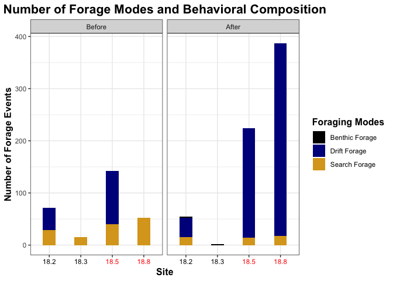

SRF VidSync 2019
================
Keane Flynn
3/18/2019

SRF 2019 VidSync Analysis
=========================

Load Libraries
--------------

``` r
library(dplyr)
```

    ## 
    ## Attaching package: 'dplyr'

    ## The following objects are masked from 'package:stats':
    ## 
    ##     filter, lag

    ## The following objects are masked from 'package:base':
    ## 
    ##     intersect, setdiff, setequal, union

``` r
library(readr)
library(tidyverse)
```

    ## ── Attaching packages ──────────────────────────────────────────────────────────────────────────────── tidyverse 1.2.1 ──

    ## ✔ ggplot2 3.0.0     ✔ purrr   0.2.5
    ## ✔ tibble  1.4.2     ✔ stringr 1.3.1
    ## ✔ tidyr   0.8.1     ✔ forcats 0.3.0

    ## ── Conflicts ─────────────────────────────────────────────────────────────────────────────────── tidyverse_conflicts() ──
    ## ✖ dplyr::filter() masks stats::filter()
    ## ✖ dplyr::lag()    masks stats::lag()

``` r
library(ggplot2)
library(lubridate)
```

    ## 
    ## Attaching package: 'lubridate'

    ## The following object is masked from 'package:base':
    ## 
    ##     date

``` r
library(geometry)
```

    ## Loading required package: magic

    ## Loading required package: abind

``` r
library(rgl)
library(hypervolume)
```

    ## Loading required package: Rcpp

``` r
library(zoo)
```

    ## 
    ## Attaching package: 'zoo'

    ## The following objects are masked from 'package:base':
    ## 
    ##     as.Date, as.Date.numeric

``` r
library(stringr)
library(data.table)
```

    ## 
    ## Attaching package: 'data.table'

    ## The following object is masked from 'package:magic':
    ## 
    ##     shift

    ## The following objects are masked from 'package:lubridate':
    ## 
    ##     hour, isoweek, mday, minute, month, quarter, second, wday,
    ##     week, yday, year

    ## The following object is masked from 'package:purrr':
    ## 
    ##     transpose

    ## The following objects are masked from 'package:dplyr':
    ## 
    ##     between, first, last

VidSync Data
============

This section of the code is devoted to importing, analyzing, and creating correlations with 3-D Videogrammetry data collected using VidSync from the summer of 2018 on Porter Creek. This is my child and I will keep it neat.

Importing Data
--------------

### Pre-Augmentation

``` r
GolfBall_VidSync_Pre <- 
  readr::read_csv(file = "Vidsync-data/PreAugmentation/Porter_BACI_GolfBall_30June2018_Part3.csv",
           skip = 2,
                    col_names = c("objects", "event", "timecode", "time", "X", "Y", "Z", "pld_error", "projection_error", "nearest_camera_distance", "screen_coordinates"),
                    col_types = "cccdddddddd") %>% 
  mutate(date = as.Date("2018-06-30")) %>% 
  mutate(BACI_date = as.Date("2018-06-29")) %>% 
  mutate(site = "18.3") %>% 
  mutate(sample_event = "Before")
```

    ## Warning in rbind(names(probs), probs_f): number of columns of result is not
    ## a multiple of vector length (arg 1)

    ## Warning: 168 parsing failures.
    ## row # A tibble: 5 x 5 col     row col   expected   actual   file                                     expected   <int> <chr> <chr>      <chr>    <chr>                                    actual 1     1 <NA>  11 columns 10 colu… 'Vidsync-data/PreAugmentation/Porter_BA… file 2     2 <NA>  11 columns 10 colu… 'Vidsync-data/PreAugmentation/Porter_BA… row 3     3 <NA>  11 columns 10 colu… 'Vidsync-data/PreAugmentation/Porter_BA… col 4     4 <NA>  11 columns 10 colu… 'Vidsync-data/PreAugmentation/Porter_BA… expected 5     5 <NA>  11 columns 10 colu… 'Vidsync-data/PreAugmentation/Porter_BA…
    ## ... ................. ... .......................................................................... ........ .......................................................................... ...... .......................................................................... .... .......................................................................... ... .......................................................................... ... .......................................................................... ........ ..........................................................................
    ## See problems(...) for more details.

``` r
HalfTire_VidSync_Pre <-
  readr::read_csv(file = "Vidsync-data/PreAugmentation/Porter_BACI_HalfTire_29June2018_Part2.csv",
           skip = 2,
                    col_names = c("objects", "event", "timecode", "time", "X", "Y", "Z", "pld_error", "projection_error", "nearest_camera_distance", "screen_coordinates"),
                    col_types = "cccdddddddd") %>% 
  mutate(date = as.Date("2018-06-29")) %>% 
  mutate(BACI_date = as.Date("2018-06-29")) %>% 
  mutate(site = "18.8") %>% 
  mutate(sample_event = "Before")
```

    ## Warning in rbind(names(probs), probs_f): number of columns of result is not
    ## a multiple of vector length (arg 1)

    ## Warning: 113 parsing failures.
    ## row # A tibble: 5 x 5 col     row col   expected   actual   file                                     expected   <int> <chr> <chr>      <chr>    <chr>                                    actual 1     1 <NA>  11 columns 10 colu… 'Vidsync-data/PreAugmentation/Porter_BA… file 2     2 <NA>  11 columns 10 colu… 'Vidsync-data/PreAugmentation/Porter_BA… row 3     3 <NA>  11 columns 10 colu… 'Vidsync-data/PreAugmentation/Porter_BA… col 4     4 <NA>  11 columns 10 colu… 'Vidsync-data/PreAugmentation/Porter_BA… expected 5     5 <NA>  11 columns 10 colu… 'Vidsync-data/PreAugmentation/Porter_BA…
    ## ... ................. ... .......................................................................... ........ .......................................................................... ...... .......................................................................... .... .......................................................................... ... .......................................................................... ... .......................................................................... ........ ..........................................................................
    ## See problems(...) for more details.

``` r
RoachRun_VidSync_Pre <-
  readr::read_csv(file = "Vidsync-data/PreAugmentation/Porter_BACI_RoachRun_29June2018_Part3.csv",
           skip = 2,
                    col_names = c("objects", "event", "timecode", "time", "X", "Y", "Z", "pld_error", "projection_error", "nearest_camera_distance", "screen_coordinates"),
                    col_types = "cccdddddddd") %>% 
  mutate(date = as.Date("2018-06-29")) %>% 
  mutate(BACI_date = as.Date("2018-06-29")) %>% 
  mutate(site = "18.5") %>% 
  mutate(sample_event = "Before")

JesusToast_VidSync_Pre <- 
  readr::read_csv(file = "Vidsync-data/PreAugmentation/Porter_BACI_JTPool_30June2018_Part1.csv",
           skip = 2,
                    col_names = c("objects", "event", "timecode", "time", "X", "Y", "Z", "pld_error", "projection_error", "nearest_camera_distance", "screen_coordinates"),
                    col_types = "cccdddddddd") %>% 
  mutate(date = as.Date("2018-06-30")) %>% 
  mutate(BACI_date = as.Date("2018-06-29")) %>% 
  mutate(site = "18.2") %>% 
  mutate(sample_event = "Before")
```

    ## Warning in rbind(names(probs), probs_f): number of columns of result is not
    ## a multiple of vector length (arg 1)

    ## Warning: 113 parsing failures.
    ## row # A tibble: 5 x 5 col     row col       expected actual                   file                   expected   <int> <chr>     <chr>    <chr>                    <chr>                  actual 1     1 screen_c… a double "LC: screen={499.007995… 'Vidsync-data/PreAugm… file 2     2 screen_c… a double "RC: screen={246.945831… 'Vidsync-data/PreAugm… row 3     3 screen_c… a double "LC: screen={448.637695… 'Vidsync-data/PreAugm… col 4     4 screen_c… a double "LC: screen={470.562622… 'Vidsync-data/PreAugm… expected 5     5 screen_c… a double "LC: screen={470.971984… 'Vidsync-data/PreAugm…
    ## ... ................. ... .......................................................................... ........ .......................................................................... ...... .......................................................................... .... .......................................................................... ... .......................................................................... ... .......................................................................... ........ ..........................................................................
    ## See problems(...) for more details.

### Post-Augmentation

``` r
GolfBall_VidSync_Post <-
  readr::read_csv(file = "Vidsync-data/PostAugmentation/Porter_BACI_Golfball_6July2018_Part1.csv",
           skip = 2,
                    col_names = c("objects", "event", "timecode", "time", "X", "Y", "Z", "pld_error", "projection_error", "nearest_camera_distance", "screen_coordinates"),
                    col_types = "cccdddddddd") %>%
  mutate(date = as.Date("2018-07-06")) %>% 
  mutate(BACI_date = as.Date("2018-07-05")) %>% 
  mutate(site = "18.3") %>% 
  mutate(sample_event = "After")
```

    ## Warning in rbind(names(probs), probs_f): number of columns of result is not
    ## a multiple of vector length (arg 1)

    ## Warning: 107 parsing failures.
    ## row # A tibble: 5 x 5 col     row col   expected   actual   file                                     expected   <int> <chr> <chr>      <chr>    <chr>                                    actual 1     1 <NA>  11 columns 10 colu… 'Vidsync-data/PostAugmentation/Porter_B… file 2     2 <NA>  11 columns 10 colu… 'Vidsync-data/PostAugmentation/Porter_B… row 3     3 <NA>  11 columns 10 colu… 'Vidsync-data/PostAugmentation/Porter_B… col 4     4 <NA>  11 columns 10 colu… 'Vidsync-data/PostAugmentation/Porter_B… expected 5     5 <NA>  11 columns 10 colu… 'Vidsync-data/PostAugmentation/Porter_B…
    ## ... ................. ... .......................................................................... ........ .......................................................................... ...... .......................................................................... .... .......................................................................... ... .......................................................................... ... .......................................................................... ........ ..........................................................................
    ## See problems(...) for more details.

``` r
RoachRun_VidSync_Post <-
  readr::read_csv(file = "Vidsync-data/PostAugmentation/Porter_BACI_RoachRun_5July2018_Part1.csv",
           skip = 2,
                    col_names = c("objects", "event", "timecode", "time", "X", "Y", "Z", "pld_error", "projection_error", "nearest_camera_distance", "screen_coordinates"),
                    col_types = "cccdddddddd") %>% 
  mutate(date = as.Date("2018-07-05")) %>% 
  mutate(BACI_date = as.Date("2018-07-05")) %>% 
  mutate(site = "18.5") %>% 
  mutate(sample_event = "After")
```

    ## Warning in rbind(names(probs), probs_f): number of columns of result is not
    ## a multiple of vector length (arg 1)

    ## Warning: 475 parsing failures.
    ## row # A tibble: 5 x 5 col     row col   expected   actual   file                                     expected   <int> <chr> <chr>      <chr>    <chr>                                    actual 1     1 <NA>  11 columns 10 colu… 'Vidsync-data/PostAugmentation/Porter_B… file 2     2 <NA>  11 columns 10 colu… 'Vidsync-data/PostAugmentation/Porter_B… row 3     3 <NA>  11 columns 10 colu… 'Vidsync-data/PostAugmentation/Porter_B… col 4     4 <NA>  11 columns 10 colu… 'Vidsync-data/PostAugmentation/Porter_B… expected 5     5 <NA>  11 columns 10 colu… 'Vidsync-data/PostAugmentation/Porter_B…
    ## ... ................. ... .......................................................................... ........ .......................................................................... ...... .......................................................................... .... .......................................................................... ... .......................................................................... ... .......................................................................... ........ ..........................................................................
    ## See problems(...) for more details.

``` r
HalfTire_VidSync_Post <- 
  readr::read_csv(file = "Vidsync-data/PostAugmentation/Porter_BACI_HalfTire_5July2018_Part3.csv",
           skip = 2,
                    col_names = c("objects", "event", "timecode", "time", "X", "Y", "Z", "pld_error", "projection_error", "nearest_camera_distance", "screen_coordinates"),
                    col_types = "cccdddddddd") %>% 
  mutate(date = as.Date("2018-07-05")) %>% 
  mutate(BACI_date = as.Date("2018-07-05")) %>% 
  mutate(site = "18.8") %>% 
  mutate(sample_event = "After")
```

    ## Warning in rbind(names(probs), probs_f): number of columns of result is not
    ## a multiple of vector length (arg 1)

    ## Warning: 692 parsing failures.
    ## row # A tibble: 5 x 5 col     row col   expected   actual   file                                     expected   <int> <chr> <chr>      <chr>    <chr>                                    actual 1     1 <NA>  11 columns 10 colu… 'Vidsync-data/PostAugmentation/Porter_B… file 2     2 <NA>  11 columns 10 colu… 'Vidsync-data/PostAugmentation/Porter_B… row 3     3 <NA>  11 columns 10 colu… 'Vidsync-data/PostAugmentation/Porter_B… col 4     4 <NA>  11 columns 10 colu… 'Vidsync-data/PostAugmentation/Porter_B… expected 5     5 <NA>  11 columns 10 colu… 'Vidsync-data/PostAugmentation/Porter_B…
    ## ... ................. ... .......................................................................... ........ .......................................................................... ...... .......................................................................... .... .......................................................................... ... .......................................................................... ... .......................................................................... ........ ..........................................................................
    ## See problems(...) for more details.

``` r
JesusToast_VidSync_Post <-
  readr::read_csv(file = "Vidsync-data/PostAugmentation/Porter_BACI_JesusToast_6July2018_Part1.csv",
           skip = 2,
                    col_names = c("objects", "event", "timecode", "time", "X", "Y", "Z", "pld_error", "projection_error", "nearest_camera_distance", "screen_coordinates"),
                    col_types = "cccdddddddd") %>% 
  mutate(date = as.Date("2018-07-06")) %>% 
  mutate(BACI_date = as.Date("2018-07-05")) %>% 
  mutate(site = "18.2") %>% 
  mutate(sample_event = "After")
```

    ## Warning in rbind(names(probs), probs_f): number of columns of result is not
    ## a multiple of vector length (arg 1)

    ## Warning: 145 parsing failures.
    ## row # A tibble: 5 x 5 col     row col   expected   actual   file                                     expected   <int> <chr> <chr>      <chr>    <chr>                                    actual 1     1 <NA>  11 columns 10 colu… 'Vidsync-data/PostAugmentation/Porter_B… file 2     2 <NA>  11 columns 10 colu… 'Vidsync-data/PostAugmentation/Porter_B… row 3     3 <NA>  11 columns 10 colu… 'Vidsync-data/PostAugmentation/Porter_B… col 4     4 <NA>  11 columns 10 colu… 'Vidsync-data/PostAugmentation/Porter_B… expected 5     5 <NA>  11 columns 10 colu… 'Vidsync-data/PostAugmentation/Porter_B…
    ## ... ................. ... .......................................................................... ........ .......................................................................... ...... .......................................................................... .... .......................................................................... ... .......................................................................... ... .......................................................................... ........ ..........................................................................
    ## See problems(...) for more details.

Test Measurement Accuracy
-------------------------

``` r
Vidsync_TestMeasurements <- 
  readr::read_csv(file = "Vidsync-data/Test-Data/Vidsync Test Measurments - Sheet1.csv") %>%
  filter(Stream == "Porter") %>%
  mutate(Percent_Accuracy = (1 - (abs(Test_measured_mm - Test_target_mm)/Test_target_mm))*100) %>%
  select(Site, Event, Test_Type, Percent_Accuracy)
```

    ## Parsed with column specification:
    ## cols(
    ##   Date = col_date(format = ""),
    ##   Stream = col_character(),
    ##   Site = col_character(),
    ##   Event = col_character(),
    ##   Video_num = col_character(),
    ##   Test_num = col_integer(),
    ##   Test_target_mm = col_integer(),
    ##   Test_measured_mm = col_double(),
    ##   Test_Type = col_character(),
    ##   Notes = col_character()
    ## )

``` r
Vidsync_TestMeasurements
```

    ## # A tibble: 40 x 4
    ##    Site     Event  Test_Type    Percent_Accuracy
    ##    <chr>    <chr>  <chr>                   <dbl>
    ##  1 RoachRun Before horizontal_1             99.8
    ##  2 RoachRun Before horizontal_2             99.6
    ##  3 RoachRun Before vertical_1               99.6
    ##  4 RoachRun Before vertical_2               98.9
    ##  5 RoachRun Before depth                    96.6
    ##  6 RoachRun After  horizontal_1            100  
    ##  7 RoachRun After  horizontal_2             99.9
    ##  8 RoachRun After  vertical_1               99.6
    ##  9 RoachRun After  vertical_2               99.7
    ## 10 RoachRun After  depth                    95  
    ## # ... with 30 more rows

``` r
ggplot(Vidsync_TestMeasurements, aes(Test_Type, Percent_Accuracy)) + 
  geom_col(width = 0.4, fill = "white", color = "black") + 
  facet_grid(Site ~ Event) +
  xlab("Test Type") +
  ylab("Percent Accuracy") 
```


Analyzation
-----------

We will be analyzing functions such as NND, distance travelled per time (cm/s), distance to forage attempt (DFA), proportion of forage types, volume occupied, overlap in forage volumes, etc.

### Nearest Neighbor Distance (NND)

This will use the three dimensional distance formula to look at nearest neighbor at any given time during the subsample rather than the average centroid point.

#### Pre-Augmentation

``` r
nnd_GolfBall_Pre <- GolfBall_VidSync_Pre %>%
  ungroup() %>%
  filter(grepl("^Subsample.*", objects)) %>%
  filter(!grepl("^Length.*", event)) %>%
  filter(!grepl("^Attack.*", event)) %>%
  filter(!grepl("^Nip.*", event)) %>%
  mutate(subsample = as.numeric(str_extract(objects, "\\d"))) %>%
  mutate(index = as.numeric(str_extract(objects, "\\h\\d{1,2}"))) %>%
  mutate(species = str_extract(objects, "Omykiss|Okisutch")) %>%
  arrange(time) %>%
  group_by(time) %>%
  mutate(distance_travelled_X_cm = X - lag(X, default = first(X))) %>%
  mutate(distance_travelled_Y_cm = Y - lag(Y, default = first(Y))) %>%
  mutate(distance_travelled_Z_cm = Z - lag(Z, default = first(Z))) %>%
  mutate(nnd = sqrt((distance_travelled_X_cm)^2
                                        + (distance_travelled_Y_cm)^2
                                        + (distance_travelled_Z_cm)^2)) %>%
  group_by(time) %>%
  filter(!nnd == 0) %>%
  filter(nnd == min(nnd)) %>%
  ungroup() %>%
  group_by(subsample, index) %>%
  summarise(mean_nnd = mean(nnd), median_nnd = median(nnd)) %>%
  mutate(date = as.Date("2018-06-30")) %>%
  mutate(BACI_date = as.Date("2018-06-29")) %>%
  mutate(site = "18.3") %>%
  mutate(sample_event = "Before") 

nnd_HalfTire_Pre <- HalfTire_VidSync_Pre %>%
  ungroup() %>%
  filter(grepl("^Subsample.*", objects)) %>%
  filter(!grepl("^Length.*", event)) %>%
  filter(!grepl("^Attack.*", event)) %>%
  filter(!grepl("^Nip.*", event)) %>%
  mutate(subsample = as.numeric(str_extract(objects, "\\d"))) %>%
  mutate(index = as.numeric(str_extract(objects, "\\h\\d{1,2}"))) %>%
  mutate(species = str_extract(objects, "Omykiss|Okisutch")) %>%
  arrange(time) %>%
  group_by(time) %>%
  mutate(distance_travelled_X_cm = X - lag(X, default = first(X))) %>%
  mutate(distance_travelled_Y_cm = Y - lag(Y, default = first(Y))) %>%
  mutate(distance_travelled_Z_cm = Z - lag(Z, default = first(Z))) %>%
  mutate(nnd = sqrt((distance_travelled_X_cm)^2
                                        + (distance_travelled_Y_cm)^2
                                        + (distance_travelled_Z_cm)^2)) %>%
  group_by(time) %>%
  filter(!nnd == 0) %>%
  filter(nnd == min(nnd)) %>%
  ungroup() %>%
  group_by(subsample, index) %>%
  summarise(mean_nnd = mean(nnd), median_nnd = median(nnd)) %>%
  mutate(date = as.Date("2018-06-29")) %>%
  mutate(BACI_date = as.Date("2018-06-29")) %>%
  mutate(site = "18.8") %>%
  mutate(sample_event = "Before")   

nnd_RoachRun_Pre <- RoachRun_VidSync_Pre %>%
  ungroup() %>%
  filter(grepl("^Subsample.*", objects)) %>%
  filter(!grepl("^Length.*", event)) %>%
  filter(!grepl("^Attack.*", event)) %>%
  filter(!grepl("^Nip.*", event)) %>%
  mutate(subsample = as.numeric(str_extract(objects, "\\d"))) %>%
  mutate(index = as.numeric(str_extract(objects, "\\h\\d{1,2}"))) %>%
  mutate(species = str_extract(objects, "Omykiss|Okisutch")) %>%
  arrange(time) %>%
  group_by(time) %>%
  mutate(distance_travelled_X_cm = X - lag(X, default = first(X))) %>%
  mutate(distance_travelled_Y_cm = Y - lag(Y, default = first(Y))) %>%
  mutate(distance_travelled_Z_cm = Z - lag(Z, default = first(Z))) %>%
  mutate(nnd = sqrt((distance_travelled_X_cm)^2
                                        + (distance_travelled_Y_cm)^2
                                        + (distance_travelled_Z_cm)^2)) %>%
  group_by(time) %>%
  filter(!nnd == 0) %>%
  filter(nnd == min(nnd)) %>%
  ungroup() %>%
  group_by(subsample, index) %>%
  summarise(mean_nnd = mean(nnd), median_nnd = median(nnd)) %>%
  mutate(date = as.Date("2018-06-29")) %>%
  mutate(BACI_date = as.Date("2018-06-29")) %>%
  mutate(site = "18.5") %>%
 mutate(sample_event = "Before")   

nnd_JesusToast_Pre <- JesusToast_VidSync_Pre %>%
  ungroup() %>%
  filter(grepl("^Subsample.*", objects)) %>%
  filter(!grepl("^Length.*", event)) %>%
  filter(!grepl("^Attack.*", event)) %>%
  filter(!grepl("^Nip.*", event)) %>%
  mutate(subsample = as.numeric(str_extract(objects, "\\d"))) %>%
  mutate(index = as.numeric(str_extract(objects, "\\h\\d{1,2}"))) %>%
  mutate(species = str_extract(objects, "Omykiss|Okisutch")) %>%
  arrange(time) %>%
  group_by(time) %>%
  mutate(distance_travelled_X_cm = X - lag(X, default = first(X))) %>%
  mutate(distance_travelled_Y_cm = Y - lag(Y, default = first(Y))) %>%
  mutate(distance_travelled_Z_cm = Z - lag(Z, default = first(Z))) %>%
  mutate(nnd = sqrt((distance_travelled_X_cm)^2
                                        + (distance_travelled_Y_cm)^2
                                        + (distance_travelled_Z_cm)^2)) %>%
  group_by(time) %>%
  filter(!nnd == 0) %>%
  filter(nnd == min(nnd)) %>%
  ungroup() %>%
  group_by(subsample, index) %>%
  summarise(mean_nnd = mean(nnd), median_nnd = median(nnd)) %>%
  mutate(date = as.Date("2018-06-30")) %>%
  mutate(BACI_date = as.Date("2018-06-29")) %>%
  mutate(site = "18.2") %>%
  mutate(sample_event = "Before")  
```

#### Post-Augmentation

``` r
nnd_GolfBall_Post <- GolfBall_VidSync_Post %>%
  ungroup() %>%
  filter(grepl("^Subsample.*", objects)) %>%
  filter(!grepl("^Length.*", event)) %>%
  filter(!grepl("^Attack.*", event)) %>%
  filter(!grepl("^Nip.*", event)) %>%
  mutate(subsample = as.numeric(str_extract(objects, "\\d"))) %>%
  mutate(index = as.numeric(str_extract(objects, "\\h\\d{1,2}"))) %>%
  mutate(species = str_extract(objects, "Omykiss|Okisutch")) %>%
  arrange(time) %>%
  group_by(time) %>%
  mutate(distance_travelled_X_cm = X - lag(X, default = first(X))) %>%
  mutate(distance_travelled_Y_cm = Y - lag(Y, default = first(Y))) %>%
  mutate(distance_travelled_Z_cm = Z - lag(Z, default = first(Z))) %>%
  mutate(nnd = sqrt((distance_travelled_X_cm)^2
                                        + (distance_travelled_Y_cm)^2
                                        + (distance_travelled_Z_cm)^2)) %>%
  group_by(time) %>%
  filter(!nnd == 0) %>%
  filter(nnd == min(nnd)) %>%
  ungroup() %>%
  group_by(subsample, index) %>%
  summarise(mean_nnd = mean(nnd), median_nnd = median(nnd)) %>%
  mutate(date = as.Date("2018-07-06")) %>%
  mutate(BACI_date = as.Date("2018-07-05")) %>%
  mutate(site = "18.3") %>%
  mutate(sample_event = "After") 

nnd_HalfTire_Post <- HalfTire_VidSync_Post %>%
  ungroup() %>%
  filter(grepl("^Subsample.*", objects)) %>%
  filter(!grepl("^Length.*", event)) %>%
  filter(!grepl("^Attack.*", event)) %>%
  filter(!grepl("^Nip.*", event)) %>%
  mutate(subsample = as.numeric(str_extract(objects, "\\d"))) %>%
  mutate(index = as.numeric(str_extract(objects, "\\h\\d{1,2}"))) %>%
  mutate(species = str_extract(objects, "Omykiss|Okisutch")) %>%
  arrange(time) %>%
  group_by(time) %>%
  mutate(distance_travelled_X_cm = X - lag(X, default = first(X))) %>%
  mutate(distance_travelled_Y_cm = Y - lag(Y, default = first(Y))) %>%
  mutate(distance_travelled_Z_cm = Z - lag(Z, default = first(Z))) %>%
  mutate(nnd = sqrt((distance_travelled_X_cm)^2
                                        + (distance_travelled_Y_cm)^2
                                        + (distance_travelled_Z_cm)^2)) %>%
  group_by(time) %>%
  filter(!nnd == 0) %>%
  filter(nnd == min(nnd)) %>%
  ungroup() %>%
  group_by(subsample, index) %>%
  summarise(mean_nnd = mean(nnd), median_nnd = median(nnd)) %>%
  mutate(date = as.Date("2018-07-05")) %>%
  mutate(BACI_date = as.Date("2018-07-05")) %>%
  mutate(site = "18.8") %>%
  mutate(sample_event = "After")   

nnd_RoachRun_Post <- RoachRun_VidSync_Post %>%
  ungroup() %>%
  filter(grepl("^Subsample.*", objects)) %>%
  filter(!grepl("^Length.*", event)) %>%
  filter(!grepl("^Attack.*", event)) %>%
  filter(!grepl("^Nip.*", event)) %>%
  mutate(subsample = as.numeric(str_extract(objects, "\\d"))) %>%
  mutate(index = as.numeric(str_extract(objects, "\\h\\d{1,2}"))) %>%
  mutate(species = str_extract(objects, "Omykiss|Okisutch")) %>%
  arrange(time) %>%
  group_by(time) %>%
  mutate(distance_travelled_X_cm = X - lag(X, default = first(X))) %>%
  mutate(distance_travelled_Y_cm = Y - lag(Y, default = first(Y))) %>%
  mutate(distance_travelled_Z_cm = Z - lag(Z, default = first(Z))) %>%
  mutate(nnd = sqrt((distance_travelled_X_cm)^2
                                        + (distance_travelled_Y_cm)^2
                                        + (distance_travelled_Z_cm)^2)) %>%
  group_by(time) %>%
  filter(!nnd == 0) %>%
  filter(nnd == min(nnd)) %>%
  ungroup() %>%
  group_by(subsample, index) %>%
  summarise(mean_nnd = mean(nnd), median_nnd = median(nnd)) %>%
  mutate(date = as.Date("2018-07-05")) %>%
  mutate(BACI_date = as.Date("2018-07-05")) %>%
  mutate(site = "18.5") %>%
  mutate(sample_event = "After")  

nnd_JesusToast_Post <- JesusToast_VidSync_Post %>%
  ungroup() %>%
  filter(grepl("^Subsample.*", objects)) %>%
  filter(!grepl("^Length.*", event)) %>%
  filter(!grepl("^Attack.*", event)) %>%
  filter(!grepl("^Nip.*", event)) %>%
  mutate(subsample = as.numeric(str_extract(objects, "\\d"))) %>%
  mutate(index = as.numeric(str_extract(objects, "\\h\\d{1,2}"))) %>%
  mutate(species = str_extract(objects, "Omykiss|Okisutch")) %>%
  arrange(time) %>%
  group_by(time) %>%
  mutate(distance_travelled_X_cm = X - lag(X, default = first(X))) %>%
  mutate(distance_travelled_Y_cm = Y - lag(Y, default = first(Y))) %>%
  mutate(distance_travelled_Z_cm = Z - lag(Z, default = first(Z))) %>%
  mutate(nnd = sqrt((distance_travelled_X_cm)^2
                                        + (distance_travelled_Y_cm)^2
                                        + (distance_travelled_Z_cm)^2)) %>%
  group_by(time) %>%
  filter(!nnd == 0) %>%
  filter(nnd == min(nnd)) %>%
  ungroup() %>%
  group_by(subsample, index) %>%
  summarise(mean_nnd = mean(nnd), median_nnd = median(nnd)) %>%
  mutate(date = as.Date("2018-07-06")) %>%
  mutate(BACI_date = as.Date("2018-07-05")) %>%
  mutate(site = "18.2") %>%
  mutate(sample_event = "After") 

nnd_data <- 
  bind_rows(nnd_RoachRun_Pre, nnd_RoachRun_Post, nnd_GolfBall_Pre, nnd_GolfBall_Post, nnd_HalfTire_Pre, nnd_HalfTire_Post, nnd_JesusToast_Pre, nnd_JesusToast_Post) %>%
  select(date, BACI_date, sample_event, site, subsample, index, mean_nnd, median_nnd)
nnd_data
```

    ## # A tibble: 77 x 8
    ## # Groups:   subsample [6]
    ##    date       BACI_date  sample_event site  subsample index mean_nnd
    ##    <date>     <date>     <chr>        <chr>     <dbl> <dbl>    <dbl>
    ##  1 2018-06-29 2018-06-29 Before       18.5          1     1   0.0725
    ##  2 2018-06-29 2018-06-29 Before       18.5          1     2  39.1   
    ##  3 2018-06-29 2018-06-29 Before       18.5          2     6  63.9   
    ##  4 2018-06-29 2018-06-29 Before       18.5          3     9  43.2   
    ##  5 2018-06-29 2018-06-29 Before       18.5          3    10  69.5   
    ##  6 2018-06-29 2018-06-29 Before       18.5          4    12  84.6   
    ##  7 2018-06-29 2018-06-29 Before       18.5          5    15  37.8   
    ##  8 2018-06-29 2018-06-29 Before       18.5          6    18  41.4   
    ##  9 2018-06-29 2018-06-29 Before       18.5          6    19  32.0   
    ## 10 2018-07-05 2018-07-05 After        18.5          1     3   3.77  
    ## # ... with 67 more rows, and 1 more variable: median_nnd <dbl>

### Distance Travelled per Time (cm/s)

This will use the three dimensional distance formula divided by time.

#### Pre-Augmentation

``` r
GolfBall_DistPerTime_Pre <- GolfBall_VidSync_Pre %>%
  arrange(objects, time) %>%
  filter(!grepl("Surface_Shots.*", objects)) %>%
  filter(!grepl("^Length.*", event)) %>%
  mutate(subsample = as.numeric(str_extract(objects, "\\d"))) %>%
  mutate(index = as.numeric(str_extract(objects, "\\h\\d{1,2}"))) %>%
  mutate(species = str_extract(objects, "Omykiss|Okisutch")) %>%
  mutate(distance_travelled_X_cm = X - lag(X, default = first(X))) %>%
  mutate(distance_travelled_Y_cm = Y - lag(Y, default = first(Y))) %>%
  mutate(distance_travelled_Z_cm = Z - lag(Z, default = first(Z))) %>%
  mutate(fish_distance_travelled_cm = sqrt((distance_travelled_X_cm)^2
                                        + (distance_travelled_Y_cm)^2
                                        + (distance_travelled_Z_cm)^2)) %>%
  mutate(date = as.Date("2018-06-30")) %>%
  mutate(BACI_date = as.Date("2018-06-29")) %>%
  mutate(site = "18.3") %>%
  mutate(sample_event = "Before")  %>%
  group_by(index) %>%
  mutate(distance_cm_per_sec = fish_distance_travelled_cm /(time - lag(time, default = first(time)))) %>%
  filter(!distance_cm_per_sec == Inf) %>%
  mutate(DistPerTime_Median = median(fish_distance_travelled_cm)) %>%
  mutate(DistPerTime_Mean = mean(fish_distance_travelled_cm)) %>%
  dplyr::select(date, BACI_date, sample_event, site, species, subsample, index, DistPerTime_Median, DistPerTime_Mean) %>%
  distinct() %>%
  arrange(as.numeric(index))


HalfTire_DistPerTime_Pre <- HalfTire_VidSync_Pre %>%
  arrange(objects, time) %>%
  filter(!grepl("Surface_Shots.*", objects)) %>%
  filter(!grepl("^Length.*", event)) %>%
  mutate(subsample = as.numeric(str_extract(objects, "\\d"))) %>%
  mutate(index = as.numeric(str_extract(objects, "\\h\\d{1,2}"))) %>%
  mutate(species = str_extract(objects, "Omykiss|Okisutch")) %>%
  mutate(distance_travelled_X_cm = X - lag(X, default = first(X))) %>%
  mutate(distance_travelled_Y_cm = Y - lag(Y, default = first(Y))) %>%
  mutate(distance_travelled_Z_cm = Z - lag(Z, default = first(Z))) %>%
  mutate(fish_distance_travelled_cm = sqrt((distance_travelled_X_cm)^2
                                        + (distance_travelled_Y_cm)^2
                                        + (distance_travelled_Z_cm)^2)) %>%
  mutate(date = as.Date("2018-06-29")) %>%
  mutate(BACI_date = as.Date("2018-06-29")) %>%
  mutate(site = "18.8") %>%
  mutate(sample_event = "Before")  %>%
  group_by(index) %>%
  mutate(distance_cm_per_sec = fish_distance_travelled_cm /(time - lag(time, default = first(time)))) %>%
  filter(!distance_cm_per_sec == Inf) %>%
  mutate(DistPerTime_Median = median(fish_distance_travelled_cm)) %>%
  mutate(DistPerTime_Mean = mean(fish_distance_travelled_cm)) %>%
 dplyr::select(date, BACI_date, sample_event, site, species, subsample, index, DistPerTime_Median, DistPerTime_Mean) %>%
  distinct() %>%
  arrange(as.numeric(index))
  

RoachRun_DistPerTime_Pre <- RoachRun_VidSync_Pre %>%
  arrange(objects, time) %>%
  filter(!grepl("Surface_Shots.*", objects)) %>%
  filter(!grepl("^Length.*", event)) %>%
  mutate(subsample = as.numeric(str_extract(objects, "\\d"))) %>%
  mutate(index = as.numeric(str_extract(objects, "\\h\\d{1,2}"))) %>%
  mutate(species = str_extract(objects, "Omykiss|Okisutch")) %>%
  mutate(distance_travelled_X_cm = X - lag(X, default = first(X))) %>%
  mutate(distance_travelled_Y_cm = Y - lag(Y, default = first(Y))) %>%
  mutate(distance_travelled_Z_cm = Z - lag(Z, default = first(Z))) %>%
  mutate(fish_distance_travelled_cm = sqrt((distance_travelled_X_cm)^2
                                        + (distance_travelled_Y_cm)^2
                                        + (distance_travelled_Z_cm)^2)) %>%
  mutate(date = as.Date("2018-06-29")) %>%
  mutate(BACI_date = as.Date("2018-06-29")) %>%
  mutate(site = "18.5") %>%
  mutate(sample_event = "Before")  %>%
  group_by(index) %>%
  mutate(distance_cm_per_sec = fish_distance_travelled_cm /(time - lag(time, default = first(time)))) %>%
  filter(!distance_cm_per_sec == Inf) %>%
  mutate(DistPerTime_Median = median(fish_distance_travelled_cm)) %>%
  mutate(DistPerTime_Mean = mean(fish_distance_travelled_cm)) %>%
  dplyr::select(date, BACI_date, sample_event, site, species, subsample, index, DistPerTime_Median, DistPerTime_Mean) %>% 
  distinct() %>%
  arrange(as.numeric(index))

JesusToast_DistPerTime_Pre <- JesusToast_VidSync_Pre %>%
  arrange(objects, time) %>%
  filter(!grepl("Surface_Shots.*", objects)) %>%
  filter(!grepl("^Length.*", event)) %>%
  mutate(subsample = as.numeric(str_extract(objects, "\\d"))) %>%
  mutate(index = as.numeric(str_extract(objects, "\\h\\d{1,2}"))) %>%
  mutate(species = str_extract(objects, "Omykiss|Okisutch")) %>%
  mutate(distance_travelled_X_cm = X - lag(X, default = first(X))) %>%
  mutate(distance_travelled_Y_cm = Y - lag(Y, default = first(Y))) %>%
  mutate(distance_travelled_Z_cm = Z - lag(Z, default = first(Z))) %>%
  mutate(fish_distance_travelled_cm = sqrt((distance_travelled_X_cm)^2
                                        + (distance_travelled_Y_cm)^2
                                        + (distance_travelled_Z_cm)^2)) %>%
  mutate(date = as.Date("2018-06-30")) %>%
  mutate(BACI_date = as.Date("2018-06-29")) %>%
  mutate(site = "18.2") %>%
  mutate(sample_event = "Before")  %>%
  group_by(index) %>%
  mutate(distance_cm_per_sec = fish_distance_travelled_cm /(time - lag(time, default = first(time)))) %>%
  filter(!distance_cm_per_sec == Inf) %>%
  mutate(DistPerTime_Median = median(fish_distance_travelled_cm)) %>%
  mutate(DistPerTime_Mean = mean(fish_distance_travelled_cm)) %>%
  dplyr::select(date, BACI_date, sample_event, site, species, subsample, index, DistPerTime_Median, DistPerTime_Mean) %>%
  distinct() %>%
  arrange(as.numeric(index))
```

#### Post-Augmentation

``` r
GolfBall_DistPerTime_Post <- GolfBall_VidSync_Post %>%
  arrange(objects, time) %>%
  filter(!grepl("Surface_Shots.*", objects)) %>%
  filter(!grepl("^Length.*", event)) %>%
  mutate(subsample = as.numeric(str_extract(objects, "\\d"))) %>%
  mutate(index = as.numeric(str_extract(objects, "\\h\\d{1,2}"))) %>%
  mutate(species = str_extract(objects, "Omykiss|Okisutch")) %>%
  mutate(distance_travelled_X_cm = X - lag(X, default = first(X))) %>%
  mutate(distance_travelled_Y_cm = Y - lag(Y, default = first(Y))) %>%
  mutate(distance_travelled_Z_cm = Z - lag(Z, default = first(Z))) %>%
  mutate(fish_distance_travelled_cm = sqrt((distance_travelled_X_cm)^2
                                        + (distance_travelled_Y_cm)^2
                                        + (distance_travelled_Z_cm)^2)) %>%
  mutate(date = as.Date("2018-07-06")) %>%
  mutate(BACI_date = as.Date("2018-07-05")) %>%
  mutate(site = "18.3") %>%
  mutate(sample_event = "After")  %>%
  group_by(index) %>%
  mutate(distance_cm_per_sec = fish_distance_travelled_cm /(time - lag(time, default = first(time)))) %>%
  filter(!distance_cm_per_sec == Inf) %>%
  mutate(DistPerTime_Median = median(fish_distance_travelled_cm)) %>%
  mutate(DistPerTime_Mean = mean(fish_distance_travelled_cm)) %>%
  dplyr::select(date, BACI_date, sample_event, site, species, subsample, index, DistPerTime_Median, DistPerTime_Mean) %>%
  distinct() %>%
  arrange(as.numeric(index))


RoachRun_DistPerTime_Post <- RoachRun_VidSync_Post %>%
  arrange(objects, time) %>% 
  filter(!grepl("Surface_Shots.*", objects)) %>%
  filter(!grepl("^Length.*", event)) %>%
  mutate(subsample = as.numeric(str_extract(objects, "\\d"))) %>%
  mutate(index = as.numeric(str_extract(objects, "\\h\\d{1,2}"))) %>%
  mutate(species = str_extract(objects, "Omykiss|Okisutch")) %>%
  mutate(distance_travelled_X_cm = X - lag(X, default = first(X))) %>%
  mutate(distance_travelled_Y_cm = Y - lag(Y, default = first(Y))) %>%
  mutate(distance_travelled_Z_cm = Z - lag(Z, default = first(Z))) %>%
  mutate(fish_distance_travelled_cm = sqrt((distance_travelled_X_cm)^2
                                        + (distance_travelled_Y_cm)^2
                                        + (distance_travelled_Z_cm)^2)) %>%
  mutate(date = as.Date("2018-07-05")) %>%
  mutate(BACI_date = as.Date("2018-07-05")) %>%
  mutate(site = "18.5") %>%
  mutate(sample_event = "After")  %>%
  group_by(index) %>%
  mutate(distance_cm_per_sec = fish_distance_travelled_cm /(time - lag(time, default = first(time)))) %>%
  filter(!distance_cm_per_sec == Inf) %>%
  mutate(DistPerTime_Median = median(fish_distance_travelled_cm)) %>%
  mutate(DistPerTime_Mean = mean(fish_distance_travelled_cm)) %>%
  dplyr::select(date, BACI_date, sample_event, site, species, subsample, index, DistPerTime_Median, DistPerTime_Mean) %>%
  distinct() %>%
  arrange(as.numeric(index))

HalfTire_DistPerTime_Post <- HalfTire_VidSync_Post %>%
  arrange(objects, time) %>% 
  filter(!grepl("Surface_Shots.*", objects)) %>%
  filter(!grepl("^Length.*", event)) %>%
  mutate(subsample = as.numeric(str_extract(objects, "\\d"))) %>%
  mutate(index = as.numeric(str_extract(objects, "\\h\\d{1,2}"))) %>%
  mutate(species = str_extract(objects, "Omykiss|Okisutch")) %>%
  mutate(distance_travelled_X_cm = X - lag(X, default = first(X))) %>%
  mutate(distance_travelled_Y_cm = Y - lag(Y, default = first(Y))) %>%
  mutate(distance_travelled_Z_cm = Z - lag(Z, default = first(Z))) %>%
  mutate(fish_distance_travelled_cm = sqrt((distance_travelled_X_cm)^2
                                        + (distance_travelled_Y_cm)^2
                                        + (distance_travelled_Z_cm)^2)) %>%
  mutate(date = as.Date("2018-07-05")) %>%
  mutate(BACI_date = as.Date("2018-07-05")) %>%
  mutate(site = "18.8") %>%
  mutate(sample_event = "After")  %>%
  group_by(index) %>%
  mutate(distance_cm_per_sec = fish_distance_travelled_cm /(time - lag(time, default = first(time)))) %>%
  filter(!distance_cm_per_sec == Inf) %>%
  mutate(DistPerTime_Median = median(fish_distance_travelled_cm)) %>%
  mutate(DistPerTime_Mean = mean(fish_distance_travelled_cm)) %>%
  dplyr::select(date, BACI_date, sample_event, site, species, subsample, index, DistPerTime_Median, DistPerTime_Mean) %>%
  distinct() %>%
  arrange(as.numeric(index))

JesusToast_DistPerTime_Post <- JesusToast_VidSync_Post %>%
  arrange(objects, time) %>%
  filter(!grepl("Surface_Shots.*", objects)) %>%
  filter(!grepl("^Length.*", event)) %>%
  mutate(subsample = as.numeric(str_extract(objects, "\\d"))) %>%
  mutate(index = as.numeric(str_extract(objects, "\\h\\d{1,2}"))) %>%
  mutate(species = str_extract(objects, "Omykiss|Okisutch")) %>%
  mutate(distance_travelled_X_cm = X - lag(X, default = first(X))) %>%
  mutate(distance_travelled_Y_cm = Y - lag(Y, default = first(Y))) %>%
  mutate(distance_travelled_Z_cm = Z - lag(Z, default = first(Z))) %>%
  mutate(fish_distance_travelled_cm = sqrt((distance_travelled_X_cm)^2
                                        + (distance_travelled_Y_cm)^2
                                        + (distance_travelled_Z_cm)^2)) %>%
  mutate(date = as.Date("2018-07-06")) %>%
  mutate(BACI_date = as.Date("2018-07-05")) %>%
  mutate(site = "18.2") %>%
  mutate(sample_event = "After")  %>%
  group_by(index) %>%
  mutate(distance_cm_per_sec = fish_distance_travelled_cm /(time - lag(time, default = first(time)))) %>%
  filter(!distance_cm_per_sec == Inf) %>%
  mutate(DistPerTime_Median = median(fish_distance_travelled_cm)) %>%
  mutate(DistPerTime_Mean = mean(fish_distance_travelled_cm)) %>%
  dplyr::select(date, BACI_date, sample_event, site, species, subsample, index, DistPerTime_Median, DistPerTime_Mean) %>%
  distinct() %>%
  arrange(as.numeric(index))

MovementPerTime_Data <-
bind_rows(RoachRun_DistPerTime_Pre, RoachRun_DistPerTime_Post, GolfBall_DistPerTime_Pre, GolfBall_DistPerTime_Post, HalfTire_DistPerTime_Pre, HalfTire_DistPerTime_Post, JesusToast_DistPerTime_Pre, JesusToast_DistPerTime_Post) %>%
  select(date, BACI_date, sample_event, site, species, subsample, index, DistPerTime_Median, DistPerTime_Mean)
MovementPerTime_Data
```

    ## # A tibble: 148 x 9
    ## # Groups:   index [47]
    ##    date       BACI_date  sample_event site  species subsample index
    ##    <date>     <date>     <chr>        <chr> <chr>       <dbl> <dbl>
    ##  1 2018-06-29 2018-06-29 Before       18.5  Omykiss         1     1
    ##  2 2018-06-29 2018-06-29 Before       18.5  Omykiss         1     2
    ##  3 2018-06-29 2018-06-29 Before       18.5  Omykiss         1     4
    ##  4 2018-06-29 2018-06-29 Before       18.5  Omykiss         2     5
    ##  5 2018-06-29 2018-06-29 Before       18.5  Omykiss         2     6
    ##  6 2018-06-29 2018-06-29 Before       18.5  Omykiss         2     7
    ##  7 2018-06-29 2018-06-29 Before       18.5  Omykiss         3     8
    ##  8 2018-06-29 2018-06-29 Before       18.5  Omykiss         3     9
    ##  9 2018-06-29 2018-06-29 Before       18.5  Okisut…         3    10
    ## 10 2018-06-29 2018-06-29 Before       18.5  Omykiss         4    11
    ## # ... with 138 more rows, and 2 more variables: DistPerTime_Median <dbl>,
    ## #   DistPerTime_Mean <dbl>

### Maximum Number of Fish in Each Subsample

``` r
Max_Fish_Tally_Dataset <- 
  bind_rows(RoachRun_VidSync_Pre, RoachRun_VidSync_Post, GolfBall_VidSync_Pre, GolfBall_VidSync_Post, HalfTire_VidSync_Pre, HalfTire_VidSync_Post, JesusToast_VidSync_Pre, JesusToast_VidSync_Post) %>% 
  filter(grepl("^Subsample.*", objects)) %>% 
  filter(!grepl("^Length.*", event)) %>% 
   mutate(species = str_extract(objects, "Omykiss|Okisutch")) %>%
  mutate(subsample = as.numeric(str_extract(objects, "\\d"))) %>% 
  mutate(index = as.numeric(str_extract(objects, "\\h\\d{1,2}"))) %>% 
  mutate(one_col = 1) %>% 
  arrange(site, sample_event, subsample, time) %>% 
  group_by(sample_event, site, time) %>% 
  mutate(max_time_tally = sum(one_col)) %>%
  distinct(time, .keep_all = TRUE) %>%
  select(date, BACI_date, site, sample_event, species, subsample, index, time, max_time_tally)
Max_Fish_Tally_Dataset
```

    ## # A tibble: 492 x 9
    ## # Groups:   sample_event, site, time [492]
    ##    date       BACI_date  site  sample_event species subsample index  time
    ##    <date>     <date>     <chr> <chr>        <chr>       <dbl> <dbl> <dbl>
    ##  1 2018-07-06 2018-07-05 18.2  After        Omykiss         1     1   450
    ##  2 2018-07-06 2018-07-05 18.2  After        Omykiss         1     1   453
    ##  3 2018-07-06 2018-07-05 18.2  After        Omykiss         1     1   456
    ##  4 2018-07-06 2018-07-05 18.2  After        Omykiss         1     2   459
    ##  5 2018-07-06 2018-07-05 18.2  After        Omykiss         1     2   462
    ##  6 2018-07-06 2018-07-05 18.2  After        Omykiss         1     2   465
    ##  7 2018-07-06 2018-07-05 18.2  After        Omykiss         1     2   468
    ##  8 2018-07-06 2018-07-05 18.2  After        Omykiss         1     2   471
    ##  9 2018-07-06 2018-07-05 18.2  After        Omykiss         1     4   474
    ## 10 2018-07-06 2018-07-05 18.2  After        Omykiss         1     4   480
    ## # ... with 482 more rows, and 1 more variable: max_time_tally <dbl>

### Proportion of Forage Types

Breaking down the proportion of each type of forage event and how it changes throughout the study period.

#### Pre-Augmentation

``` r
Behavior_Types_Dataset <-
  bind_rows(RoachRun_VidSync_Pre, RoachRun_VidSync_Post, GolfBall_VidSync_Pre, GolfBall_VidSync_Post, HalfTire_VidSync_Pre, HalfTire_VidSync_Post, JesusToast_VidSync_Pre, JesusToast_VidSync_Post) %>%
  filter(grepl("^Subsample.*", objects)) %>%
  filter(!grepl("^Length.*", event)) %>%
  arrange(BACI_date, site, time) %>%
  group_by(sample_event, site) %>% 
  mutate(Behaviors = if_else(grepl("^Drift_Forage", event), "Drift Forage", if_else(grepl("^Search_Forage", event), "Search Forage", if_else(grepl("^Search_Forage", event), "Search Forage", if_else(grepl("^Benthic_Forage", event), "Benthic Forage", if_else(grepl("Nip|Attack", event), "Attack", if_else(grepl("^Surface_Strike", event), "Surface Strike", if_else(grepl("^Movement", event), "Movement", "NA")))))))) %>% 
  mutate(subsample = as.numeric(str_extract(objects, "\\d"))) %>%
  mutate(index = as.numeric(str_extract(objects, "\\h\\d{1,2}"))) %>%
  mutate(species = str_extract(objects, "Omykiss|Okisutch")) %>%
  filter(!species == "Omykiss | Okisutch") %>% 
  select(BACI_date, date, site, sample_event, species, subsample, index, time, Behaviors) 

Forage_Types <- Behavior_Types_Dataset %>%
  group_by(site, sample_event) %>% 
  count(Behaviors) %>% 
  filter(!Behaviors == "Attack") %>% 
  filter(!Behaviors == "Movement") %>% 
  filter(!Behaviors == "Surface Strike") %>% 
  setnames(old = "Behaviors", new = "Foraging_Mode")

Normalized_Forage_Types <- Forage_Types %>% 
  group_by(site, sample_event) %>% 
  mutate(forage_mode_percent = n/sum(n))

Forage_Types$sample_event1 <- factor(Forage_Types$sample_event, levels = c("Before", "After"))
Normalized_Forage_Types$sample_event2 <- factor(Normalized_Forage_Types$sample_event, levels = c("Before", "After"))

Forage_Types_Plot <- 
  ggplot(Forage_Types, aes(x = site, y = n, fill = Foraging_Mode)) +
  geom_col(width = 0.4) + 
  facet_grid(.~sample_event1) +
  xlab("Site") +
  ylab("Number of Forage Events") +
  ggtitle("Number and Proportion of Forage Modes") +
  scale_fill_manual(values = c("black", "darkblue", "goldenrod")) +
  guides(fill=guide_legend(title="Foraging Modes")) +
  theme_bw() +
  theme(legend.title = element_text(size = 12, face = "bold"), plot.title = element_text(size = 18, face = "bold", hjust = 0.5), axis.title.x = element_text(size = 12, face = "bold"), axis.title.y = element_text(size = 12, face = "bold"), axis.text.x = element_text(colour = c("black", "black", "red", "red", "black", "black", "red", "red")))
Forage_Types_Plot
```



``` r
Normalized_Forage_Types_Plot <- 
  ggplot(Normalized_Forage_Types, aes(x = site, y = forage_mode_percent, fill = Foraging_Mode)) + 
  geom_col(width = 0.4) + 
  facet_grid(.~sample_event2) +
  xlab("Site") +
  ylab("Proportion of Fish Foraging") +
  scale_fill_discrete(name = "Foraging Mode")
```

### Volume Occupied Dataset

Using Delaunay Triangulation to calculate the volume each fish is occupying during each subsample.

#### Importing Final Volume CSV

``` r
SRF_Volume_Dataset <- 
  readr::read_csv(file = "Vidsync-data/BACI Fish Volume Data - SRF-Volumes.csv",
                  col_names = TRUE,
                  col_types = "ccccDcdddddddddddc") %>% 
  setnames(old = "event", new = "sample_event") %>% 
  setnames(old = "pool", new = "site") %>%
  setnames(old = "fish_species", new = "species") %>%
  select(stream, reach, date, sample_event, site, species, subsample, index, fish_length_mm, num_fish_in_subsample, volume_occupied_all_cm3, volume_occupied_forage_cm3, points_in_sample, repeat_index) %>% 
  filter(!species == "Hsymmetricus")
SRF_Volume_Dataset
```

    ## # A tibble: 145 x 14
    ##    stream reach date       sample_event site  species subsample index
    ##    <chr>  <chr> <date>     <chr>        <chr> <chr>       <dbl> <dbl>
    ##  1 Porter BACI  2018-06-29 Before       18.5  Omykiss         1     1
    ##  2 Porter BACI  2018-06-29 Before       18.5  Omykiss         1     2
    ##  3 Porter BACI  2018-06-29 Before       18.5  Omykiss         1     4
    ##  4 Porter BACI  2018-06-29 Before       18.5  Omykiss         2     5
    ##  5 Porter BACI  2018-06-29 Before       18.5  Omykiss         2     6
    ##  6 Porter BACI  2018-06-29 Before       18.5  Omykiss         2     7
    ##  7 Porter BACI  2018-06-29 Before       18.5  Omykiss         3     8
    ##  8 Porter BACI  2018-06-29 Before       18.5  Omykiss         3     9
    ##  9 Porter BACI  2018-06-29 Before       18.5  Okisut…         3    10
    ## 10 Porter BACI  2018-06-29 Before       18.5  Omykiss         4    11
    ## # ... with 135 more rows, and 6 more variables: fish_length_mm <dbl>,
    ## #   num_fish_in_subsample <dbl>, volume_occupied_all_cm3 <dbl>,
    ## #   volume_occupied_forage_cm3 <dbl>, points_in_sample <dbl>,
    ## #   repeat_index <dbl>

Final Fish Dataset Creation
---------------------------

``` r
Fish_Dataset <- Behavior_Types_Dataset %>% 
  left_join(Max_Fish_Tally_Dataset, by = c("date", "BACI_date", "site", "sample_event", "species", "subsample", "index", "time")) %>% 
  left_join(SRF_Volume_Dataset, by = c("date", "site", "sample_event", "species", "subsample", "index")) %>% 
  left_join(MovementPerTime_Data, by = c("date", "BACI_date", "site", "sample_event", "species", "subsample", "index")) %>% 
  left_join(nnd_data, by = c("date", "BACI_date", "site", "sample_event", "subsample", "index")) %>% 
  select(date, BACI_date, sample_event, site, species, subsample, index, time, Behaviors, max_time_tally, DistPerTime_Median, DistPerTime_Mean, mean_nnd, median_nnd, fish_length_mm, num_fish_in_subsample, volume_occupied_all_cm3, volume_occupied_forage_cm3, points_in_sample, repeat_index) %>% 
  arrange(BACI_date, sample_event, site, subsample, index, time) %>% 
  group_by(sample_event, site, subsample) %>% 
  mutate(Total_Volume_Occupied = sum(base::unique(volume_occupied_all_cm3), na.rm = TRUE)) %>% 
  mutate(Total_Forage_Volume_Occupied = sum(base::unique(volume_occupied_forage_cm3), na.rm = TRUE)) %>% 
  ungroup() %>% 
  group_by(sample_event, site) %>% 
  mutate(Mean_Total_Volume_Occupied_cm3 = mean(base::unique(Total_Volume_Occupied))) %>% 
  mutate(Mean_Total_Forage_Volume_Occupied_cm3 = mean(base::unique(Total_Forage_Volume_Occupied))) %>%
  select(date, BACI_date, sample_event, site, species, subsample, index, num_fish_in_subsample, time, Behaviors, max_time_tally, DistPerTime_Median, DistPerTime_Mean, mean_nnd, median_nnd, fish_length_mm, volume_occupied_all_cm3, volume_occupied_forage_cm3, Mean_Total_Volume_Occupied_cm3, Mean_Total_Forage_Volume_Occupied_cm3, points_in_sample, repeat_index)
Fish_Dataset
```

    ## # A tibble: 1,205 x 22
    ## # Groups:   sample_event, site [8]
    ##    date       BACI_date  sample_event site  species subsample index
    ##    <date>     <date>     <chr>        <chr> <chr>       <dbl> <dbl>
    ##  1 2018-06-30 2018-06-29 Before       18.2  Omykiss         1     1
    ##  2 2018-06-30 2018-06-29 Before       18.2  Omykiss         1     1
    ##  3 2018-06-30 2018-06-29 Before       18.2  Omykiss         1     1
    ##  4 2018-06-30 2018-06-29 Before       18.2  Omykiss         1     1
    ##  5 2018-06-30 2018-06-29 Before       18.2  Omykiss         1     1
    ##  6 2018-06-30 2018-06-29 Before       18.2  Omykiss         1     1
    ##  7 2018-06-30 2018-06-29 Before       18.2  Omykiss         1     1
    ##  8 2018-06-30 2018-06-29 Before       18.2  Omykiss         1     5
    ##  9 2018-06-30 2018-06-29 Before       18.2  Omykiss         1     5
    ## 10 2018-06-30 2018-06-29 Before       18.2  Omykiss         1     5
    ## # ... with 1,195 more rows, and 15 more variables:
    ## #   num_fish_in_subsample <dbl>, time <dbl>, Behaviors <chr>,
    ## #   max_time_tally <dbl>, DistPerTime_Median <dbl>,
    ## #   DistPerTime_Mean <dbl>, mean_nnd <dbl>, median_nnd <dbl>,
    ## #   fish_length_mm <dbl>, volume_occupied_all_cm3 <dbl>,
    ## #   volume_occupied_forage_cm3 <dbl>,
    ## #   Mean_Total_Volume_Occupied_cm3 <dbl>,
    ## #   Mean_Total_Forage_Volume_Occupied_cm3 <dbl>, points_in_sample <dbl>,
    ## #   repeat_index <dbl>

### Fish Graphs

#### Total Volume Graph

``` r
Mean_Total_Volume_Dataset <- Fish_Dataset %>% 
  select(sample_event, site, Mean_Total_Volume_Occupied_cm3, Mean_Total_Forage_Volume_Occupied_cm3, num_fish_in_subsample) %>% 
  distinct(Total_Volume_Occupied, .keep_all = TRUE)
```

    ## Warning: Trying to compute distinct() for variables not found in the data:
    ## - `Total_Volume_Occupied`
    ## This is an error, but only a warning is raised for compatibility reasons.
    ## The operation will return the input unchanged.

``` r
Mean_Total_Volume_Dataset$sample_event <- factor(Mean_Total_Volume_Dataset$sample_event, levels = c("Before", "After"))
  
Total_Volume_Plot <- 
  ggplot(Mean_Total_Volume_Dataset) +
  geom_bar(aes(x = site, y = Mean_Total_Volume_Occupied_cm3, fill = sample_event, width = 0.5), position = position_dodge(), stat = "identity") +
  theme_bw() +
  guides(fill=guide_legend(title = "Augmentation\nPeriod")) +
  scale_fill_manual(values = c("goldenrod", "darkblue")) +
  xlab("Site") +
  ylab("Volume Occupied (cm^3)") +
  ggtitle("Total Volume Occupied by Present Salmonids in Pool Head Patch") +
  theme(axis.title.x = element_text(face = "bold", size = 14), axis.title.y = element_text(face = "bold", size = 14), legend.title = element_text(face = "plain", size = 14), plot.title = element_text(face = "bold", size = 16, hjust = 0.25), axis.text.x = element_text(colour = c("black", "black", "red", "red")))
```

    ## Warning: Ignoring unknown aesthetics: width

``` r
Total_Volume_Plot
```


#### NND Graph

``` r
NND_Graph_Dataset <- Fish_Dataset %>% 
  select(sample_event, site, subsample, mean_nnd, median_nnd) %>% 
  distinct(mean_nnd, .keep_all = TRUE) %>% 
  na.omit() %>% 
  group_by(sample_event, site) %>% 
  mutate(mean_nnd = base::mean(mean_nnd)) %>% 
  mutate(median_nnd = base::mean(median_nnd)) %>% 
  select(sample_event, site, mean_nnd, median_nnd) %>% 
  distinct(.keep_all = TRUE)

NND_Graph <- 
  ggplot(NND_Graph_Dataset) + 
  geom_bar(aes(x = site, y = median_nnd, fill = sample_event), position = position_dodge() ,stat = "identity")
```

### Volume Dataset Calculations

#### Pre-Augmentation: All Behaviors

``` r
GolfBall_Volume_Pre <- GolfBall_VidSync_Pre %>%
  arrange(objects) %>%
  filter(!grepl("Surface_Shots.*", objects)) %>%
  filter(!grepl("^Length.*", event)) %>%
  mutate(subsample = str_extract(objects, "\\d")) %>%
  mutate(index = str_extract(objects, "\\h\\d{1,2}")) %>%
  mutate(species = str_extract(objects, "Omykiss|Okisutch")) %>%
  transform(index = as.numeric(index),
            subsample = as.numeric(subsample)) %>%
  arrange(subsample, index, time) %>%
  select(subsample, index, X, Y, Z) %>%
  arrange(subsample, index)

for (i in 1:13) {
  if (i == 3) {
    next
  }
  if (i == 10) {
    next
  }
  GolfBall_Volume_Pre %>%
    filter(index == i) %>%
    select(X, Y, Z) %>%
    as.matrix() %>%
    convhulln("FA") #%>%
    #
}

HalfTire_Volume_Pre <- HalfTire_VidSync_Pre %>%
  arrange(objects) %>%
  filter(!grepl("Surface_Shots.*", objects)) %>%
  filter(!grepl("^Length.*", event)) %>%
  mutate(subsample = str_extract(objects, "\\d")) %>%
  mutate(index = str_extract(objects, "\\h\\d{1,2}")) %>%
  mutate(species = str_extract(objects, "Omykiss|Okisutch")) %>%
  transform(index = as.numeric(index),
            subsample = as.numeric(subsample)) %>%
  arrange(subsample, index, time) %>%
  select(subsample, index, X, Y, Z) %>%
  arrange(subsample, index)

for (i in 1:8) {
  HalfTire_Volume_Pre %>%
    filter(index == i) %>%
    select(X, Y, Z) %>%
    as.matrix() %>%
    convhulln("FA") #%>%
    #
}

RoachRun_Volume_Pre <- RoachRun_VidSync_Pre %>%
  arrange(objects) %>%
  filter(!grepl("Surface_Shots.*", objects)) %>%
  filter(!grepl("^Length.*", event)) %>%
  mutate(subsample = str_extract(objects, "\\d")) %>%
  mutate(index = str_extract(objects, "\\h\\d{1,2}")) %>%
  mutate(species = str_extract(objects, "Omykiss|Okisutch")) %>%
  transform(index = as.numeric(index),
            subsample = as.numeric(subsample)) %>%
  arrange(subsample, index, time) %>%
  select(subsample, index, X, Y, Z) %>%
  arrange(subsample, index)

for (i in 1:19) {
  if (i == 3) {
    next
  }
  if (i == 7) {
    next
  }
  if (i == 14) {
    next
  }
  if (i == 16) {
    next
  }
  RoachRun_Volume_Pre %>%
    filter(index == i) %>%
    select(X, Y, Z) %>%
    as.matrix() %>%
    convhulln("FA") #%>%
    #
}

JesusToast_Volume_Pre <- JesusToast_VidSync_Pre %>%
  arrange(objects) %>%
  filter(!grepl("Surface_Shots.*", objects)) %>%
  filter(!grepl("^Length.*", event)) %>%
  mutate(subsample = str_extract(objects, "\\d")) %>%
  mutate(index = str_extract(objects, "\\h\\d{1,2}")) %>%
  mutate(species = str_extract(objects, "Omykiss|Okisutch")) %>%
  transform(index = as.numeric(index),
            subsample = as.numeric(subsample)) %>%
  arrange(subsample, index, time) %>%
  select(subsample, index, X, Y, Z) %>%
  arrange(subsample, index)

for (i in 1:13) {
  if (i == 2) {
    next
  }
  if (i == 5) {
    next
  }
  if (i == 6) {
    next
  }
  if (i == 10) {
    next
  }
  if (i == 12) {
    next
  }
  JesusToast_Volume_Pre %>%
    filter(index == i) %>%
    select(X, Y, Z) %>%
    as.matrix() %>%
    convhulln("FA") #%>%
    #
}
```

#### Post-Augmentation: All Behaviors

``` r
GolfBall_Volume_Post <- GolfBall_VidSync_Post %>%
  arrange(objects) %>%
  filter(!grepl("Surface_Shots.*", objects)) %>%
  filter(!grepl("^Length.*", event)) %>%
  mutate(subsample = str_extract(objects, "\\d")) %>%
  mutate(index = str_extract(objects, "\\h\\d{1,2}")) %>%
  mutate(species = str_extract(objects, "Omykiss|Okisutch")) %>%
  transform(index = as.numeric(index),
            subsample = as.numeric(subsample)) %>%
  arrange(subsample, index, time) %>%
  select(subsample, index, X, Y, Z) %>%
  arrange(subsample, index)

for (i in 1:6) {
  GolfBall_Volume_Post %>%
    filter(index == i) %>%
    select(X, Y, Z) %>%
    as.matrix() %>%
    convhulln("FA") #%>%
    #
}

HalfTire_Volume_Post <- HalfTire_VidSync_Post %>%
  arrange(objects) %>%
  filter(!grepl("Surface_Shots.*", objects)) %>%
  filter(!grepl("^Length.*", event)) %>%
  mutate(subsample = str_extract(objects, "\\d")) %>%
  mutate(index = str_extract(objects, "\\h\\d{1,2}")) %>%
  mutate(species = str_extract(objects, "Omykiss|Okisutch")) %>%
  transform(index = as.numeric(index),
            subsample = as.numeric(subsample)) %>%
  arrange(subsample, index, time) %>%
  select(subsample, index, X, Y, Z) %>%
  arrange(subsample, index)

for (i in 1:48) {
  if (i == 6) {
    next
  }
  if (i == 7) {
    next
  }
  if (i == 8) {
    next
  }
  if (i == 14) {
    next
  }
  if (i == 20) {
    next
  }
  if (i == 29) {
    next
  }
  if (i == 36) {
    next
  }
  if (i == 40) {
    next
  }
  if (i == 41) {
    next
  }
  HalfTire_Volume_Post %>%
    filter(index == i) %>%
    select(X, Y, Z) %>%
    as.matrix() %>%
    convhulln("FA") #%>%
    #
}

JesusToast_Volume_Post <- JesusToast_VidSync_Post %>%
  arrange(objects) %>%
  filter(!grepl("Surface_Shots.*", objects)) %>%
  filter(!grepl("^Length.*", event)) %>%
  mutate(subsample = str_extract(objects, "\\d")) %>%
  mutate(index = str_extract(objects, "\\h\\d{1,2}")) %>%
  mutate(species = str_extract(objects, "Omykiss|Okisutch")) %>%
  transform(index = as.numeric(index),
            subsample = as.numeric(subsample)) %>%
  arrange(subsample, index, time) %>%
  select(subsample, index, X, Y, Z) %>%
  arrange(subsample, index)

for (i in 1:16) {
  if (i == 1) {
    next
  }
  if (i == 6) {
    next
  }
  if (i == 8) {
    next
  }
  if (i == 9) {
    next
  }
  if (i == 10) {
    next
  }
  if (i == 11) {
    next
  }
  if (i == 16) {
    next
  }
  JesusToast_Volume_Post %>%
    filter(index == i) %>%
    select(X, Y, Z) %>%
    as.matrix() %>%
    convhulln("FA") #%>%
    #
}

RoachRun_Volume_Post <- RoachRun_VidSync_Post %>% 
  arrange(objects) %>%
  filter(!grepl("Surface_Shots.*", objects)) %>%
  filter(!grepl("^Length.*", event)) %>%
  mutate(subsample = str_extract(objects, "\\d")) %>%
  mutate(index = str_extract(objects, "\\h\\d{1,2}")) %>%
  mutate(species = str_extract(objects, "Omykiss|Okisutch")) %>%
  transform(index = as.numeric(index),
            subsample = as.numeric(subsample)) %>%
  arrange(subsample, index, time) %>%
  select(subsample, index, X, Y, Z) %>%
  arrange(subsample, index)

for (i in 1:33) {
  RoachRun_Volume_Post %>%
    filter(index == i) %>%
    select(X, Y, Z) %>%
    as.matrix() %>%
    convhulln("FA") #%>%
    #
}
```

#### Pre-Augmentation: Foraging Modes

``` r
GolfBall_Volume_Forage_Pre <- GolfBall_VidSync_Pre %>%
  arrange(objects) %>%
  filter(!grepl("Surface_Shots.*", objects)) %>%
  filter(!grepl("^Length.*", event)) %>%
  filter(!grepl("^Attack.*", event)) %>%
  filter(!grepl("^Nip.*", event)) %>%
  filter(!grepl("Movement", event)) %>%
  filter(!grepl("Surface_Strike", event)) %>%
  mutate(subsample = str_extract(objects, "\\d")) %>%
  mutate(index = str_extract(objects, "\\h\\d{1,2}")) %>%
  mutate(species = str_extract(objects, "Omykiss|Okisutch")) %>%
  transform(index = as.numeric(index),
            subsample = as.numeric(subsample)) %>%
  arrange(subsample, index, time) %>%
  select(subsample, index, X, Y, Z) %>%
  arrange(subsample, index)

a <- c(7,13)
for (i in a) {
  GolfBall_Volume_Forage_Pre %>%
    filter(index == i) %>%
    select(X, Y, Z) %>%
    as.matrix() %>%
    convhulln("FA") #%>%
    #
}

HalfTire_Volume_Forage_Pre <- HalfTire_VidSync_Pre %>%
  arrange(objects) %>%
  filter(!grepl("Surface_Shots.*", objects)) %>%
  filter(!grepl("^Length.*", event)) %>%
  filter(!grepl("^Attack.*", event)) %>%
  filter(!grepl("^Nip.*", event)) %>%
  filter(!grepl("Movement", event)) %>%
  filter(!grepl("Surface_Strike", event)) %>%
  mutate(subsample = str_extract(objects, "\\d")) %>%
  mutate(index = str_extract(objects, "\\h\\d{1,2}")) %>%
  mutate(species = str_extract(objects, "Omykiss|Okisutch")) %>%
  transform(index = as.numeric(index),
            subsample = as.numeric(subsample)) %>%
  arrange(subsample, index, time) %>%
  select(subsample, index, X, Y, Z) %>%
  arrange(subsample, index)

for (i in 1:8) {
  HalfTire_Volume_Forage_Pre %>%
    filter(index == i) %>%
    select(X, Y, Z) %>%
    as.matrix() %>%
    convhulln("FA") #%>%
    #
}

RoachRun_Volume_Forage_Pre <- RoachRun_VidSync_Pre %>%
  arrange(objects) %>%
  filter(!grepl("Surface_Shots.*", objects)) %>%
  filter(!grepl("^Length.*", event)) %>%
  filter(!grepl("^Attack.*", event)) %>%
  filter(!grepl("^Nip.*", event)) %>%
  filter(!grepl("Movement", event)) %>%
  filter(!grepl("Surface_Strike", event)) %>%
  mutate(subsample = str_extract(objects, "\\d")) %>%
  mutate(index = str_extract(objects, "\\h\\d{1,2}")) %>%
  mutate(species = str_extract(objects, "Omykiss|Okisutch")) %>%
  transform(index = as.numeric(index),
            subsample = as.numeric(subsample)) %>%
  arrange(subsample, index, time) %>%
  select(subsample, index, X, Y, Z) %>%
  arrange(subsample, index)

for (i in 1:19) {
  if (i == 3) {
    next
  }
  if (i == 7) {
    next
  }
  if (i == 14) {
    next
  }
  if (i == 16) {
    next
  }
  RoachRun_Volume_Forage_Pre %>%
    filter(index == i) %>%
    select(X, Y, Z) %>%
    as.matrix() %>%
    convhulln("FA") #%>%
    #
}

JesusToast_Volume_Forage_Pre <- JesusToast_VidSync_Pre %>%
  arrange(objects) %>%
  filter(!grepl("Surface_Shots.*", objects)) %>%
  filter(!grepl("^Length.*", event)) %>%
  filter(!grepl("^Attack.*", event)) %>%
  filter(!grepl("^Nip.*", event)) %>%
  filter(!grepl("Movement", event)) %>%
  filter(!grepl("Surface_Strike", event)) %>%
  mutate(subsample = str_extract(objects, "\\d")) %>%
  mutate(index = str_extract(objects, "\\h\\d{1,2}")) %>%
  mutate(species = str_extract(objects, "Omykiss|Okisutch")) %>%
  transform(index = as.numeric(index),
            subsample = as.numeric(subsample)) %>%
  arrange(subsample, index, time) %>%
  select(subsample, index, X, Y, Z) %>%
  arrange(subsample, index)

for (i in 1:13) {
  if (i == 2) {
    next
  }
  if (i == 5) {
    next
  }
  if (i == 6) {
    next
  }
  if (i == 10) {
    next
  }
  if (i == 12) {
    next
  }
  JesusToast_Volume_Forage_Pre %>%
    filter(index == i) %>%
    select(X, Y, Z) %>%
    as.matrix() %>%
    convhulln("FA") #%>%
    #
}
```

#### Post-Augmentation: Foraging Modes

``` r
GolfBall_Volume_Forage_Post <- GolfBall_VidSync_Post %>%
  arrange(objects) %>%
  filter(!grepl("Surface_Shots.*", objects)) %>%
  filter(!grepl("^Length.*", event)) %>%
  filter(!grepl("^Attack.*", event)) %>%
  filter(!grepl("^Nip.*", event)) %>%
  filter(!grepl("Movement", event)) %>%
  filter(!grepl("Surface_Strike", event)) %>%
  mutate(subsample = str_extract(objects, "\\d")) %>%
  mutate(index = str_extract(objects, "\\h\\d{1,2}")) %>%
  mutate(species = str_extract(objects, "Omykiss|Okisutch")) %>%
  transform(index = as.numeric(index),
            subsample = as.numeric(subsample)) %>%
  arrange(subsample, index, time) %>%
  select(subsample, index, X, Y, Z) %>%
  arrange(subsample, index)

HalfTire_Volume_Forage_Post <- HalfTire_VidSync_Post %>%
  arrange(objects) %>%
  filter(!grepl("Surface_Shots.*", objects)) %>%
  filter(!grepl("^Length.*", event)) %>%
  filter(!grepl("^Attack.*", event)) %>%
  filter(!grepl("^Nip.*", event)) %>%
  filter(!grepl("Movement", event)) %>%
  filter(!grepl("Surface_Strike", event)) %>%
  mutate(subsample = str_extract(objects, "\\d")) %>%
  mutate(index = str_extract(objects, "\\h\\d{1,2}")) %>%
  mutate(species = str_extract(objects, "Omykiss|Okisutch")) %>%
  transform(index = as.numeric(index),
            subsample = as.numeric(subsample)) %>%
  arrange(subsample, index, time) %>%
  select(subsample, index, X, Y, Z) %>%
  arrange(subsample, index)

for (i in 1:48) {
  if (i == 6) {
    next
  }
  if (i == 8) {
    next
  }
  if (i == 12) {
    next
  }
  if (i == 23) {
    next
  }
  if (i == 32) {
    next
  }
  if (i == 39) {
    next
  }
  if (i == 40) {
    next
  }
  if (i == 41) {
    next
  }
  HalfTire_Volume_Forage_Post %>%
    filter(index == i) %>%
    select(X, Y, Z) %>%
    as.matrix() %>%
    convhulln("FA") #%>%
    #
}

RoachRun_Volume_Forage_Post <- RoachRun_VidSync_Post %>%
  arrange(objects) %>%
  filter(!grepl("Surface_Shots.*", objects)) %>%
  filter(!grepl("^Length.*", event)) %>%
  filter(!grepl("^Attack.*", event)) %>%
  filter(!grepl("^Nip.*", event)) %>%
  filter(!grepl("Movement", event)) %>%
  filter(!grepl("Surface_Strike", event)) %>%
  mutate(subsample = str_extract(objects, "\\d")) %>%
  mutate(index = str_extract(objects, "\\h\\d{1,2}")) %>%
  mutate(species = str_extract(objects, "Omykiss|Okisutch")) %>%
  transform(index = as.numeric(index),
            subsample = as.numeric(subsample)) %>%
  arrange(subsample, index, time) %>%
  select(subsample, index, X, Y, Z) %>%
  arrange(subsample, index)

for (i in 1:33) {
  if (i == 2) {
    next
  }
  if (i == 6) {
    next
  }
  RoachRun_Volume_Forage_Post %>%
    filter(index == i) %>%
    select(X, Y, Z) %>%
    as.matrix() %>%
    convhulln("FA") #%>%
    #
}

JesusToast_Volume_Forage_Post <- JesusToast_VidSync_Post %>%
  arrange(objects) %>%
  filter(!grepl("Surface_Shots.*", objects)) %>%
  filter(!grepl("^Length.*", event)) %>%
  filter(!grepl("^Attack.*", event)) %>%
  filter(!grepl("^Nip.*", event)) %>%
  filter(!grepl("Movement", event)) %>%
  filter(!grepl("Surface_Strike", event)) %>%
  mutate(subsample = str_extract(objects, "\\d")) %>%
  mutate(index = str_extract(objects, "\\h\\d{1,2}")) %>%
  mutate(species = str_extract(objects, "Omykiss|Okisutch")) %>%
  transform(index = as.numeric(index),
            subsample = as.numeric(subsample)) %>%
  arrange(subsample, index, time) %>%
  select(subsample, index, X, Y, Z) %>%
  arrange(subsample, index)

for (i in 1:16) {
  if (i == 1) {
    next
  }
  if (i == 3) {
    next
  }
  if (i == 6) {
    next
  }
  if (i == 8) {
    next
  }
  if (i == 9) {
    next
  }
  if (i == 10) {
    next
  }
  if (i == 11) {
    next
  }
  if (i == 12) {
    next
  }
  if (i == 14) {
    next
  }
  if (i == 16) {
    next
  }
  JesusToast_Volume_Forage_Post %>%
    filter(index == i) %>%
    select(X, Y, Z) %>%
    as.matrix() %>%
    convhulln("FA") #%>%
    #
}
```

Hydrology
---------

### Importing Datasets

``` r
Flow_Dataset <-
  read_csv(file = "Hydrology-Data/TU_FlowData - Sheet1.csv") %>% 
  filter(Date >= "2018-01-01") %>% 
  group_by(Date) %>% 
  mutate(Streamflow_gpm = mean(Streamflow_cfs)*448.83) %>% 
  distinct(Streamflow_gpm, .keep_all = TRUE) %>% 
  select(Streamflow_cfs, Streamflow_gpm, WaterTemp_C)
```

    ## Parsed with column specification:
    ## cols(
    ##   Date = col_date(format = ""),
    ##   WaterTemp_C = col_double(),
    ##   WaterDepth_ft = col_double(),
    ##   Streamflow_cfs = col_double()
    ## )

    ## Adding missing grouping variables: `Date`

``` r
RCT_Dataset <- 
  read_csv(file = "Hydrology-Data/POR_MovementStudyData_Analysis_withER - RCT.csv") %>% 
  select(SampleDate, RCT_RR, RCT_BB, RCT_HT) %>% 
  group_by(SampleDate) %>% 
  summarize(RCT_RR = mean(RCT_RR), RCT_BB = mean(RCT_BB), RCT_HT = mean(RCT_HT))
```

    ## Warning: Missing column names filled in: 'X21' [21], 'X32' [32],
    ## 'X33' [33], 'X34' [34], 'X35' [35], 'X36' [36], 'X37' [37], 'X38' [38],
    ## 'X39' [39], 'X40' [40], 'X41' [41]

    ## Parsed with column specification:
    ## cols(
    ##   .default = col_double(),
    ##   SampleDate = col_date(format = ""),
    ##   `Simple Date` = col_character(),
    ##   Time = col_time(format = ""),
    ##   Datetime = col_character(),
    ##   `PIT Detections 1.59 (18.6 US1)` = col_integer(),
    ##   `18.6 US1 RCT * # Detections` = col_integer(),
    ##   `PIT Detections 1.56 (18.7 US1 RCT)` = col_integer(),
    ##   `18.7 US1 RCT * # Detections` = col_integer(),
    ##   `PIT Detections 1.55 (18.8 US1 RCT)` = col_integer(),
    ##   `18.8 US1 RCT * # Detections` = col_integer(),
    ##   `PIT Detections 1.73 (18.5 US1 RCT)` = col_integer(),
    ##   `18.5 US1 RCT * # Detections` = col_integer(),
    ##   `Across Unit Mean RCT at Detection (Excluding 18.7)` = col_integer(),
    ##   X21 = col_character(),
    ##   `Detections by Bin 18.6` = col_integer(),
    ##   `Detections by Bin 18.7` = col_integer(),
    ##   `Detections by Bin 18.8` = col_integer(),
    ##   `Detections by Bin 18.5` = col_integer(),
    ##   `Total Detections Across Units (Excluding 18.7)` = col_integer(),
    ##   `Number if values in dataset in Bin` = col_integer()
    ##   # ... with 6 more columns
    ## )

    ## See spec(...) for full column specifications.

    ## Warning in rbind(names(probs), probs_f): number of columns of result is not
    ## a multiple of vector length (arg 1)

    ## Warning: 487 parsing failures.
    ## row # A tibble: 5 x 5 col     row col                  expected      actual  file                    expected   <int> <chr>                <chr>         <chr>   <chr>                   actual 1 23861 18.6 US1 RCT * # De… no trailing … .24464… 'Hydrology-Data/POR_Mo… file 2 23861 18.7 US1 RCT * # De… no trailing … .63114… 'Hydrology-Data/POR_Mo… row 3 23861 18.8 US1 RCT * # De… no trailing … .51769… 'Hydrology-Data/POR_Mo… col 4 23861 Across Unit Mean RC… no trailing … .76233… 'Hydrology-Data/POR_Mo… expected 5 23863 18.6 US1 RCT * # De… no trailing … .96865… 'Hydrology-Data/POR_Mo…
    ## ... ................. ... .......................................................................... ........ .......................................................................... ...... .......................................................................... .... .......................................................................... ... .......................................................................... ... .......................................................................... ........ ..........................................................................
    ## See problems(...) for more details.

``` r
Augmentation_Dataset <- 
  read_csv(file = "Hydrology-Data/PorterCreek_AugmentationData.csv") %>% 
  select(Date, avg_gpm) %>% 
  filter(!Date == "Grand Total") %>% 
  setnames(old = "avg_gpm", new = "Augmentation_gpm")
```

    ## Warning: Missing column names filled in: 'X1' [1]

    ## Parsed with column specification:
    ## cols(
    ##   X1 = col_integer(),
    ##   Date = col_character(),
    ##   avg_gpm = col_double(),
    ##   Min = col_integer(),
    ##   Max = col_integer(),
    ##   avg_clean = col_double(),
    ##   gpd = col_double(),
    ##   `ac-ft` = col_double(),
    ##   cum_ac_ft = col_double()
    ## )

``` r
Augmentation_Dataset$Date <- base::as.Date(Augmentation_Dataset$Date, "%m/%d/%y")

DO_Dataset_Impacted <- 
  read_csv(file = "Hydrology-Data/Porter_BACI_DO_Data.csv") %>% 
  select(Date, Value_Adj) %>% 
  setnames(old = "Value_Adj", new ="DO_mg_L") %>% 
  group_by(Date) %>% 
  na.omit() %>% 
  summarize(DO_Impacted_mg_L = mean(DO_mg_L))
```

    ## Parsed with column specification:
    ## cols(
    ##   .default = col_character(),
    ##   Value_Raw = col_double(),
    ##   Value_Adj = col_double(),
    ##   FileID = col_integer(),
    ##   DateTimeID = col_integer(),
    ##   Year = col_integer(),
    ##   Time = col_time(format = ""),
    ##   RiverKm = col_double()
    ## )
    ## See spec(...) for full column specifications.

``` r
DO_Dataset_Impacted$Date <- base::as.Date(DO_Dataset_Impacted$Date, "%m/%d/%Y")

DO_Dataset_Control <- 
  read_csv(file = "Hydrology-Data/Porter_POFW_DO_Data.csv") %>% 
  select(Date, Value_Adj) %>% 
  setnames(old = "Value_Adj", new ="DO_mg_L") %>% 
  group_by(Date) %>% 
  na.omit() %>% 
  summarize(DO_Control_mg_L = mean(DO_mg_L))
```

    ## Parsed with column specification:
    ## cols(
    ##   .default = col_character(),
    ##   Value_Raw = col_double(),
    ##   Value_Adj = col_double(),
    ##   FileID = col_integer(),
    ##   DateTimeID = col_integer(),
    ##   Year = col_integer(),
    ##   Time = col_time(format = ""),
    ##   RiverKm = col_double(),
    ##   LoggerSN = col_integer()
    ## )
    ## See spec(...) for full column specifications.

``` r
DO_Dataset_Control$Date <- base::as.Date(DO_Dataset_Control$Date, "%m/%d/%Y") 

Hydrology_Dataset <- RCT_Dataset %>% 
  left_join(Flow_Dataset, by = c("SampleDate" = "Date")) %>% 
  left_join(Augmentation_Dataset, by = c("SampleDate" = "Date")) %>% 
  left_join(DO_Dataset_Control, by = c("SampleDate" = "Date")) %>% 
  left_join(DO_Dataset_Impacted, by = c("SampleDate" = "Date")) %>%
  filter(!Streamflow_gpm == "NA") %>% 
  filter(!Augmentation_gpm == "NA") %>% 
  filter(!DO_Control_mg_L == "NA") %>% 
  filter(!DO_Impacted_mg_L == "NA") %>% 
  mutate(Streamflow_cfs = Streamflow_gpm/448.83) %>% 
  mutate(Augmentation_cfs = Augmentation_gpm/448.83) %>% 
  setnames(old = "SampleDate", new = "Date")
Hydrology_Dataset
```

    ## # A tibble: 131 x 11
    ##    Date       RCT_RR RCT_BB RCT_HT Streamflow_cfs Streamflow_gpm
    ##    <date>      <dbl>  <dbl>  <dbl>          <dbl>          <dbl>
    ##  1 2018-04-27   16.6   15.9   17.1           2.69          1208.
    ##  2 2018-04-28   16.2   15.6   16.8           2.60          1167.
    ##  3 2018-04-29   15.8   15.3   16.4           2.44          1094.
    ##  4 2018-04-30   15.3   14.9   16.0           2.30          1033.
    ##  5 2018-05-01   14.9   14.6   15.6           2.17           975.
    ##  6 2018-05-02   14.4   14.2   15.2           2.05           919.
    ##  7 2018-05-03   14.1   13.9   14.9           1.94           871.
    ##  8 2018-05-04   13.8   13.7   14.6           1.86           835.
    ##  9 2018-05-05   13.4   13.4   14.3           1.75           784.
    ## 10 2018-05-06   13.1   13.1   14.0           1.66           744.
    ## # ... with 121 more rows, and 5 more variables: WaterTemp_C <dbl>,
    ## #   Augmentation_gpm <dbl>, DO_Control_mg_L <dbl>, DO_Impacted_mg_L <dbl>,
    ## #   Augmentation_cfs <dbl>

### Hydrology Graphs

``` r
Natural_PorterCreek_Hydrograph <- 
  ggplot(Hydrology_Dataset) + 
  geom_line(aes(x = Date, y = (Streamflow_cfs - Augmentation_cfs))) +
  xlab("Date") +
  ylab("Discharge in Cubic Feet per Second (CFS)") +
  ggtitle("Porter Creek Natural Hydrograph 2018") +
  theme(plot.title = element_text(hjust = 0.5, size = 20, face = "bold"))
Natural_PorterCreek_Hydrograph
```


``` r
PorterCreek_Augmentation <- 
  ggplot(Hydrology_Dataset) +
  geom_line(aes(x = Date, y = Augmentation_cfs)) +
  xlab("Date") +
  ylab("Cubic Feet per Second (CFS)") +
  ggtitle("Porter Creek Augmentation Discharge (Q) 2018") +
  theme(plot.title = element_text(hjust = 0.5, size = 20, face = "bold"))
PorterCreek_Augmentation
```


``` r
Augmented_PorterCreek_Hydrograph <- 
  ggplot(Hydrology_Dataset) +
  geom_line(aes(x = Date, y = Streamflow_cfs)) +
  xlab("Date") +
  ylab("Discharge in Cubic Feet per Second (CFS)") +
  ggtitle("Porter Creek Total Discharge (Q) 2018") +
  theme(plot.title = element_text(hjust = 0.5, size = 20, face = "bold"))
Augmented_PorterCreek_Hydrograph
```


``` r
RCT_DO_Graph <- 
  ggplot(Hydrology_Dataset) +
  geom_smooth(aes(x = RCT_RR, y = DO_Impacted_mg_L, color = "Site 18.5")) +
  geom_smooth(aes(x = RCT_BB, y = DO_Impacted_mg_L, color = "Site 18.6")) +
  geom_smooth(aes(x = RCT_HT, y = DO_Impacted_mg_L, color = "Site 18.8")) +
  scale_x_reverse() +
  labs(color = "Study Site") +
  xlab("Riffle Crest Thalweg (RCT) Depth in cm") +
  ylab("Dissolve Oxygen (mg/L)") +
  ggtitle("Effect of Upstream RCT Depth on Dissolved Oxygen Content") +
  theme(plot.title = element_text(hjust = 0.5, size = 16, face = "bold")) +
  theme_bw()
RCT_DO_Graph
```

    ## `geom_smooth()` using method = 'loess' and formula 'y ~ x'
    ## `geom_smooth()` using method = 'loess' and formula 'y ~ x'
    ## `geom_smooth()` using method = 'loess' and formula 'y ~ x'


``` r
WaterTemp_PorterCreek <- 
  ggplot(Hydrology_Dataset) +
  geom_line(aes(x = Date, y = WaterTemp_C))
WaterTemp_PorterCreek
```


Final SRF Dataset
=================

``` r
Final_SRF_Dataset <- Fish_Dataset %>% 
  left_join(Hydrology_Dataset, by = c("date" = "Date"))
Final_SRF_Dataset
```

    ## # A tibble: 1,205 x 32
    ## # Groups:   sample_event, site [?]
    ##    date       BACI_date  sample_event site  species subsample index
    ##    <date>     <date>     <chr>        <chr> <chr>       <dbl> <dbl>
    ##  1 2018-06-30 2018-06-29 Before       18.2  Omykiss         1     1
    ##  2 2018-06-30 2018-06-29 Before       18.2  Omykiss         1     1
    ##  3 2018-06-30 2018-06-29 Before       18.2  Omykiss         1     1
    ##  4 2018-06-30 2018-06-29 Before       18.2  Omykiss         1     1
    ##  5 2018-06-30 2018-06-29 Before       18.2  Omykiss         1     1
    ##  6 2018-06-30 2018-06-29 Before       18.2  Omykiss         1     1
    ##  7 2018-06-30 2018-06-29 Before       18.2  Omykiss         1     1
    ##  8 2018-06-30 2018-06-29 Before       18.2  Omykiss         1     5
    ##  9 2018-06-30 2018-06-29 Before       18.2  Omykiss         1     5
    ## 10 2018-06-30 2018-06-29 Before       18.2  Omykiss         1     5
    ## # ... with 1,195 more rows, and 25 more variables:
    ## #   num_fish_in_subsample <dbl>, time <dbl>, Behaviors <chr>,
    ## #   max_time_tally <dbl>, DistPerTime_Median <dbl>,
    ## #   DistPerTime_Mean <dbl>, mean_nnd <dbl>, median_nnd <dbl>,
    ## #   fish_length_mm <dbl>, volume_occupied_all_cm3 <dbl>,
    ## #   volume_occupied_forage_cm3 <dbl>,
    ## #   Mean_Total_Volume_Occupied_cm3 <dbl>,
    ## #   Mean_Total_Forage_Volume_Occupied_cm3 <dbl>, points_in_sample <dbl>,
    ## #   repeat_index <dbl>, RCT_RR <dbl>, RCT_BB <dbl>, RCT_HT <dbl>,
    ## #   Streamflow_cfs <dbl>, Streamflow_gpm <dbl>, WaterTemp_C <dbl>,
    ## #   Augmentation_gpm <dbl>, DO_Control_mg_L <dbl>, DO_Impacted_mg_L <dbl>,
    ## #   Augmentation_cfs <dbl>
